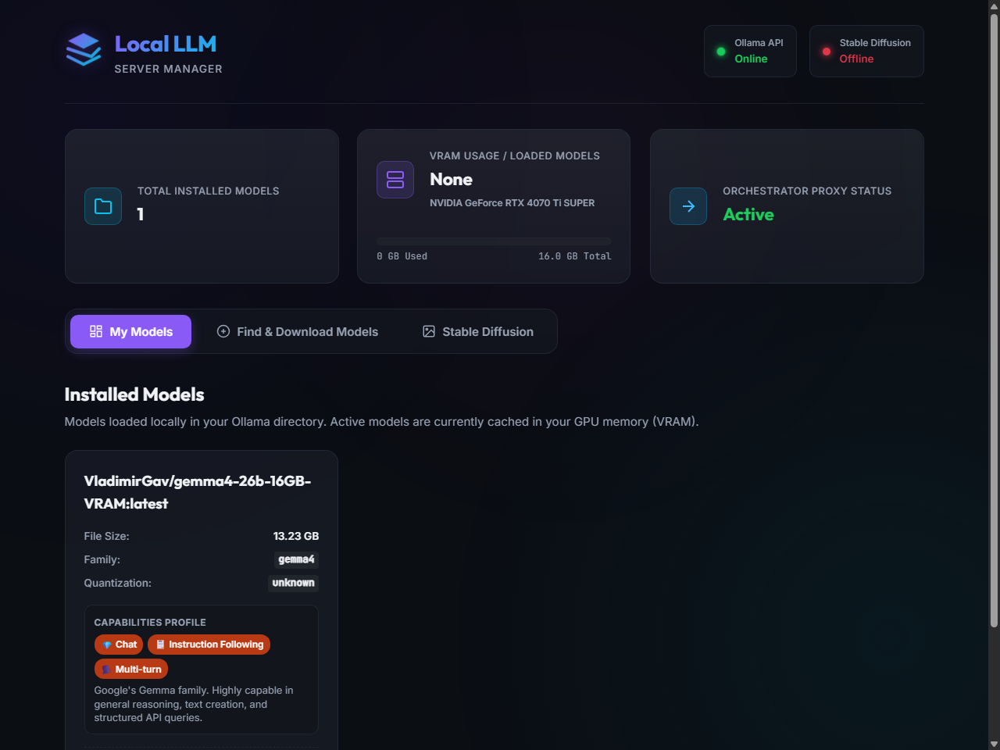
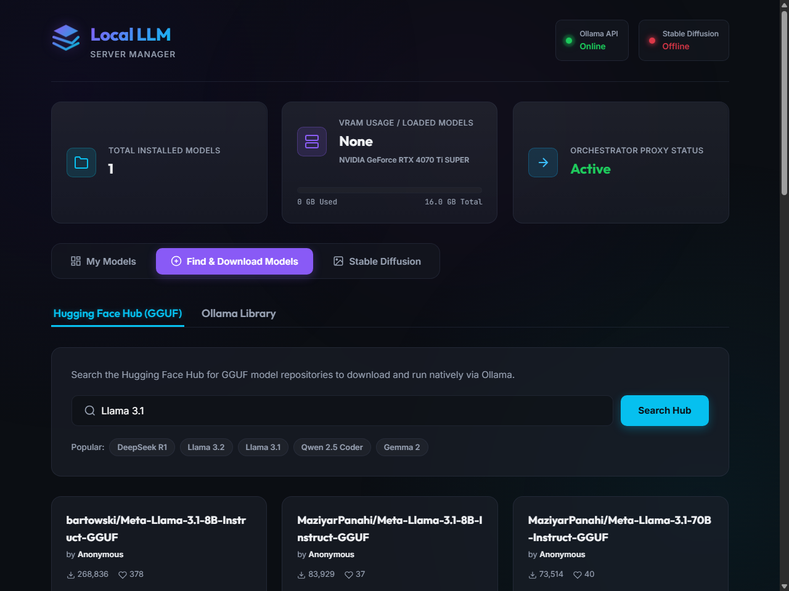
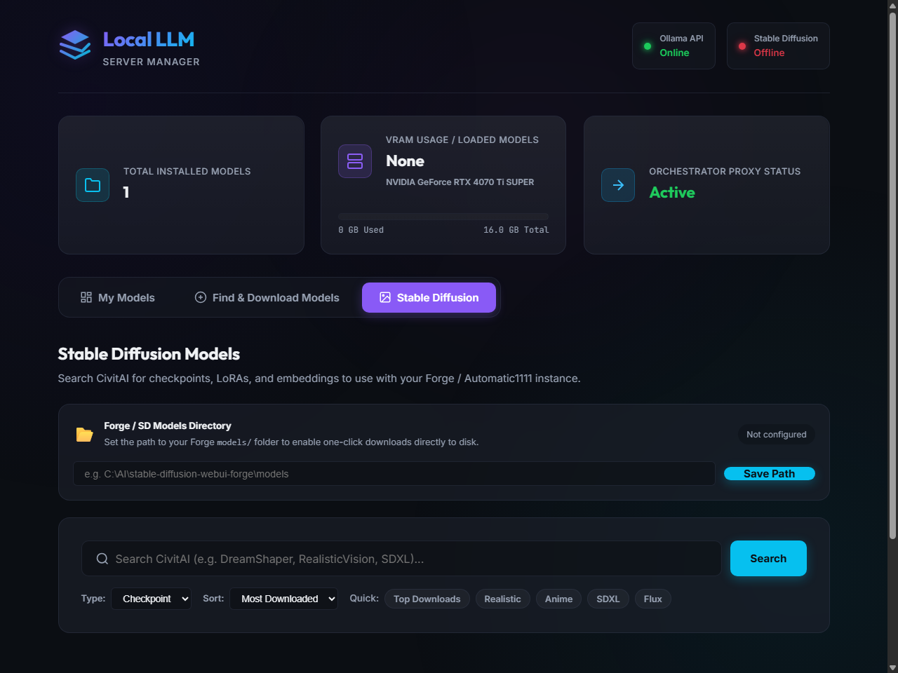
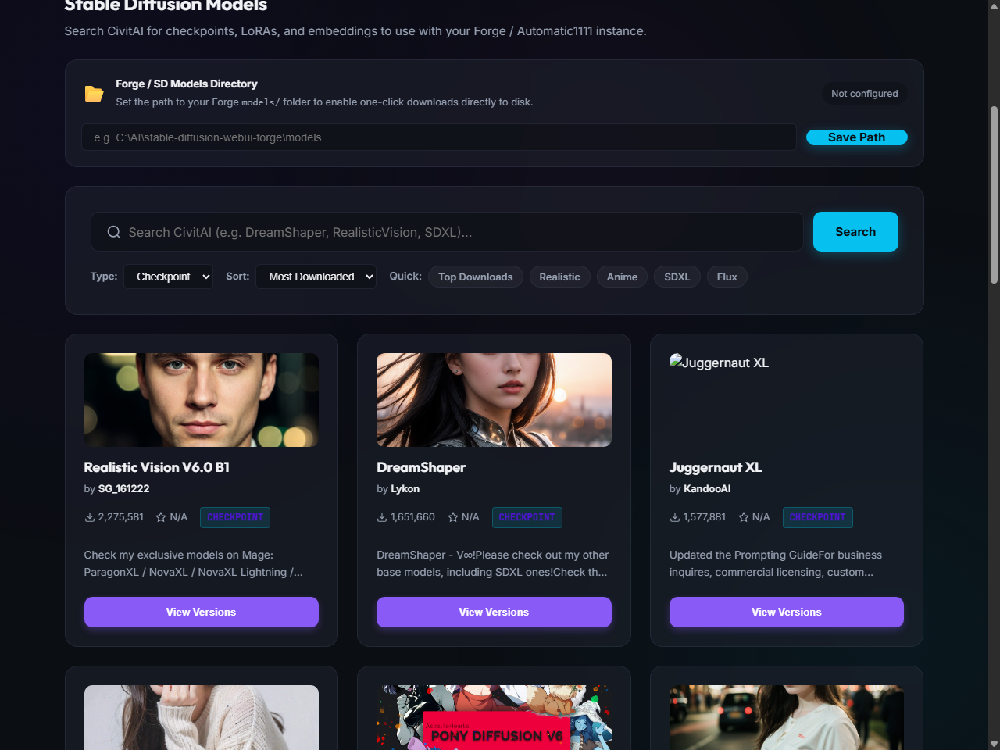

# Local LLM Server Manager

> **v1.3.0** — An orchestrator, proxy, and visual dashboard to manage local Large Language Models (**Ollama**) and Image Generation (**Stable Diffusion / Forge**) on Windows.

It tracks GPU VRAM usage in real time, profiles model capabilities, computes KV Cache memory footprints, integrates with the **Hugging Face Hub** to discover and pull GGUF models, and connects to **CivitAI** to browse and download Stable Diffusion checkpoints, LoRAs, and embeddings directly to your Forge models folder.

---

## 📸 Web UI Screenshots (From Running Instance)

### 1. Model Management Dashboard
*View installed Ollama models, VRAM usage bar, GPU name, active loaded models, and capabilities profiles.*


### 2. Find & Download Models — Hugging Face Hub
*Search GGUF repositories on Hugging Face, inspect quantization file sizes, and pull them with live progress tracking.*


### 3. Stable Diffusion — CivitAI Search
*Browse CivitAI checkpoints by type, sort, and keyword. Filter by Checkpoint, LoRA, Embedding, VAE, or ControlNet.*


### 4. CivitAI Results Grid
*Real model preview images, download counts, ratings, and one-click version selection for direct-to-disk downloads.*


---

## 🌟 Key Features

### LLM Management (Ollama)
1. **Service Health Checks** — Pulsing real-time indicators for Ollama (`11434`) and Stable Diffusion / Forge (`7860`).
2. **Native VRAM Detection** — Reads GPU name and VRAM directly from the Windows Registry, bypassing the WMI 4 GB cap. Correctly reports e.g. *NVIDIA GeForce RTX 4070 Ti SUPER — 16 GB*.
3. **VRAM Usage Visualizer** — Stacked bar showing loaded-model VRAM vs free GPU memory.
4. **KV Cache Context Calculator** — Slide target token length (up to 32 K tokens) to preview weights + KV cache sizes and warn when context exceeds VRAM.
5. **Model Capabilities Profile** — Tags model families (Llama, Gemma, Qwen, Phi, Mistral, DeepSeek) with use-case badges (`Coding`, `Reasoning`, `Math`, `Chat`).
6. **Hugging Face Hub Integration** — Search GGUF repos, select quantization, inspect file sizes, and download with a live SSE progress stream.
7. **Ollama Library Quick-Pull** — Pre-populated cards for popular models (gemma2, llama3.2, qwen2.5-coder, phi3) with size estimates and one-click pull.
8. **Custom Pull** — Type any `user/model:tag` to pull an arbitrary Ollama model.
9. **Concurrent Model Preloading** — Trigger indefinite VRAM holds (`keep_alive: -1`) to run multiple models side-by-side.

### Stable Diffusion / Forge
10. **CivitAI Integration** — Search by name, type (Checkpoint / LoRA / Embedding / VAE / ControlNet), and sort order (Most Downloaded / Highest Rated / Newest). Shows preview thumbnails, download counts, and star ratings.
11. **Direct-to-Disk Downloads** — Configure your Forge `models/` directory once; the server streams CivitAI files directly to disk with a live progress bar (no browser download needed).
12. **Persistent Settings** — Forge path is saved to `settings.json` next to the executable and restored on next launch.

### Infrastructure
13. **YARP Reverse Proxy** — Transparently proxies Ollama and Forge traffic through a single port so clients only need one endpoint.
14. **VRAM Orchestrator** — Auto-unloads LLMs before heavy Stable Diffusion requests to prevent OOM errors.
15. **Optional Windows Service** — Run headlessly as a background service that starts on boot.

---

## 📦 Versioning Convention

We use **MAJOR.MINOR.PATCH** (SemVer):

| Bump | When |
|------|------|
| `PATCH` (e.g. `1.2.0 → 1.2.1`) | Bug fixes, dependency updates, doc/screenshot-only changes |
| `MINOR` (e.g. `1.2.0 → 1.3.0`) | New user-facing feature added |
| `MAJOR` (e.g. `1.x.x → 2.0.0`) | Breaking change or major architecture rewrite |

**Version history:**

| Version | What changed |
|---------|-------------|
| `1.0.0` | Initial release — dashboard, VRAM bar, HF search, Ollama pull, YARP proxy, Windows Service |
| `1.1.0` | CivitAI search tab with model type / sort filters and preview thumbnails |
| `1.2.0` | Forge models directory config, direct-to-disk CivitAI downloads with SSE progress, persistent `settings.json` |
| `1.3.0` | Migration to .NET 10 LTS target framework and updated dependencies |

---

## 🚀 Installation & Setup

We provide a PowerShell installer script to compile, publish, and optionally register the app as a Windows Service.

### Quick Install
1. Open PowerShell as **Administrator**.
2. Navigate to the project directory.
3. Run the installer:
   ```powershell
   Set-ExecutionPolicy -ExecutionPolicy RemoteSigned -Scope Process -Force
   .\install.ps1
   ```

### Installer Prompts
- **Installation Directory** — Where to copy the published binaries (default: `C:\LocalLLMServerManager`).
- **Windows Service** — Register and start as a background service that survives reboots (`Y/N`).

---

## ⚙️ Service Control Commands

Open PowerShell as **Administrator**:

```powershell
# Start
Start-Service -Name "LocalLLMServerManager"

# Stop
Stop-Service -Name "LocalLLMServerManager"

# Status
Get-Service -Name "LocalLLMServerManager"

# Uninstall
sc.exe delete "LocalLLMServerManager"
```

If running directly (not as a service):
```cmd
C:\LocalLLMServerManager\LocalLLMServerManager.exe
```
Dashboard available at **http://localhost:5246/**

---

## 🗂 First-Run Configuration

### LLM (Ollama)
No configuration needed — the dashboard auto-detects Ollama at `localhost:11434`.

### Stable Diffusion / Forge
1. Open the **Stable Diffusion** tab.
2. Paste your Forge models directory path (e.g. `C:\AI\stable-diffusion-webui-forge\models`) into the **Forge / SD Models Directory** banner.
3. Click **Save Path**. The badge turns green and downloads will go directly to that folder.

---

## 🔧 Prerequisites

- [.NET 9 SDK](https://dotnet.microsoft.com/download/dotnet/9) — to build/run from source
- [Ollama](https://ollama.com/) — LLM inference runtime
- [Stable Diffusion WebUI Forge](https://github.com/lllyasviel/stable-diffusion-webui-forge) *(optional)* — image generation backend
