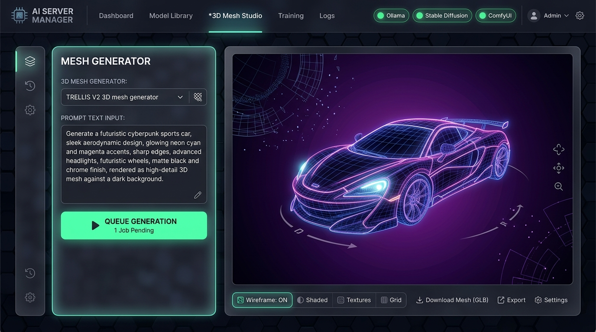

# Local LLM Server Manager

> **v1.4.0** — An orchestrator, proxy, and visual dashboard to manage local Large Language Models (**Ollama**), Image Generation (**Stable Diffusion / Forge & ComfyUI**), and **3D Mesh Generation (TRELLIS V2 & Hunyuan3D v2)** on Windows.

It tracks GPU VRAM usage in real time, profiles model capabilities, computes KV Cache memory footprints, integrates with the **Hugging Face Hub** to discover and pull GGUF models, connects to **CivitAI** to browse and download Stable Diffusion checkpoints directly to disk, and features a **3D & ComfyUI Studio** with an interactive WebGL 3D canvas viewer.

---

## 📸 Web UI Screenshots (From Running Instance)

### 1. Model Management Dashboard
*View installed Ollama models, VRAM usage bar, GPU name, active loaded models, and capabilities profiles.*


### 2. 3D & ComfyUI Studio (TRELLIS V2 / Hunyuan3D v2 & WebGL Viewer)
*Select 3D mesh workflows (TRELLIS V2, Hunyuan3D v2), queue generations with auto-VRAM offloading, and inspect 3D assets interactively in WebGL with 360° rotation.*


### 3. Find & Download Models — Hugging Face Hub
*Search GGUF repositories on Hugging Face, inspect quantization file sizes, and pull them with live progress tracking.*


### 4. Stable Diffusion — CivitAI Search
*Browse CivitAI checkpoints by type, sort, and keyword. Filter by Checkpoint, LoRA, Embedding, VAE, or ControlNet.*


### 5. CivitAI Results Grid
*Real model preview images, download counts, ratings, and one-click version selection for direct-to-disk downloads.*


---

## 🌟 Key Features

### LLM Management (Ollama)
1. **Service Health Checks** — Real-time status indicators for Ollama (`11434`), Stable Diffusion / Forge (`7860`), and ComfyUI (`8188`).
2. **Native VRAM Detection** — Reads GPU name and VRAM directly from the Windows Registry, bypassing the WMI 4 GB cap. Correctly reports e.g. *NVIDIA GeForce RTX 4070 Ti SUPER — 16 GB*.
3. **VRAM Usage Visualizer** — Stacked bar showing loaded-model VRAM vs free GPU memory.
4. **KV Cache Context Calculator** — Slide target token length (up to 32 K tokens) to preview weights + KV cache sizes and warn when context exceeds VRAM.
5. **Model Capabilities Profile** — Tags model families (Llama, Gemma, Qwen, Phi, Mistral, DeepSeek) with use-case badges (`Coding`, `Reasoning`, `Math`, `Chat`).
6. **Hugging Face Hub Integration** — Search GGUF repos, select quantization, inspect file sizes, and download with a live SSE progress stream.
7. **Ollama Library Quick-Pull** — Pre-populated cards for popular models (gemma2, llama3.2, qwen2.5-coder, phi3) with size estimates and one-click pull.
8. **Custom Pull** — Type any `user/model:tag` to pull an arbitrary Ollama model.
9. **Concurrent Model Preloading** — Trigger indefinite VRAM holds (`keep_alive: -1`) to run multiple models side-by-side.

### 3D Mesh & ComfyUI Generation (TRELLIS V2 / Hunyuan3D v2)
10. **ComfyUI Integration** — Proxy ComfyUI workflow execution, API requests, and WebSocket progress directly through port 5246.
11. **3D Mesh Generation** — Run TRELLIS V2 and Hunyuan3D v2 workflows for Image-to-3D and Text-to-3D mesh generation (.glb / .gltf).
12. **Interactive WebGL 3D Canvas** — Render generated 3D meshes natively in-browser using `<model-viewer>` with 360° orbital controls, wireframe toggles, lighting options, and GLB export.
13. **Bundled API Workflow Presets** — Ships with default ready-to-run API JSON templates for TRELLIS V2, Hunyuan3D v2, and FLUX/SDXL image generation.
14. **Engine Preference Switcher** — Easily set your preferred default image generator engine (Forge vs ComfyUI).

### Stable Diffusion / Forge
15. **CivitAI Integration** — Search by name, type (Checkpoint / LoRA / Embedding / VAE / ControlNet), and sort order. Shows preview thumbnails, download counts, and star ratings.
16. **Direct-to-Disk Downloads** — Stream CivitAI files directly to disk with live progress bars.

### Infrastructure & Reverse Proxy
17. **YARP Reverse Proxy** — Transparently proxies Ollama (`:11434`), Forge (`:7860`), and ComfyUI (`:8188`) traffic through a single endpoint (`:5246`).
18. **VRAM Orchestrator** — Auto-unloads active LLM models from GPU memory before heavy Stable Diffusion or ComfyUI 3D render jobs to prevent OOM errors.
19. **Optional Windows Service** — Run headlessly as a background service starting on boot.

---

## 📚 Guides & Documentation

- [ComfyUI & 3D Mesh Generation Setup Guide](docs/COMFYUI_AND_3D_GUIDE.md) — How to configure ComfyUI, install 3D nodes (TRELLIS V2 / Hunyuan3D v2), and export custom workflow presets.
- [Linux Caddy Proxy & Open WebUI / LibreChat Integration Guide](docs/CADDY_OPENWEBUI_SETUP.md) — How to expose LocalLLMServerManager via Caddy reverse proxy to Open WebUI and LibreChat clients.

---

## 📦 Versioning Convention

We use **MAJOR.MINOR.PATCH** (SemVer):

| Version | What changed |
|---------|-------------|
| `1.0.0` | Initial release — dashboard, VRAM bar, HF search, Ollama pull, YARP proxy, Windows Service |
| `1.1.0` | CivitAI search tab with model type / sort filters and preview thumbnails |
| `1.2.0` | Forge models directory config, direct-to-disk CivitAI downloads with SSE progress, persistent `settings.json` |
| `1.3.0` | Migration to .NET 10 LTS target framework and updated dependencies |
| `1.4.0` | ComfyUI integration, 3D Mesh Studio (TRELLIS V2 / Hunyuan3D v2), interactive WebGL 3D viewer, preferred engine toggle |

---

## 🚀 Installation & Setup

We provide a PowerShell installer script to compile, publish, and optionally register the app as a Windows Service.

### Quick Install
1. Open PowerShell as **Administrator**.
2. Navigate to the project directory.
3. Run the installer:
   ```powershell
   Set-ExecutionPolicy -ExecutionPolicy RemoteSigned -Scope Process -Force
   .\install.ps1
   ```

### Service Control Commands
Open PowerShell as **Administrator**:
```powershell
# Start
Start-Service -Name "LocalLLMServerManager"

# Stop
Stop-Service -Name "LocalLLMServerManager"

# Status
Get-Service -Name "LocalLLMServerManager"
```

If running directly:
```cmd
C:\LocalLLMServerManager\LocalLLMServerManager.exe
```
Dashboard available at **http://localhost:5246/**

---

## 🔧 Prerequisites

- [.NET 10 SDK](https://dotnet.microsoft.com/download/dotnet/10) — to build/run from source
- [Ollama](https://ollama.com/) — LLM inference runtime
- [Stable Diffusion WebUI Forge](https://github.com/lllyasviel/stable-diffusion-webui-forge) *(optional)* — SD image generation backend
- [ComfyUI](https://github.com/comfyanonymous/ComfyUI) *(optional)* — node-based image & 3D mesh generation backend
