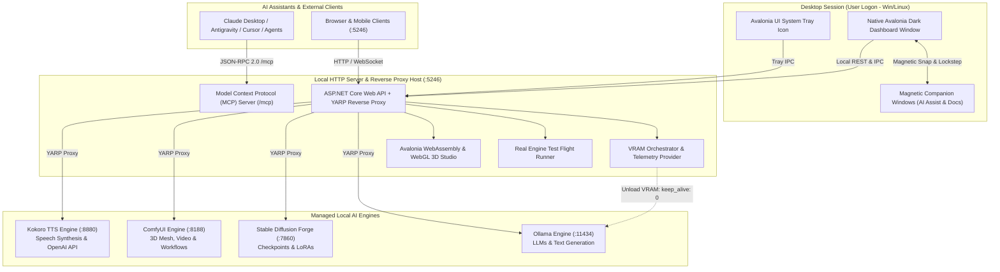

# Local LLM Server Manager

> **v3.15.0** — A unified cross-platform application (.NET 10 + Avalonia UI & WebAssembly), System Tray app, background service/daemon, Model Context Protocol (MCP) AI API, visual orchestrator dashboard, and automated Playwright E2E testing framework to manage local Large Language Models (**Ollama**), Image Generation (**Stable Diffusion / Forge & ComfyUI**), **3D Mesh Generation (TRELLIS V2 & Hunyuan3D v2)**, **Video Generation (Wan 2.2, LTX-2.5, HunyuanVideo)**, and **Audio & Speech Generation (Kokoro TTS, AllTalk XTTS-v2, Faster-Whisper, Stable Audio Open 3.0, MusicGen, YuE)** on Windows, Linux, Mobile, and Web.
It features the official **`L³M²`** monochromatic brand identity, a high-contrast **Matte Carbon Design System**, a live **Dynamic Theming Engine** (Matte Carbon, OLED Black, Clean Light), **Magnetic Companion Windows** (`WindowSnapManager`), in-app **AI Assist** with multimodal diagnostics, **Real Engine Test Flight**, integrated **`playwright-layout-inspector`** automated visual audits, NVML CUDA real-time telemetry, **Hugging Face Hub** Multimodal discovery (GGUF, Text-to-Video, Image-to-Video, TTS, Text-to-Audio), **CivitAI** checkpoint downloads, **Multimodal Studio** with interactive 3D WebGL viewer, Video Player Preview, Audio Waveform Visualizer, a unified **Avalonia WebAssembly (WASM)** dashboard, **Modular Feature Packs** (`--with-video`, `--with-audio`), and an active **Model Context Protocol (MCP) Server** (`/mcp`).


---

## 🖥️ User Interface Layout & Dashboard Structure

The application features a dark Fluent Avalonia UI theme (`#0F172A`) organized into modular workspaces:

| UI Workspace | Target Capabilities | Active Controls |
| :--- | :--- | :--- |
| **Telemetry Header** | Real-Time Hardware Telemetry | GPU name, total/used VRAM bar, service health indicator, and refresh button. |
| **Installed Models** | Local Model Management | Ollama model cards, family tags (`Coding`, `Chat`), and interactive KV Cache Context Calculator. |
| **Hugging Face Hub** | Multimodal GGUF Discovery | Search repositories, inspect branch quantization trees (`Q4_K_M`, `Q8_0`), and stream downloads. |
| **CivitAI Models** | Diffusion Checkpoints & LoRAs | Filter by model type, inspect preview thumbnails, and download directly to disk. |
| **Multimodal Studio** | Creative Generation Suite | Workspaces for Images, Video, Audio, 3D Mesh, and the one-click **Real Engine Test Flight** runner. |
| **AI Assistant** | In-App Conversational Copilot | Multimodal screenshot diagnostics, dynamic LiteLLM capability badges, and detachable companion window. |
| **Settings & Tools** | Configuration & Auto-Discovery | Multi-drive tool auto-detection, path status badges (`Valid`, `Missing`), and LAN IP endpoint summaries. |
| **Companion Windows** | Multi-Window Workspaces | Detachable Documentation and AI Assist windows with magnetic flank docking and lockstep dragging. |

---

## 🌟 Key Features

### Native Desktop App & Services (Windows & Linux)
1. **Avalonia UI Native Dashboard** — Sleek Fluent dark desktop window presenting live VRAM usage, engine status cards, and one-click browser launch on Windows and Linux (X11 / Wayland).
2. **System Tray Integration** — Operates quietly in the notification area with right-click quick controls (Open Dashboard, View Health, Exit).
3. **Headless Background Services** — Runs headlessly on machine boot via Windows Service or Linux `systemd` daemon (`localllmmanager.service`).
4. **Automated Tray Attachment** — When a user logs in, the Avalonia System Tray app automatically attaches to the running background service instance.
5. **Seamless In-Place Upgrades** — Upgrading via Windows Inno Setup installer, PowerShell scripts (`update.ps1`, `install.ps1`), or Linux script (`install_linux.sh`) automatically detects active services and tray apps, terminates them cleanly, preserves user configuration (`settings.json`), and restarts the updated background service without file lock errors.
6. **Modular Feature Packs** — Optional components for Video (`ext_video`) and Audio (`ext_audio`) can be installed on-demand via `--with-video` / `--with-audio` installer flags or the in-app Component Manager, keeping base installation lightweight.

### Model Context Protocol (MCP) AI Automation
7. **Official MCP Streamable HTTP / SSE Endpoint (`/mcp`)** — Fully compliant Model Context Protocol (MCP) server built with `ModelContextProtocol.AspNetCore` implementing the official **2026-07-28** stateless specification, enabling AI assistants (Antigravity, Claude Desktop, Cursor, Open WebUI) to automate server operations over JSON-RPC 2.0 with `_meta` request envelopes.
8. **11 Native MCP AI Tools** — Exposes comprehensive tools for telemetry (`get_gpu_vram`), health probing (`check_health`), model management (`list_models`, `pull_model`, `unload_vram`), process control (`start_engine`, `stop_engine`), filesystem tool auto-discovery (`detect_tools`), video generation (`generate_video`), speech synthesis (`synthesize_speech`), and music/sound generation (`generate_audio`).

### LLM Management (Ollama & Hugging Face Hub)
9. **Service Health Checks** — Real-time status indicators for Ollama (`11434`), Stable Diffusion / Forge (`7860`), ComfyUI (`8188`), and Audio Engine (`8880`).
10. **Cross-Platform VRAM Telemetry** — Reads GPU name and VRAM via NVML CUDA (`nvidia-smi`), Windows Registry, or Linux system memory (`/proc/meminfo`). Correctly reports e.g. *NVIDIA GeForce RTX 4070 Ti SUPER — 16 GB*.
11. **VRAM Usage Visualizer** — Stacked bar showing loaded-model VRAM vs free GPU memory.
12. **KV Cache Context Calculator** — Slide target token length (up to 32 K tokens) to preview weights + KV cache sizes and warn when context exceeds VRAM.
13. **Model Capabilities Profile** — Tags model families (Llama, Gemma, Qwen, Phi, Mistral, DeepSeek) with use-case badges (`Coding`, `Reasoning`, `Math`, `Chat`).
14. **Multimodal Hugging Face Hub Discovery** — Search GGUF LLMs, Text-to-Video, Image-to-Video, TTS, and Text-to-Audio models with category chip filters, inspect weights, and stream downloads with live progress.
15. **Ollama Library Quick-Pull** — Pre-populated cards for popular models (gemma2, llama3.2, qwen2.5-coder, phi3) with size estimates and one-click pull.
16. **Custom Pull** — Type any `user/model:tag` to pull an arbitrary Ollama model.
17. **Concurrent Model Preloading** — Trigger indefinite VRAM holds (`keep_alive: -1`) to run multiple models side-by-side.

### 3D Mesh & ComfyUI Generation (TRELLIS V2 / Hunyuan3D v2)
18. **ComfyUI Integration** — Proxy ComfyUI workflow execution, API requests, and WebSocket progress directly through port 5246.
19. **3D Mesh Generation** — Run TRELLIS V2 and Hunyuan3D v2 workflows for Image-to-3D and Text-to-3D mesh generation (.glb / .gltf).
20. **Interactive WebGL 3D Canvas** — Render generated 3D meshes natively in-browser using `<model-viewer>` with 360° orbital controls, wireframe toggles, lighting options, and GLB export.

### Video Generation Studio (Wan 2.2, LTX-2.5, HunyuanVideo)
21. **Video Generation Presets** — Ships with ComfyUI workflow presets for state-of-the-art video models: **Wan 2.2** (Text-to-Video / Image-to-Video), **LTX-2.5**, and **HunyuanVideo 1.5**.
22. **Interactive Video Player Preview** — Native Desktop & WASM video preview component with playback controls, scrub bar, looping, playback speed selector, resolution badges, frame count overlay, and recent video gallery.

### Audio & Speech Synthesis Studio (Kokoro TTS, Stable Audio, YuE)
23. **Managed TTS Engine & OpenAI Compatibility** — Auto-detects and supervises local TTS engines (e.g. Kokoro-FastAPI, AllTalk) with native OpenAI-compatible `POST /v1/audio/speech` endpoint.
24. **Audio & Music Generation** — ComfyUI workflows for **Stable Audio Open 3.0** (sound effects & sample generation) and **YuE** (full-length song and vocal generation).
25. **Waveform Visualizer & Audio Player** — Integrated audio player with live waveform rendering, duration scrub, volume control, and audio file gallery.

### Stable Diffusion / Forge & CivitAI
26. **CivitAI Integration** — Search by name, type (Checkpoint / LoRA / Embedding / VAE / ControlNet), and sort order. Shows preview thumbnails, download counts, and star ratings.
27. **Direct-to-Disk Downloads** — Stream CivitAI files directly to disk with live progress bars.

### Application Settings, Network & Engine Controls
28. **Flexible Path Configuration & Auto-Discovery** — Customize executable/script paths and model directories for Ollama, Stable Diffusion / Forge, ComfyUI, and Audio TTS Engine. Use the one-click "🔍 Auto-Detect Installed Tools" feature (or `POST /api/tools/detect`) to automatically scan common install locations across drives, with real-time path validation badges (`Valid` 🟢 / `Missing` 🔴 / `Unset` ⚪).
29. **Auto-Detected LAN IP & Network Endpoints** — Automatically discovers local area network addresses (e.g. `http://10.0.0.21:5246`) and publishes firewall-ready LAN MCP URLs for connected devices.
30. **Component Manager** — View, install, and uninstall optional feature packs (`ext_video`, `ext_audio`) directly from the Settings UI.

### Magnetic Companion Windows & Multi-Window Workflow
31. **WindowSnapManager & Magnetic Flank Docking** — Detach the Documentation tab (left flank) or AI Assistant tab (right flank) into floating companion windows with smooth lockstep movement, proximity snap (< 32 px), and drag detachment (> 24 px).
32. **In-App AI Chat Assistant (AI Assist)** — Interactive copilot featuring dynamic LiteLLM capability badges (`👁️`, `⚡`, `1M`), multimodal screenshot paste (**Ctrl+V**), inline C# tool execution cards, and zero local GPU VRAM usage.
33. **Real Engine Test Flight** — Instant in-app verification runner testing Text, Image, Video, and Audio engine network connectivity and GPU buffer allocation before launching complex generative jobs.

### Infrastructure & Reverse Proxy
34. **YARP Reverse Proxy** — Transparently proxies Ollama (`:11434`), Forge (`:7860`), ComfyUI (`:8188`), and Audio Engine (`:8880`) traffic through a single unified endpoint (`:5246`).
35. **VRAM Orchestrator** — Auto-unloads active LLM models from GPU memory before heavy Stable Diffusion, ComfyUI 3D, or Video render jobs to prevent OOM errors.
36. **Background Engine Management** — UI controls to start/stop engines directly from the dashboard cleanly.
37. **Lazy Boot** — AI engines can boot lazily on-demand when first requested, conserving system resources when idle.

---

## 🏛️ System Architecture


```mermaid
flowchart TD
    subgraph ExternalClients["AI Assistants & External Clients"]
        Claude["Claude Desktop / Antigravity / Cursor / Agents"]
        WebClients["Browser & Mobile Clients (:5246)"]
    end

    subgraph DesktopSession["Desktop Session (User Logon - Win/Linux)"]
        Tray["Avalonia UI System Tray Icon"]
        DesktopApp["Native Avalonia Dark Dashboard Window"]
        CompanionWins["Magnetic Companion Windows (AI Assist & Docs)"]
    end

    subgraph ServerHost["Local HTTP Server & Reverse Proxy Host (:5246)"]
        ProgramHost["ASP.NET Core Web API + YARP Reverse Proxy"]
        McpServer["Model Context Protocol (MCP) Server (/mcp)"]
        VramOrch["VRAM Orchestrator & Telemetry Provider"]
        TestFlight["Real Engine Test Flight Runner"]
        WasmStatic["Avalonia WebAssembly & WebGL 3D Studio"]
    end

    subgraph Engines["Managed Local AI Engines"]
        Ollama["Ollama Engine (:11434)\nLLMs & Text Generation"]
        Forge["Stable Diffusion Forge (:7860)\nCheckpoints & LoRAs"]
        Comfy["ComfyUI Engine (:8188)\n3D Mesh, Video & Workflows"]
        Audio["Kokoro TTS Engine (:8880)\nSpeech Synthesis & OpenAI API"]
    end

    Claude -->|JSON-RPC 2.0 /mcp| McpServer
    WebClients -->|HTTP / WebSocket| ProgramHost
    DesktopApp <-->|Magnetic Snap & Lockstep| CompanionWins
    DesktopApp -->|Local REST & IPC| ProgramHost
    Tray -->|Tray IPC| ProgramHost

    ProgramHost --> VramOrch
    ProgramHost --> TestFlight
    ProgramHost --> WasmStatic

    VramOrch -.->|Unload VRAM: keep_alive: 0| Ollama
    ProgramHost -->|YARP Proxy| Ollama
    ProgramHost -->|YARP Proxy| Forge
    ProgramHost -->|YARP Proxy| Comfy
    ProgramHost -->|YARP Proxy| Audio
```

### Dual-Session Lifecycle
* **Headless Background Service Mode**: Machine boots -> `LocalLLMServerManager --service` starts automatically before user logon (Windows Service or Linux `systemd` daemon). Hosts Web API, YARP proxy, and VRAM orchestrator headlessly on `http://127.0.0.1:5246`.
* **User Desktop Session**: User signs in -> `LocalLLMServerManager` desktop app starts, probes `:5246/health`, and automatically attaches to the running background service instance.

---

## 🤖 Model Context Protocol (MCP) AI Integration

LocalLLMServerManager includes a native **Model Context Protocol (MCP)** server enabling AI coding assistants and autonomous agents (**Claude Desktop**, **Cursor**, **Antigravity**, **Open WebUI**) to monitor and control local LLMs, image generation engines, and GPU hardware.

### Endpoints
* **`/mcp` (Streamable HTTP / SSE)**: Standard JSON-RPC 2.0 endpoint implementing the official Model Context Protocol (**2026-07-28 specification**) via `ModelContextProtocol.AspNetCore`. Supports stateless JSON-RPC requests with `_meta` metadata, `tools/list`, and `tools/call`.

### Available MCP Tools (11 Tools)

| Tool Name | Parameters | Description | Backend Delegation |
|---|---|---|---|
| **`get_gpu_vram`** | *none* | Retrieves real-time GPU VRAM allocation, total/used/free memory in MB, utilization percentage, and hardware name. | `IGpuTelemetryProvider` (NVML CUDA) |
| **`check_health`** | *none* | Probes real-time connectivity and latency for Ollama (`:11434`), SD Forge (`:7860`), ComfyUI (`:8188`), and Audio Engine (`:8880`). | HTTP Health Checks |
| **`list_models`** | *none* | Lists all installed Ollama LLM models with family classification, disk footprint, and parameter tags. | `IOllamaModelService` |
| **`pull_model`** | `modelName` *(string, required)* | Initiates an asynchronous download of a model from Ollama Library or Hugging Face. | `IOllamaModelService` |
| **`unload_vram`** | *none* | Releases all loaded LLM models from GPU VRAM (`keep_alive: 0`) to free memory for diffusion, video, or 3D generation. | `VramOrchestrator` / Ollama |
| **`start_engine`** | `engine` *('forge' \| 'comfyui' \| 'audio')* | Spawns and supervises an AI backend engine process. | `IAiEngineManager` (Win32 Job / Process) |
| **`stop_engine`** | `engine` *('forge' \| 'comfyui' \| 'audio')* | Gracefully terminates an AI backend engine process. | `IAiEngineManager` |
| **`detect_tools`** | *none* | Scans system drives, environment variables, and default paths for Ollama, ComfyUI, SD Forge, and TTS Audio Engines. | `IToolDiscoveryService` |
| **`generate_video`** | `prompt` *(string)*, `workflow` *(string, default 'wan2.2_t2v')*, `width` *(int)*, `height` *(int)*, `frames` *(int)*, `fps` *(int)*, `seed` *(long)* | Queues and orchestrates video generation with ComfyUI presets (Wan 2.2, LTX-2.5, HunyuanVideo). | `POST /api/video/generate` |
| **`synthesize_speech`** | `text` *(string)*, `voice` *(string, default 'af_heart')*, `speed` *(float)*, `format` *(string)* | Synthesizes speech from text using local Kokoro TTS engine with OpenAI-compatible backend. | `POST /v1/audio/speech` |
| **`generate_audio`** | `prompt` *(string)*, `workflow` *(string, default 'stable_audio_open_sfx')*, `duration_seconds` *(int)*, `seed` *(long)* | Generates music or audio sound effects with ComfyUI audio presets (Stable Audio Open 3.0, YuE). | `POST /api/audio/generate` |

### Connecting AI Assistants to LocalLLMServerManager

#### Claude Desktop Configuration (`claude_desktop_config.json`)
```json
{
  "mcpServers": {
    "localllm": {
      "command": "npx",
      "args": ["-y", "mcp-proxy", "http://127.0.0.1:5246/mcp"]
    }
  }
}
```

#### Cursor / Antigravity Custom MCP Server
Add an HTTP MCP server pointing to:
```
http://127.0.0.1:5246/mcp
```

---

## 🎭 Playwright Automated E2E Browser Testing

LocalLLMServerManager includes automated end-to-end (E2E) browser testing built on `Microsoft.Playwright` and xUnit. The test suite spins up an in-memory ASP.NET Core server (`AppTestServerFixture`) and launches headless Chromium with WebAssembly and WebGL flags (`--use-gl=angle --use-angle=swiftshader --enable-webgl`) to validate application behavior in real browser engines.

### Key Capabilities
- **WASM Bundle & Static File Validation**: Listens for HTTP responses to verify zero `404 Not Found` errors when serving Avalonia WASM `.dll`, `.dat`, `.wasm`, and `.boot.json` assets.
- **Console Error Trap**: Monitors browser console output to ensure zero uncaught JavaScript errors occur during WASM startup and canvas rendering.
- **WebGL 3D Canvas Initialization**: Confirms the `<canvas id="out">` element is initialized and rendered with non-zero dimensions.
- **Automated Screenshot Generation**: `PlaywrightScreenshotGenerator` navigates the dark Fluent UI dashboard and captures real 1280x800 PNG screenshots stored in `docs/images/`.

### Running Playwright Tests
```bash
# Install Playwright browser drivers (Chromium)
pwsh LocalLLMServerManager.Tests/bin/Release/net10.0/playwright.ps1 install chromium

# Run all Playwright WASM E2E tests
dotnet test LocalLLMServerManager.Tests/LocalLLMServerManager.Tests.csproj --filter "FullyQualifiedName~PlaywrightWasmE2ETests" -c Release

# Run automated screenshot generator
dotnet test LocalLLMServerManager.Tests/LocalLLMServerManager.Tests.csproj --filter "FullyQualifiedName~PlaywrightScreenshotGenerator" -c Release
```

---

## 🐳 Docker & Container Deployment

LocalLLMServerManager can be containerized using Docker for seamless deployment on server infrastructure or home lab setups.

### Multi-Stage `Dockerfile`
```dockerfile
# Build Stage
FROM mcr.microsoft.com/dotnet/sdk:10.0 AS build
WORKDIR /src
COPY ["LocalLLMServerManager.csproj", "./"]
COPY ["LocalLLMServerManager.Shared/LocalLLMServerManager.Shared.csproj", "LocalLLMServerManager.Shared/"]
COPY ["LocalLLMServerManager.Web/LocalLLMServerManager.Web.csproj", "LocalLLMServerManager.Web/"]
RUN dotnet restore "LocalLLMServerManager.csproj"
COPY . .
RUN dotnet publish "LocalLLMServerManager.csproj" -c Release -o /app/publish

# Runtime Stage
FROM mcr.microsoft.com/dotnet/aspnet:10.0 AS final
WORKDIR /app
EXPOSE 5246
ENV ASPNETCORE_URLS=http://+:5246
COPY --from=build /app/publish .
ENTRYPOINT ["dotnet", "LocalLLMServerManager.dll", "--service"]
```

### `docker-compose.yml`
```yaml
version: '3.8'

services:
  localllmservermanager:
    build:
      context: .
      dockerfile: Dockerfile
    container_name: localllmservermanager
    ports:
      - "5246:5246"
    volumes:
      - ./data:/app/data
    environment:
      - ASPNETCORE_ENVIRONMENT=Production
      - ASPNETCORE_URLS=http://+:5246
    restart: unless-stopped
```

### Running with Docker CLI
```bash
# Build Docker image
docker build -t localllmservermanager:v3.5.0 .

# Run container exposing port 5246
docker run -d -p 5246:5246 --name localllmservermanager localllmservermanager:v3.5.0

# Or start using Docker Compose
docker-compose up -d
```

---

## 🌐 WebAssembly Static Asset Hosting & Kestrel MIME Mappings

To host Avalonia XAML WebAssembly applications directly within ASP.NET Core Kestrel without runtime loading errors, `Program.cs` configures a custom `FileExtensionContentTypeProvider` for static files.

### Configured MIME Mappings
```csharp
var contentTypeProvider = new FileExtensionContentTypeProvider();
contentTypeProvider.Mappings[".dat"] = "application/octet-stream";
contentTypeProvider.Mappings[".symbols"] = "application/octet-stream";
contentTypeProvider.Mappings[".wasm"] = "application/wasm";
contentTypeProvider.Mappings[".clr"] = "application/octet-stream";
contentTypeProvider.Mappings[".pdb"] = "application/octet-stream";
contentTypeProvider.Mappings[".boot.json"] = "application/json";

app.UseDefaultFiles();
app.UseStaticFiles(new StaticFileOptions
{
    ContentTypeProvider = contentTypeProvider,
    ServeUnknownFileTypes = true,
    DefaultContentType = "application/octet-stream"
});
```

### Technical Benefits
- **WebAssembly Compatibility**: Ensures `.wasm` files are served with `application/wasm` headers required by web browsers for WebAssembly compilation.
- **Managed Assembly & Data Stream Support**: `.dat`, `.clr`, and `.pdb` static files are served as `application/octet-stream`, preventing 404/415 media type rejection by ASP.NET Core middleware.
- **Fallback Type Handling**: `ServeUnknownFileTypes = true` prevents missing static file headers when Avalonia WASM requests dynamic assembly blobs or metadata files.

---

## 📱 Mobile Responsiveness & Cross-Device Compatibility

The Web Dashboard features a responsive CSS layout engine:
* **Mobile Viewport Optimization**: Dynamically adjusts cards, status badges, search bars, and navigation tabs to single-column flex layouts on mobile devices (< 768px).
* **Zero Element Overlap**: Grid systems automatically collapse into stacked cards with full touch target support for phones and tablets.
* **Responsive 3D Studio**: The WebGL 3D Mesh viewer (`<model-viewer>`) automatically resizes canvas bounds and supports touch gesture orbit controls.

---

## 🧪 Quality Assurance, Test Coverage & Requirements Traceability

| Metric | Measured Value | Operational Notes |
| :--- | :--- | :--- |
| **Total Tests Executed** | `174` | Automated test suite across Windows and Linux |
| **Passed Tests** | `173 (99.4%)` | All unit, integration, and UI tests pass |
| **Skipped Tests** | `1 (0.6%)` | On-demand Playwright screenshot generator |
| **Failed Tests** | `0 (0.0%)` | Zero test failures across matrix |
| **Test Fixture Classes** | `20` | Partitioned test fixtures across 5 execution chunks |
| **Target Platforms** | Windows 11 x64, Linux x64, Headless Chromium | Dual-OS verified |

* **[Full Test Coverage Specification](docs/TEST_COVERAGE.md)** — Detailed component-by-component coverage mapping across all 20 test classes, cross-platform validation matrix (Windows & Linux), and 5-chunk test execution guide.
* **[Software Requirements Specification & Traceability Matrix](docs/REQUIREMENTS.md)** — Formal requirements specification across 12 functional domains (`CORE-xxx`, `LLM-xxx`, `HUB-xxx`, `DIFF-xxx`, `3D-xxx`, `VRAM-xxx`, `MCP-xxx`, `INST-xxx`, `DISC-xxx`, `UI-xxx`, `WASM-xxx`, `E2E-xxx`), mapping each requirement to source files and test assertions, plus explicit gap analysis.

---

## 📚 Guides & Documentation

- [User Guide Hub](docs/USER_GUIDE.md) — Complete overview of all dashboard workspaces and engine controls.
- [Real Engine Test Flight Guide](docs/getting-started/test-flight.md) — Verify engine readiness and GPU clearance with one-click test flight payloads.
- [Magnetic Companion Windows Guide](docs/guide/companion-windows.md) — Floating helper windows, lockstep tracking, and magnetic flank snapping.
- [Remote Access & Reverse Proxy Guide](docs/getting-started/remote-access.md) — LAN IP configuration, SSH tunneling, and Caddy reverse proxy setup.
- [LoRA Art Styles & CivitAI](docs/studio/lora-styles.md) — Download and apply community style adapters in ComfyUI and SD Forge.
- [AI Chat Assistant Guide](docs/ai-and-mcp/assistant.md) — Configure LiteLLM gateway, dynamic model badges, and multimodal screenshot diagnostics.
- [Developer & Contributor Guide](docs/DEVELOPMENT_GUIDE.md) — Architecture layout, MVVM patterns, Minimal API endpoints, and Playwright tests.
- [System Architecture Blueprint](docs/ARCHITECTURE.md) — High-level architecture, component hierarchy, and VRAM sequence diagrams.
- [Documentation Writing Style Guide](docs/standards/ste-100.md) — ASD-STE100 writing rules for clarity, brevity, and active voice.

---

## 📦 Versioning Convention

We use **MAJOR.MINOR.PATCH** (SemVer):

| Version | What changed |
|---------|-------------|
| `1.0.0` | Initial release — dashboard, VRAM bar, HF search, Ollama pull, YARP proxy, Windows Service |
| `1.1.0` | CivitAI search tab with model type / sort filters and preview thumbnails |
| `1.2.0` | Forge models directory config, direct-to-disk CivitAI downloads with SSE progress, persistent `settings.json` |
| `1.3.0` | Migration to .NET 10 LTS target framework and updated dependencies |
| `1.4.0` | ComfyUI integration, 3D Mesh Studio (TRELLIS V2 / Hunyuan3D v2), interactive WebGL 3D viewer, preferred engine toggle |
| `1.5.0` | Lazy boot for AI engines, process job objects, and UI controls for background engine management |
| `2.0.0` | Major architecture update — Avalonia UI desktop shell, system tray icon, pre-logon Windows Service boot & logon tray attachment |
| `3.0.0` | Avalonia WebAssembly (Wasm) integration, 3D Canvas Studio, unified multi-platform interface |
| `3.1.0` | Cross-Platform Linux support, Linux release scripts (`build_release.sh`), systemd service installer (`install_linux.sh`), `.desktop` launcher, NVML & `/proc/meminfo` VRAM telemetry, and SSH remote workflow support |
| `3.2.0` | Fixed WASM launcher script routing, added `/api/models` backend proxy, updated high-res 32-bit icon, added end-to-end integration tests, and completed repo housekeeping |
| `3.3.0` | Major architecture refactoring — decomposed Program.cs and MainViewModel into modular interfaces, services, and endpoint route extensions |
| `3.4.0` | Added Playwright automated E2E browser testing, real WebAssembly UI screenshot generator, Docker containerization support, and Kestrel WASM static asset MIME type mappings |
| `3.5.0` | Flexible tool path configuration, multi-drive auto-discovery service (`IToolDiscoveryService`), `POST /api/tools/detect`, official Model Context Protocol (MCP) server endpoint (`/mcp`) with 8 AI automation tools, and graceful in-place update support across Windows Inno Setup and shell installers |
| `3.6.0` | Monochromatic L³M² brand identity, Matte Carbon Design System, live Dynamic Theming Engine (Matte Carbon, OLED Black, Clean Light), and playwright-layout-inspector visual audits |
| `3.7.0` | Multimodal Video & Audio Studio (Wan 2.2, LTX-2.5, HunyuanVideo, Kokoro TTS, Stable Audio Open 3.0, YuE), interactive Video Player and Audio Waveform controls, Multimodal Hugging Face Discovery filters, 3 new MCP AI Tools (`generate_video`, `synthesize_speech`, `generate_audio`), OpenAI-compatible `/v1/audio/speech`, and Modular Feature Packs (`--with-video`, `--with-audio`) |
| `3.8.0` | Cross-Platform Tool Discovery (FFmpeg hardware encoder detection: NVENC, Intel QSV, VAAPI, AMD AMF; Kokoro Python environment inspection; Linux paths & shell runners), Dual-OS GitHub Actions CI Matrix (`[windows-latest, ubuntu-latest]`), Windows Service directory handling & Linux headless guard, and enhanced Windows & Linux installers with automated Firewall rule creation and LAN/MCP endpoint summaries |
| `3.9.0` | Local Audio & Music Studio suite (Kokoro TTS, AllTalk XTTS-v2 voice cloning, Faster-Whisper STT with `/v1/audio/transcriptions` & `/v1/audio/translations`, ComfyUI MusicGen & Stable Audio Open presets, automated setup scripts, and `D:\AI\audio` storage isolation) |
| `3.11.0` | Dynamic WebAssembly browser origin resolution via JSImport, centralized `HttpHelper` with `BaseAddress` validation, thread-safe model collection synchronization, dynamic engine health status indicators, headless UI interaction test suite, and enhanced browser E2E test harness |
| `3.15.0` | Magnetic Companion Windows (`WindowSnapManager`) with lockstep dragging, proximity snap, and multi-monitor detach; in-app AI Assist with LiteLLM capability discovery badges and multimodal screenshot analysis; Real Engine Test Flight verification runner for Text, Image, Video, and Audio backends; auto-detected LAN IP endpoints with LAN MCP URLs; optimized SettingsService async caching and hardware JSON lookup performance |

---

## 🚀 Installation & Downloads

### Testing & Setup Requirements Matrix

Local LLM Server Manager uses a modular design. Testers only need to install components for the features they want to test:

| Feature Area | Stack Requirement | Prerequisite Needed | What It Enables |
| :--- | :--- | :--- | :--- |
| **Core Manager & Dashboard** | **REQUIRED** | Windows 10/11 x64 or Linux x64 | Hardware telemetry, VRAM bar, system tray, reverse proxy, web dashboard. |
| **Ollama Engine** | *Optional* | [Ollama](https://ollama.com) installed | Local LLM text generation, GGUF downloads, KV cache calculator. |
| **Stable Diffusion Forge** | *Optional* | [SD Forge](https://github.com/lllyasviel/stable-diffusion-webui-forge) installed | Local image generation, CivitAI checkpoint and LoRA downloads. |
| **ComfyUI Engine** | *Optional* | [ComfyUI](https://github.com/comfyanonymous/ComfyUI) installed | 3D mesh reconstruction, video generation, and FLUX workflows. |
| **Kokoro TTS Engine** | *Optional* | Python environment or Audio Pack | Local speech synthesis with OpenAI-compatible audio API. |
| **AI Chat Assistant** | *Optional* | LiteLLM gateway or OpenAI endpoint | In-app assistant, multimodal screenshot analysis, and app control. |
| **Feature Packs (`ext_*`)** | *Optional* | Installed via Settings tab | Video ComfyUI presets (`ext_video`) and Audio workflows (`ext_audio`). |

> [!IMPORTANT]
> The release package is **self-contained**. You do not need to install the .NET SDK or .NET runtime to run the application.

### Option 1: Official Windows Installer (.exe) — Seamless In-Place Upgrades
Download the latest `LocalLLMServerManager-Setup.exe` from the [GitHub Releases](https://github.com/spelech/LocalLLMServerManager/releases) page.
* **In-Place Upgrades**: Running setup over an existing installation automatically stops any active `LocalLLMServerManager` Windows Service (`net stop`) and closes running tray processes, safely overwrites binaries without file lock errors, preserves your custom `settings.json`, and reconfigures & restarts the background service.
* Includes an installation wizard with options for:
  * 🟢 **Install Windows Service** (Headless pre-logon machine boot)
  * 🟢 **Auto-Start System Tray App** on user login
  * 🟢 **Desktop & Start Menu Shortcuts**

### Option 2: Linux Automated Installation Script (`install_linux.sh`) — In-Place Upgrades
Clone the repository on Linux and run:
```bash
sudo ./install_linux.sh
```
* Automatically stops active `localllmmanager.service` via systemd before binary copy
* Preserves existing user settings and configurations
* Installs the app binary to `/usr/local/share/LocalLLMServerManager`
* Symlinks binary to `/usr/local/bin/localllmmanager`
* Reloads and restarts the **systemd service** (`localllmmanager.service`) for background autostart
* Installs desktop launcher (`localllmmanager.desktop`) in your application menu

### Option 3: Standalone Portable (.zip / .tar.gz)
Download `LocalLLMServerManager-win-x64.zip` or `LocalLLMServerManager-linux-x64.tar.gz` from Releases, extract, and run executable. Includes bundled runtime — no .NET SDK required!

### Option 4: Building Release Packages Locally
- **Windows:** Run `.\build_release.ps1` (or `.\scripts\update.ps1` for in-place local build & upgrade)
- **Linux:** Run `./build_release.sh`
Output artifacts will be generated in `dist/`.

---

## 🔍 Configuration & Auto-Discovery

LocalLLMServerManager supports fully flexible tool paths across any storage drive or folder structure, eliminating rigid hardcoded path assumptions.

### 1. Auto-Detect Installed Tools (One-Click Setup)
In the **⚙️ Settings** tab, click **🔍 Auto-Detect Installed Tools** (or send `POST /api/tools/detect` to the backend REST API). The built-in `IToolDiscoveryService` actively scans:
- **System PATH & Environment Variables** (`OLLAMA_MODELS`, `PATH`, etc.)
- **All available drive roots** (`C:`, `D:`, `E:`, etc. on Windows, `/opt`, `/home/$USER`, `/usr/local` on Linux)
- **Standard installation paths**:
  - **Ollama**: `%LOCALAPPDATA%\Programs\Ollama\ollama.exe`, `~/.ollama/models`, `%USERPROFILE%\.ollama\models`
  - **ComfyUI**: Portable batch runners (`run_nvidia_gpu.bat`, `run_cpu.bat`), Git clones (`main.py`), and standard `models/` checkpoints
  - **Stable Diffusion WebUI / Forge / A1111**: Launch scripts (`webui-user.bat`, `webui.sh`, `run.bat`) and `models/Stable-diffusion` directories

Auto-detection only populates unset or missing paths, preserving any custom paths you've previously configured.

### 2. Manual Path Customization & Real-Time Status Badges
You can customize every tool path independently via the Settings UI (with native file/folder pickers) or by editing `settings.json`:
- **`OllamaExecutablePath`**: Direct path to `ollama.exe` (or `ollama` on Linux)
- **`OllamaModelsPath`**: Target directory where Ollama stores model blobs and manifests
- **`ForgeScriptPath`**: Batch or shell launcher script for Stable Diffusion WebUI / Forge
- **`ForgeModelsPath`**: Directory for SD Checkpoints, LoRAs, VAEs, and ControlNets
- **`ComfyUiScriptPath`**: Batch or shell launcher script for ComfyUI
- **`ComfyUiModelsPath`**: Root models directory for ComfyUI checkpoints, UNETs, and VAEs
- **`ComfyUiUrl`**: Network address for ComfyUI (default `http://127.0.0.1:8188`)

Each path input features a real-time status badge:
- 🟢 **Valid**: Executable file exists or directory is accessible on disk
- 🔴 **Missing**: Path is configured but does not exist at the specified target
- ⚪ **Unset**: Path is empty (defaults to standard environment fallback)

### 3. Parameterized Helper Scripts
All automation scripts in `scripts/` accept command-line parameters for custom installation locations:

```powershell
# Set up 3D workflows for ComfyUI with custom paths (PowerShell)
.\scripts\setup_3d_workflows.ps1 -ComfyUiPath "D:\AI\ComfyUI_windows_portable\ComfyUI" -ModelsDir "D:\AI\ComfyUI_windows_portable\ComfyUI\models"

# Start AI engines with custom script paths
.\scripts\start_engines.ps1 -Ollama -ComfyUI -ComfyUiScript "D:\AI\ComfyUI_windows_portable\run_nvidia_gpu.bat"
```

```bash
# Set up 3D workflows on Linux with custom paths (Bash)
./scripts/setup_3d_workflows.sh --comfy-path "/opt/ComfyUI" --models-dir "/opt/ComfyUI/models"

# Install Linux package to custom directory
sudo ./scripts/install_linux.sh --install-dir "/opt/LocalLLMServerManager" --bin-dir "/usr/bin"
```

---

## 🌐 Remote SSH Viewing & Port Forwarding

To work with LocalLLMServerManager on a remote Linux machine over SSH:
1. Connect over SSH with local port forwarding:
   ```bash
   ssh -L 5246:localhost:5246 user@your-linux-host
   ```
2. Run the application in headless service mode on the remote host:
   ```bash
   dotnet run -- --service
   # or manage via systemd: sudo systemctl start localllmmanager
   ```
3. Open **`http://localhost:5246`** in your local browser to access 100% of the UI features (VRAM monitor, Hugging Face search, CivitAI downloader, 3D WebGL viewer) at full speed with zero lag over SSH.

---

## ⚙️ Service Control Commands

### Linux (systemd)
```bash
# Start Service
sudo systemctl start localllmmanager

# Stop Service
sudo systemctl stop localllmmanager

# Check Status
sudo systemctl status localllmmanager
```

### Windows (Service Control)
Open PowerShell as **Administrator**:
```powershell
# Start Service
Start-Service -Name "LocalLLMServerManager"

# Stop Service
Stop-Service -Name "LocalLLMServerManager"

# Service Status
Get-Service -Name "LocalLLMServerManager"
```

If running directly:
```cmd
C:\LocalLLMServerManager\LocalLLMServerManager.exe
```
Dashboard available at **http://localhost:5246/**

---

## 🔧 Prerequisites & Engine Links

For complete installation steps and testing requirements, see the [Testing & Setup Requirements Matrix](#testing--setup-requirements-matrix) above.

- **Operating System**: Windows 10/11 (64-bit) or Linux (Ubuntu 22.04+, Debian 12+, Fedora 38+)
- **GPU Acceleration**: NVIDIA GPU with CUDA support (8 GB+ VRAM recommended; CPU inference supported for text models)
- **[Ollama](https://ollama.com/)** *(Optional)* — Local LLM inference engine for chat and code generation
- **[Stable Diffusion WebUI Forge](https://github.com/lllyasviel/stable-diffusion-webui-forge)** *(Optional)* — Checkpoint and LoRA image generation backend
- **[ComfyUI](https://github.com/comfyanonymous/ComfyUI)** *(Optional)* — Node-based 3D mesh, video, and complex diffusion backend
- **[LiteLLM Proxy](https://github.com/BerriAI/litellm)** *(Optional)* — External gateway for the in-app AI Assistant
- **[.NET 10 SDK](https://dotnet.microsoft.com/download/dotnet/10)** *(Optional)* — Only required if building the application from source code


