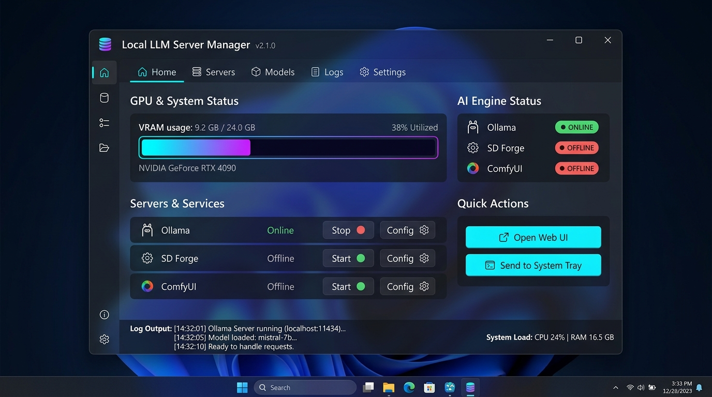
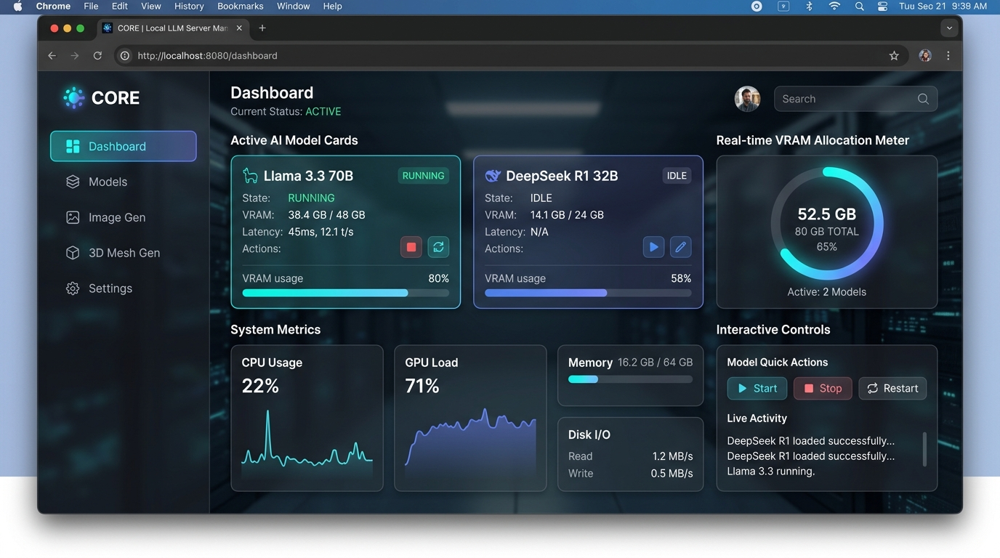
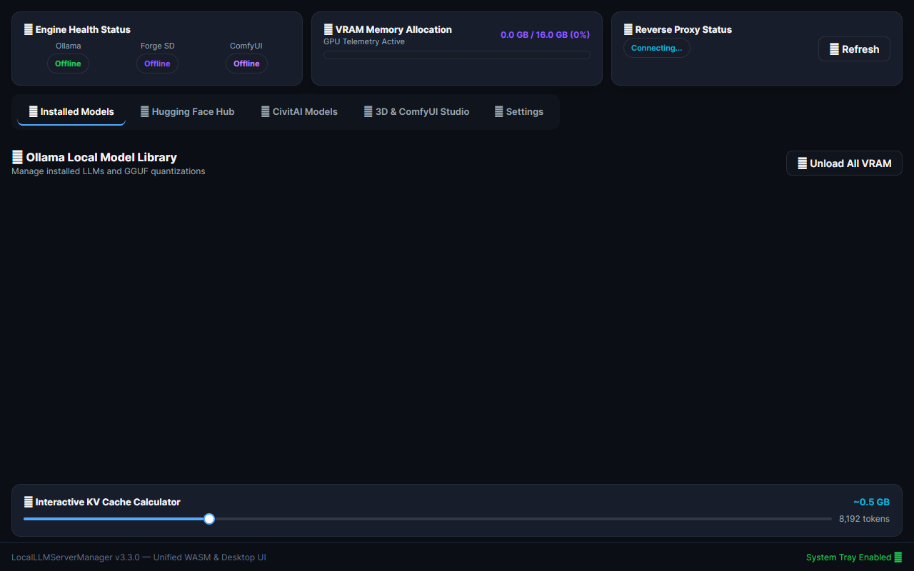
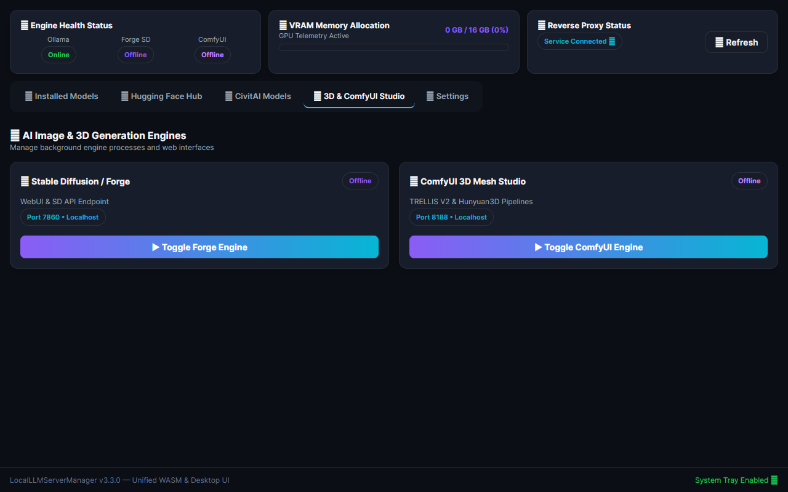
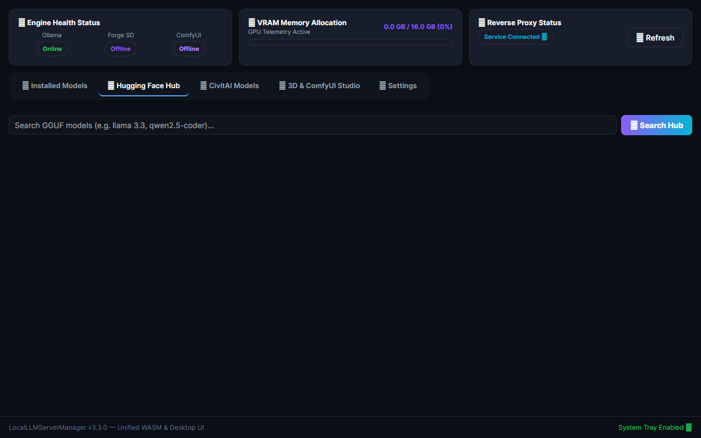
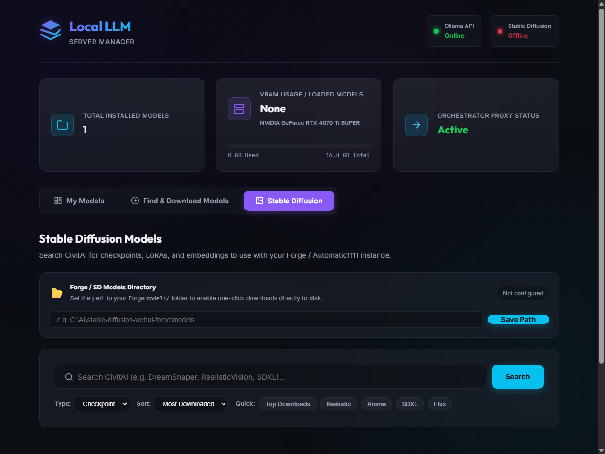

# Local LLM Server Manager

> **v3.0.0** — A unified cross-platform application (.NET 10 + Avalonia UI & WebAssembly), System Tray app, background Windows Service, Model Context Protocol (MCP) AI API, and visual orchestrator dashboard to manage local Large Language Models (**Ollama**), Image Generation (**Stable Diffusion / Forge & ComfyUI**), and **3D Mesh Generation (TRELLIS V2 & Hunyuan3D v2)** on Windows, Mobile, and Web.

It tracks GPU VRAM usage in real time via NVML CUDA telemetry, profiles model capabilities, computes KV Cache memory footprints, integrates with the **Hugging Face Hub** to discover and pull GGUF models, connects to **CivitAI** to browse and download Stable Diffusion checkpoints directly to disk, features a **3D & ComfyUI Studio** with an interactive WebGL 3D canvas viewer, provides a **Unified Avalonia XAML WebAssembly (WASM)** interface across mobile and desktop browsers, and exposes a **Model Context Protocol (MCP) Server** (`/api/mcp/tools`) for AI assistants (Antigravity, Cursor, Claude).

---

## 📸 User Interface Screenshots

### 1. Avalonia UI Native System Tray & Desktop Dashboard (v2.1.0)
*Fluent Dark Avalonia desktop window showing live VRAM consumption, GPU hardware telemetry, AI engine health badges, and one-click quick actions.*


### 2. Modern Glassmorphism Web UI
*Responsive web dashboard with real-time model capability tags, KV Cache context calculator, engine status toggles, and mobile-friendly UI layout.*


### 3. Model Management Dashboard
*View installed Ollama models, VRAM usage bar, GPU name, active loaded models, and capabilities profiles.*


### 4. 3D & ComfyUI Studio (TRELLIS V2 / Hunyuan3D v2 & WebGL Viewer)
*Select 3D mesh workflows (TRELLIS V2, Hunyuan3D v2), queue generations with auto-VRAM offloading, and inspect 3D assets interactively in WebGL with 360° rotation.*


### 5. Find & Download Models — Hugging Face Hub
*Search GGUF repositories on Hugging Face, inspect quantization file sizes, and pull them with live progress tracking.*


### 6. Stable Diffusion — CivitAI Search & Downloads
*Browse CivitAI checkpoints with real preview images, ratings, and direct-to-disk downloads.*


---

## 🌟 Key Features

### Native Desktop App & Windows Service (v2.1.0)
1. **Avalonia UI Native Dashboard** — Sleek Fluent dark desktop window presenting live VRAM usage, engine status cards, and one-click browser launch.
2. **System Tray Integration** — Operates quietly in the Windows notification area with right-click quick controls (Open Dashboard, View Health, Exit).
3. **Pre-Logon Machine Boot** — Optional Windows Service (`--service`) boots headlessly on machine startup in Session 0 before user login.
4. **Automated Tray Attachment** — When a user logs in, the Avalonia System Tray app automatically attaches to the running Windows Service instance.

### LLM Management (Ollama)
5. **Service Health Checks** — Real-time status indicators for Ollama (`11434`), Stable Diffusion / Forge (`7860`), and ComfyUI (`8188`).
6. **Native VRAM Detection** — Reads GPU name and VRAM directly from the Windows Registry, bypassing the WMI 4 GB cap. Correctly reports e.g. *NVIDIA GeForce RTX 4070 Ti SUPER — 16 GB*.
7. **VRAM Usage Visualizer** — Stacked bar showing loaded-model VRAM vs free GPU memory.
8. **KV Cache Context Calculator** — Slide target token length (up to 32 K tokens) to preview weights + KV cache sizes and warn when context exceeds VRAM.
9. **Model Capabilities Profile** — Tags model families (Llama, Gemma, Qwen, Phi, Mistral, DeepSeek) with use-case badges (`Coding`, `Reasoning`, `Math`, `Chat`).
10. **Hugging Face Hub Integration** — Search GGUF repos, select quantization, inspect file sizes, and download with a live SSE progress stream.
11. **Ollama Library Quick-Pull** — Pre-populated cards for popular models (gemma2, llama3.2, qwen2.5-coder, phi3) with size estimates and one-click pull.
12. **Custom Pull** — Type any `user/model:tag` to pull an arbitrary Ollama model.
13. **Concurrent Model Preloading** — Trigger indefinite VRAM holds (`keep_alive: -1`) to run multiple models side-by-side.

### 3D Mesh & ComfyUI Generation (TRELLIS V2 / Hunyuan3D v2)
14. **ComfyUI Integration** — Proxy ComfyUI workflow execution, API requests, and WebSocket progress directly through port 5246.
15. **3D Mesh Generation** — Run TRELLIS V2 and Hunyuan3D v2 workflows for Image-to-3D and Text-to-3D mesh generation (.glb / .gltf).
16. **Interactive WebGL 3D Canvas** — Render generated 3D meshes natively in-browser using `<model-viewer>` with 360° orbital controls, wireframe toggles, lighting options, and GLB export.
17. **Bundled API Workflow Presets** — Ships with default ready-to-run API JSON templates for TRELLIS V2, Hunyuan3D v2, and FLUX/SDXL image generation.
18. **Engine Preference Switcher** — Easily set your preferred default image generator engine (Forge vs ComfyUI).

### Stable Diffusion / Forge
19. **CivitAI Integration** — Search by name, type (Checkpoint / LoRA / Embedding / VAE / ControlNet), and sort order. Shows preview thumbnails, download counts, and star ratings.
20. **Direct-to-Disk Downloads** — Stream CivitAI files directly to disk with live progress bars.

### Infrastructure & Reverse Proxy
21. **YARP Reverse Proxy** — Transparently proxies Ollama (`:11434`), Forge (`:7860`), and ComfyUI (`:8188`) traffic through a single endpoint (`:5246`).
22. **VRAM Orchestrator** — Auto-unloads active LLM models from GPU memory before heavy Stable Diffusion or ComfyUI 3D render jobs to prevent OOM errors.
23. **Background Engine Management** — UI controls to start/stop engines directly from the dashboard, utilizing Win32 Job Objects for reliable child process termination.
24. **Lazy Boot** — AI engines can now boot lazily on-demand when first requested, conserving system resources when idle.

---

## 🏛️ System Architecture

```
                  +----------------------------------------------+
                  |  Windows Desktop (Session 1 - User Logon)   |
                  |  - Avalonia UI System Tray Icon              |
                  |  - Native XAML Dark Dashboard Window         |
                  |  - Auto-Attaches to local server (:5246)     |
                  +----------------------+-----------------------+
                                         | REST / HTTP (:5246)
                                         v
+-----------------------------------------------------------------------------------+
|  Local HTTP Server & Reverse Proxy Host                                           |
|  - ASP.NET Core Web API + YARP Reverse Proxy (:5246)                              |
|  - VRAM Orchestrator & Win32 Job Objects                                          |
|  - Responsive Web Dashboard & WebGL 3D Studio (wwwroot)                           |
+------------------------------------+----------------------------------------------+
                                     |
                                     v
                  +-----------------------------------+
                  | Managed Processes                 |
                  | - Ollama (:11434)                 |
                  | - SD Forge (:7860)                |
                  | - ComfyUI (:8188)                 |
                  +-----------------------------------+
```

### Dual-Session Lifecycle
* **Session 0 (Windows Service Mode)**: Machine boots -> `LocalLLMServerManager.exe --service` starts automatically before user logon. Hosts the Web API, YARP proxy, and VRAM orchestrator headlessly on `http://127.0.0.1:5246`.
* **Session 1 (User Logon Tray App)**: User signs in -> `LocalLLMServerManager.exe` starts in system tray, probes `:5246/health`, and automatically attaches to the running service instance.

---

## 📱 Mobile Responsiveness & Cross-Device Compatibility

The Web Dashboard features a responsive CSS layout engine:
* **Mobile Viewport Optimization**: Dynamically adjusts cards, status badges, search bars, and navigation tabs to single-column flex layouts on mobile devices (< 768px).
* **Zero Element Overlap**: Grid systems automatically collapse into stacked cards with full touch target support for phones and tablets.
* **Responsive 3D Studio**: The WebGL 3D Mesh viewer (`<model-viewer>`) automatically resizes canvas bounds and supports touch gesture orbit controls.

---

## 📚 Guides & Documentation

- [ComfyUI & 3D Mesh Generation Setup Guide](docs/COMFYUI_AND_3D_GUIDE.md) — How to configure ComfyUI, install 3D nodes (TRELLIS V2 / Hunyuan3D v2), and export custom workflow presets.
- [Linux Caddy Proxy & Open WebUI / LibreChat Integration Guide](docs/CADDY_OPENWEBUI_SETUP.md) — How to expose LocalLLMServerManager via Caddy reverse proxy to Open WebUI and LibreChat clients.

---

## 📦 Versioning Convention

We use **MAJOR.MINOR.PATCH** (SemVer):

| Version | What changed |
|---------|-------------|
| `1.0.0` | Initial release — dashboard, VRAM bar, HF search, Ollama pull, YARP proxy, Windows Service |
| `1.1.0` | CivitAI search tab with model type / sort filters and preview thumbnails |
| `1.2.0` | Forge models directory config, direct-to-disk CivitAI downloads with SSE progress, persistent `settings.json` |
| `1.3.0` | Migration to .NET 10 LTS target framework and updated dependencies |
| `1.4.0` | ComfyUI integration, 3D Mesh Studio (TRELLIS V2 / Hunyuan3D v2), interactive WebGL 3D viewer, preferred engine toggle |
| `1.5.0` | Lazy boot for AI engines, Win32 Job Object integration, and UI controls for background engine management |
| `2.0.0` | Major architecture update — Avalonia UI desktop shell, system tray icon, pre-logon Windows Service boot & logon tray attachment |

---

---

## 🚀 Installation & Downloads

### Option 1: Official Windows Installer (.exe)
Download the latest `LocalLLMServerManager-v2.1.0-Setup.exe` from the [GitHub Releases](https://github.com/spelech/LocalLLMServerManager/releases) page.
* Includes an installation wizard with options for:
  * 🟢 **Install Windows Service** (Headless pre-logon machine boot)
  * 🟢 **Auto-Start System Tray App** on user login
  * 🟢 **Desktop & Start Menu Shortcuts**

### Option 2: Standalone Portable (.zip)
Download `LocalLLMServerManager-v2.1.0-win-x64.zip` from Releases, extract to any folder, and run `LocalLLMServerManager.exe`. Includes bundled runtime — no .NET SDK installation required!

### Option 3: Install from Source (PowerShell Script)
1. Open PowerShell as **Administrator**.
2. Navigate to the project directory.
3. Run the installer script:
   ```powershell
   Set-ExecutionPolicy -ExecutionPolicy RemoteSigned -Scope Process -Force
   .\install.ps1
   ```

### Building Release Packages Locally
To build the self-contained `win-x64` standalone zip archive and Inno Setup installer executable locally:
```powershell
.\build_release.ps1
```
Output artifacts will be generated in `dist/`.

---

## ⚙️ Service Control Commands
Open PowerShell as **Administrator**:
```powershell
# Start Service
Start-Service -Name "LocalLLMServerManager"

# Stop Service
Stop-Service -Name "LocalLLMServerManager"

# Service Status
Get-Service -Name "LocalLLMServerManager"
```

If running directly:
```cmd
C:\LocalLLMServerManager\LocalLLMServerManager.exe
```
Dashboard available at **http://localhost:5246/**

---

## 🔧 Prerequisites

- **[Ollama](https://ollama.com/)** — Local LLM inference runtime
- **[Stable Diffusion WebUI Forge](https://github.com/lllyasviel/stable-diffusion-webui-forge)** *(optional)* — SD image generation backend
- **[ComfyUI](https://github.com/comfyanonymous/ComfyUI)** *(optional)* — Node-based 3D mesh & image generation backend
- **[.NET 10 SDK](https://dotnet.microsoft.com/download/dotnet/10)** *(optional)* — Only required if compiling from source code
