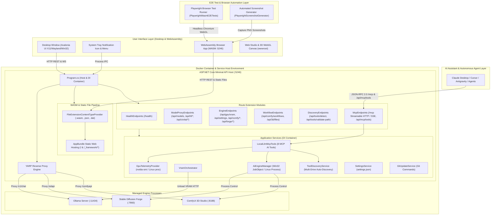
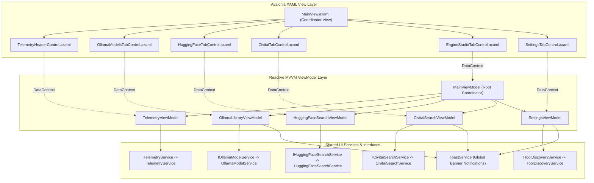
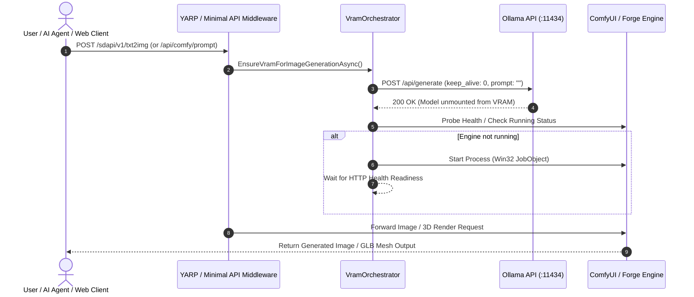

# LocalLLMServerManager — System Architecture & Component Design

> **v3.5.0 Architecture Specification & Mermaid Diagrams**

This document provides a visual and structural blueprint of **LocalLLMServerManager**, detailing its component decomposition, MVVM hierarchy, Minimal API route modules, Dependency Injection lifecycle, Model Context Protocol (MCP) AI integration, VRAM orchestration flow, WebAssembly static asset pipeline, Playwright E2E testing layer, and Docker containerization architecture.

---

## 🏛️ High-Level System Architecture

---

## 🧱 SOLID MVVM Control & ViewModel Hierarchy

The UI layer is structured into single-responsibility Avalonia `UserControl`s and matching child `ObservableObject` ViewModels.

---

## 🔄 VRAM Orchestration & Engine Switch Sequence

When a user or external client requests an Image Generation or 3D Mesh job while an LLM model is consuming GPU VRAM, the `VramOrchestrator` automatically frees VRAM to prevent Out-Of-Memory (OOM) crashes.

---

## 🛠️ Interface & Service Mapping Matrix

| Interface | Implementation | Lifetime | Responsibility |
|---|---|---|---|
| `IAiEngineManager` | `AiEngineManager` | Singleton | Spawns, monitors, and terminates ComfyUI & Forge process trees via Win32 Job Objects |
| `IToolDiscoveryService` | `ToolDiscoveryService` | Singleton | Scans system drives and PATH to detect Ollama, ComfyUI, and SD Forge; validates paths |
| `IGitUpdateService` | `GitUpdateService` | Singleton | Validates branch names, executes `git fetch`, `git checkout`, and `git pull` |
| `IGpuTelemetryProvider` | `GpuTelemetryProvider` | Singleton | Queries hardware VRAM via `nvidia-smi` CLI, Linux `/proc/meminfo`, or Windows Registry scoring |
| `ISettingsService` | `SettingsService` | Singleton | Handles thread-safe JSON serialization for `settings.json` |
| `ITelemetryService` | `TelemetryService` | Singleton | Queries `/api/gpu/vram` and engine health endpoints for UI ViewModels |
| `IOllamaModelService` | `OllamaModelService` | Singleton | Loads installed models, capabilities, and executes VRAM unload API calls |
| `IHuggingFaceSearchService` | `HuggingFaceSearchService` | Singleton | Queries Hugging Face Hub API for GGUF model repositories and quantization files |
| `ICivitaiSearchService` | `CivitaiSearchService` | Singleton | Queries CivitAI REST API for Stable Diffusion checkpoints, LoRAs, and ratings |
| `LocalLlmMcpTools` | `LocalLlmMcpTools` | Scoped / MCP | Implements 8 standard Model Context Protocol tools for AI agent automation |
| `IContentTypeProvider` | `FileExtensionContentTypeProvider` | Singleton | Configures WASM MIME mapping (`.wasm`, `.dat`, `.json`) for static file hosting |
| `IBrowser` / `IPage` | `PlaywrightWasmE2ETests` / `PlaywrightScreenshotGenerator` | Test Lifecycle | Headless Chromium automation for E2E integration testing and screenshot generation |
| Container Orchestration | `Dockerfile` / `docker-compose.yml` | Container Runtime | Multi-stage Docker packaging, port mapping (`5246`), and volume mounting |
| Installer & Lifecycle | Inno Setup / PowerShell / Bash | Install Runtime | Manages pre-stop of active processes, non-destructive config upgrades, and post-update restarts |

---

## 🎯 Architecture-to-Requirements Mapping

Each architectural subsystem maps directly to standardized requirement specifications defined in **[Software Requirements Specification & RTM](REQUIREMENTS.md)** and verified in **[Test Coverage Specification](TEST_COVERAGE.md)**:

| Architecture Layer | Subsystem / Component | Requirement Domain | Key Requirement IDs |
|---|---|---|---|
| **Host & Middleware** | ASP.NET Core Kestrel Host, YARP Proxy, Settings | Core Infrastructure | `CORE-001` .. `CORE-008` |
| **LLM Management** | Ollama Model Service, KV Cache Calculator | LLM & Ollama | `LLM-001` .. `LLM-008` |
| **Model Hubs** | Hugging Face Hub Service, CivitAI Service | Model Repositories | `HUB-001` .. `HUB-003`, `DIFF-001` .. `DIFF-005` |
| **3D & Studio** | ComfyUI Proxy, 3D Mesh Studio, WebGL Viewer | 3D Generation | `3D-001` .. `3D-006` |
| **Hardware & Memory** | GPU Telemetry Provider, VRAM Orchestrator | Telemetry & Memory | `VRAM-001` .. `VRAM-005` |
| **AI Assistant API** | Model Context Protocol Streamable HTTP & SSE | MCP Integration | `MCP-001` .. `MCP-004` |
| **Installer & Lifecycle**| Inno Setup, PowerShell & Linux Installers | Installer & Upgrades | `INST-001` .. `INST-004` |
| **Tool Discovery** | Multi-Drive Scanner & Path Validation | Tool Discovery | `DISC-001` .. `DISC-005` |
| **Desktop & Web UI** | Avalonia XAML Controls, MVVM Layer, WASM App | User Interface | `UI-001` .. `UI-004`, `WASM-001` .. `WASM-003` |
| **Quality & Automation**| Playwright Harness, Screenshot Generator | Test & Automation | `E2E-001` .. `E2E-003` |

