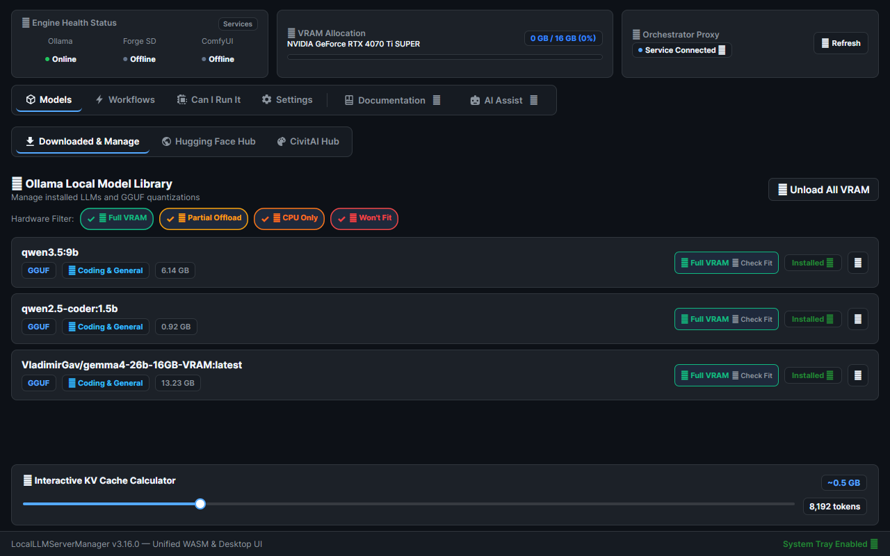
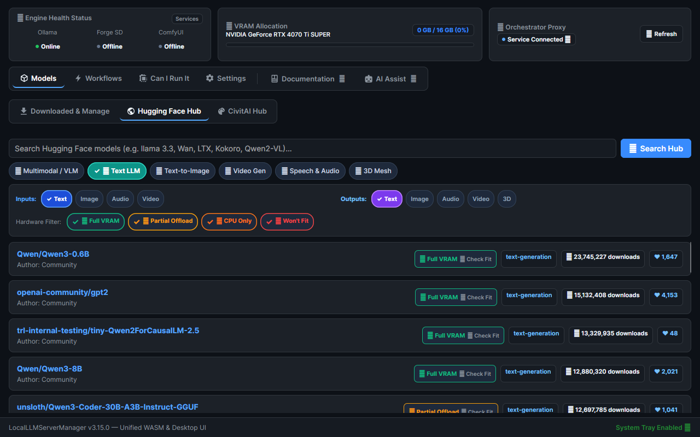
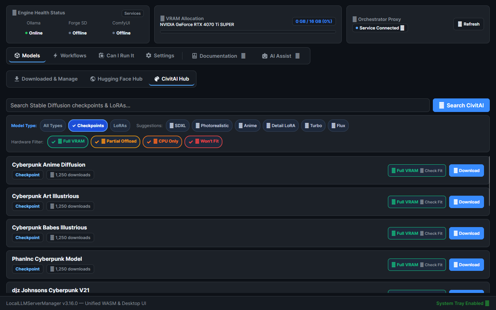
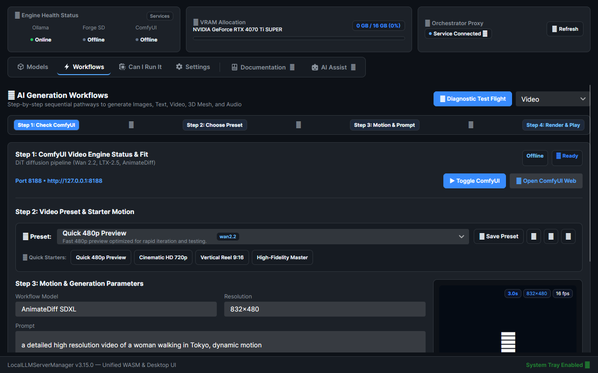
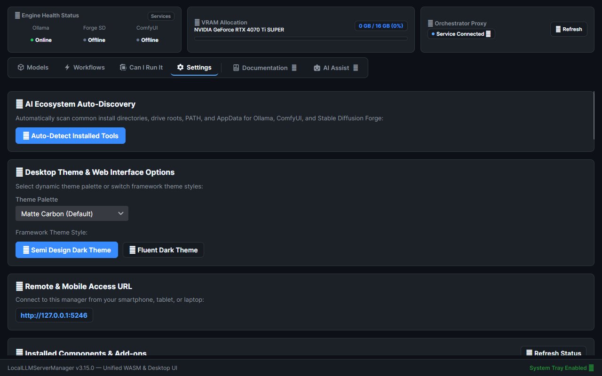

# Local LLM Server Manager — Detailed User Guide

Welcome to the **Local LLM Server Manager (v3.8.0)**. This guide will walk you through the main tabs of the dashboard, showing you how to manage your local AI engines (Ollama, Stable Diffusion / Forge, ComfyUI, and Kokoro TTS), configure your settings, and successfully generate text, images, 3D models, video, and speech.

---

## 1. My Models (Dashboard & VRAM Orchestrator)

The **My Models** tab is your home base for monitoring your system's hardware telemetry and active language models.



### Features:
* **VRAM Monitor:** At the top of the screen, you will see a visual representation of your GPU's VRAM. It accurately reads your hardware (e.g. `NVIDIA GeForce RTX 4070 Ti SUPER — 16 GB`) and shows a stacked bar representing free vs. used memory.
* **Model Capabilities Profile:** Installed models are grouped and tagged with capabilities (e.g., *Coding*, *Reasoning*, *Chat*). 
* **KV Cache Estimator:** Click on a model to view its details, where you can use the **Context Length Slider** to estimate how much VRAM a specific context length (up to 32K tokens) will require.
* **VRAM Orchestrator:** If your GPU gets full, the orchestrator will automatically unload idle text models when you try to run heavy image/video generations in the background.


**How to Use:**
To run a model in a frontend chat UI (like Open WebUI or LibreChat), simply select the model there. The Local LLM Server Manager proxy will wake up Ollama on port `11434` and transparently route the generation request while updating your VRAM usage bar live.

---

## 2. Find & Download Models

This tab integrates directly with the **Hugging Face Hub (GGUF)** and the **Ollama Official Library** so you can pull models natively without touching the command line.



### Sub-tabs:
* **Hugging Face Hub (GGUF):** Search for community-quantized models. 
  * *Sample search:* Type `DeepSeek-R1-Distill-GGUF` or `Llama-3.2`. 
  * Click on a model repository to view a list of quantization sizes (e.g., `Q4_K_M` which is a good balance of size and quality, or `Q8_0` for high fidelity).
  * Select your desired `.gguf` file and hit **Pull Selected**. The dashboard will stream the download progress directly to your screen.
* **Ollama Library:** Provides one-click pulls for the most popular models.
  * *Sample models:* Click **Pull 14B (7.9 GB)** under the `phi3` card, or **Pull 7B (4.7 GB)** under `qwen2.5-coder`.

**Changing Settings (Multiple Models):**
Ollama can run multiple models simultaneously. To do this, edit your system environment variables and set `OLLAMA_MAX_LOADED_MODELS=3`. 

---

## 3. Stable Diffusion (CivitAI Integration)

The Stable Diffusion tab allows you to configure your Forge engine and seamlessly download new image generation assets from **CivitAI**.



### Configuring Your Engine:
1. At the top of the tab, look for **Forge / SD Models Directory**.
2. Type in your absolute path (e.g. `C:\AI\SD_Forge\models`).
3. Click **Save Path**. This updates your `settings.json` so downloads go exactly where they need to.
4. You can boot or stop the SD Forge engine directly using the **Boot SD Forge** and **Stop SD Forge** UI controls. The app relies on Win32 Job Objects to manage these background processes cleanly.

### CivitAI Search & Download:
* **Search:** Look up popular models. *Sample text:* `"RealisticVision"`, `"DreamShaper"`, or `"Flux"`.
* **Filters:** Use the dropdowns to search by type (*Checkpoint, LoRA, VAE, Embedding*) or Sort by *Highest Rated*.
* **Download:** Click on a result to view its details and thumbnail. Choose the specific version you want, and click **⬇ Download to Forge**. The file will stream directly to your configured directory.

---

## 4. Multimodal Studio (Images, 3D Mesh, Video & Audio)

The Studio tab provides a unified creative environment for image generation, 3D mesh reconstruction, video synthesis, and audio generation via ComfyUI and local AI engines.



### Studio Modes:
1. **🎨 Images**: Generate high-fidelity images using FLUX, SDXL, or SD 1.5 with ComfyUI or SD Forge.
2. **📦 3D Mesh**: Reconstruct 3D meshes using **TRELLIS V2** and **Hunyuan3D v2** with interactive 360° orbital WebGL viewer.
3. **🎬 Video Generation**:
   * **Supported Models**: **Wan 2.2** (Text-to-Video and Image-to-Video), **LTX-2.5**, and **HunyuanVideo 1.5**.
   * **Controls**: Set prompt, negative prompt, resolution (Width x Height), frame count, FPS, and seed.
   * **Interactive Video Player**: Preview generated MP4 videos directly in the desktop or web dashboard with scrub controls, loop toggle, playback speed selector (0.5x–2x), and metadata badges.
4. **🎵 Audio & Speech Synthesis**:
   * **Kokoro TTS Engine**: Text-to-Speech synthesis with 50+ high-quality voices (`af_heart`, `am_adam`, etc.) and native OpenAI-compatible `/v1/audio/speech` proxy.
   * **Stable Audio Open 3.0**: Generate realistic sound effects, ambient audio, and instrumental samples.
   * **YuE Music Generator**: Generate full-length songs with dual-track lyrics and melody generation.
   * **Waveform Visualizer**: Live interactive waveform display with scrub bar, duration badges, and download button.

---

## 5. Settings, Engine Controls & Modular Feature Packs

The Settings tab provides centralized configuration for engine endpoints, model directories, and optional component management.



### Key Features:
* **🔍 Auto-Detect Installed Tools**: One-click scanner that discovers Ollama, ComfyUI, Forge, and Kokoro TTS installations across all storage drives.
* **Feature Packs (Modular Components)**:
  * **Core**: Ollama LLM management, Hugging Face Hub, CivitAI downloader.
  * **Video Feature Pack (`ext_video`)**: Video ComfyUI workflow presets, models, and video player preview tools.
  * **Audio Feature Pack (`ext_audio`)**: Kokoro TTS engine scripts, Stable Audio presets, and waveform audio player.
  * You can install or uninstall optional packs on-demand directly from the Settings tab without restarting your system.
* **Connection Endpoints**: Configure HTTP ports for Ollama (`:11434`), SD Forge (`:7860`), ComfyUI (`:8188`), and Audio Engine (`:8880`).
* **Storage Paths**: Set custom directories for models, output videos, audio files, and 3D meshes.

---

## 6. Cross-Platform Linux & Remote SSH Workflow

Local LLM Server Manager supports native Linux execution and remote SSH viewing.

### Running on Linux Desktop (Native GUI)
Launch the desktop application directly from your Linux terminal or application menu:
```bash
localllmmanager
```
This opens the native Avalonia UI dark desktop window on X11 and Wayland display environments.

### Working Remotely over SSH
To access all features of the manager from a remote machine:
1. Establish an SSH connection with port forwarding for port `5246`:
   ```bash
   ssh -L 5246:localhost:5246 user@linux-host
   ```
2. Start the headless service on the remote Linux host:
   ```bash
   sudo systemctl start localllmmanager
   # or run directly: dotnet run -- --service
   ```
3. Open `http://localhost:5246` in your local client browser. You get 100% of the UI functionality (VRAM telemetry, Hugging Face search, CivitAI downloader, 3D WebGL viewer) at native speed with zero lag over SSH.
