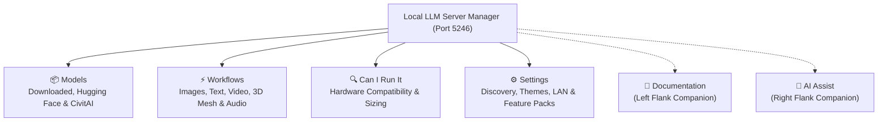
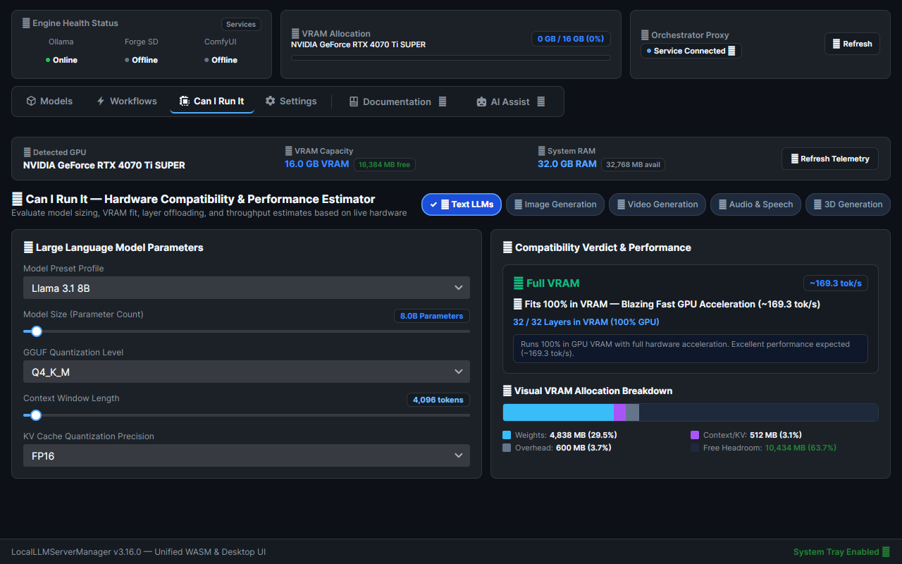
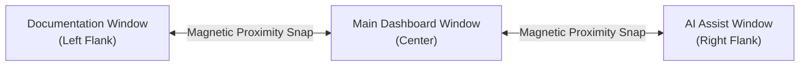

# Local LLM Server Manager — User Guide Hub

Welcome to the **Local LLM Server Manager (v3.16.0)** User Guide. This document provides a complete guide to operating the dashboard, configuring local AI engines, and using generative studio tools.

---

## Workspace Navigation

The desktop application organizes capabilities into dedicated workspaces with docked companion windows:

---

## 1. Hardware Telemetry & My Models

The **Models** workspace monitors active hardware metrics and manages local model weights.

### Key Capabilities
* **Live VRAM Bar**: Displays total, used, and free GPU memory in real time via NVML CUDA telemetry.
* **Model Capability Badges**: Identifies model capabilities (e.g., `Coding & General`, `Reasoning`, `Math`).
* **Interactive KV Cache Estimator**: Drag the context length slider (up to 32,768 tokens) to preview memory consumption before loading models.
* **VRAM Orchestrator**: Automatically frees GPU memory before heavy diffusion or 3D tasks start.
* **Unload All VRAM Button**: Releases all active models from GPU memory with a single click.

> [!TIP]
> Read the complete [Engines & VRAM Guide](./engines/index.md) and [Ollama Engine Guide](./engines/ollama.md).

---

## 2. Model Discovery & Downloads

Download models directly without opening a web browser or using terminal commands.

### Hugging Face Hub (GGUF & Multimodal)
Search community repositories, compare quantization levels (`Q4_K_M`, `Q8_0`), filter by input/output modalities, and stream downloads to disk.

### CivitAI Model Hub (Checkpoints & LoRAs)
Search diffusion checkpoints, LoRA style adapters, and VAE models with real-time download counters and hardware compatibility badges.

> [!TIP]
> Read the [Model Hubs & Downloads Guide](./engines/model-management.md) and [LoRA Art Styles Guide](./studio/lora-styles.md).

---

## 3. Hardware Fit Calculator (Can I Run It)

The **Can I Run It** workspace estimates whether an AI model fits within your system memory before downloading files.

### Key Capabilities
* **Live GPU Detection**: Queries your graphics card and system memory automatically.
* **Multi-Modality Sizing**: Calculates memory consumption for Text LLMs, Diffusion Images, Video, Audio, and 3D Mesh models.
* **Visual Allocation Bar**: Color-coded breakdown of Model Weights, Context/KV Cache, CUDA Overhead, and Free Headroom.
* **Layer Offloading Calculation**: Predicts the exact number of transformer layers that fit in GPU VRAM versus CPU RAM.
* **Performance Throughput**: Provides real-time token per second estimates for your hardware.

> [!TIP]
> Read the dedicated [Can I Run It Hardware Fit Guide](./guide/can-i-run-it.md).

---

## 4. Multimodal Generation Workflows

The **Workflows** workspace provides generation pipelines across five creative modalities:

| Modality | Supported Models | Output Formats | Dedicated Guide |
| :--- | :--- | :--- | :--- |
| **Image Generation** | FLUX.1, SDXL, SD 1.5 | PNG, WebP | [Image Generation Guide](./studio/image-generation.md) |
| **Video Generation** | Wan 2.2, LTX-Video 2.5, HunyuanVideo | MP4 | [Video Generation Guide](./studio/video-generation.md) |
| **Audio & Speech** | Kokoro TTS, Stable Audio Open, YuE | WAV, MP3 | [Audio & Music Guide](./studio/audio-and-music.md) |
| **3D Mesh** | TRELLIS V2, Hunyuan3D v2 | GLB, OBJ | [3D Mesh Guide](./studio/3d-mesh.md) |

### Real Engine Test Flight
Before starting complex renders, use the **Test Flight** control panel in the studio header:
1. Select your target modality (**Text**, **Image**, **Video**, or **Audio**).
2. Choose a starter prompt.
3. Click **🚀 Launch Test Flight**.
4. The system validates network readiness and GPU memory in seconds.

> [!TIP]
> Read the [Real Engine Test Flight Guide](./getting-started/test-flight.md).

---

## 5. In-App AI Assistant & Companion Windows

The **AI Assistant** workspace provides interactive guidance, screenshot diagnostics, and app control without consuming local GPU memory.

### Key Capabilities
* **External Gateway**: Connects to LiteLLM or Vertex AI Gemini Flash to keep local GPU memory free for generation.
* **Multimodal Attachments**: Paste screenshots (**Ctrl+V**) to diagnose ComfyUI errors or review outputs.
* **Magnetic Companion Windows**: Detach the assistant into a floating window that docks magnetically to the right flank.
* **Lockstep Movement**: Moving the main window moves docked companion windows automatically.

> [!TIP]
> Read the [AI Chat Assistant Guide](./ai-and-mcp/assistant.md) and [Magnetic Companion Windows Guide](./guide/companion-windows.md).

---

## 6. Application Settings & Engine Controls

The **Settings** workspace centralizes engine paths, port bindings, and optional component management.

### Key Settings
* **Auto-Detect Installed Tools**: Scans system drives to locate Ollama, ComfyUI, Forge, and Kokoro TTS automatically.
* **Modular Feature Packs**: Install or remove `ext_video` and `ext_audio` packages on demand.
* **Network Endpoints**: Displays auto-detected LAN IP addresses and remote MCP connection URLs.

> [!TIP]
> Read the [First-Time Configuration Guide](./getting-started/configuration.md) and [Remote Access Guide](./getting-started/remote-access.md).

---

## Comprehensive Guides Index

- **Getting Started**:
  - [Overview & Requirements](./getting-started/index.md)
  - [Installation Guide](./getting-started/installation.md)
  - [First-Time Configuration](./getting-started/configuration.md)
  - [Quickstart Guide](./getting-started/quickstart.md)
  - [Can I Run It Hardware Fit](./guide/can-i-run-it.md)
  - [Real Engine Test Flight](./getting-started/test-flight.md)
  - [Remote Access & Reverse Proxy](./getting-started/remote-access.md)
  - [Troubleshooting](./getting-started/troubleshooting.md)
- **Engines & Models**:
  - [Engines & VRAM Overview](./engines/index.md)
  - [Ollama LLM Engine](./engines/ollama.md)
  - [Stable Diffusion Forge](./engines/sd-forge.md)
  - [ComfyUI Engine](./engines/comfyui.md)
  - [Kokoro TTS Engine](./engines/kokoro-tts.md)
  - [Model Hubs & Downloads](./engines/model-management.md)
- **Multimodal Studio**:
  - [Studio Overview](./studio/index.md)
  - [Image Generation](./studio/image-generation.md)
  - [LoRA Art Styles & CivitAI](./studio/lora-styles.md)
  - [Video Generation](./studio/video-generation.md)
  - [Audio & Music Synthesis](./studio/audio-and-music.md)
  - [3D Mesh Reconstruction](./studio/3d-mesh.md)
  - [ComfyUI & 3D Setup](./studio/comfyui-setup.md)
- **AI & MCP Automation**:
  - [AI & MCP Overview](./ai-and-mcp/index.md)
  - [AI Chat Assistant](./ai-and-mcp/assistant.md)
  - [Magnetic Companion Windows](./guide/companion-windows.md)
  - [Model Context Protocol (MCP) Tools](./ai-and-mcp/mcp-tools.md)
  - [Workflow Presets](./ai-and-mcp/flows-and-presets.md)
- **Technical Reference**:
  - [System Architecture](./technical/architecture.md)
  - [Development & Build Guide](./technical/development.md)
  - [Collaborative UI Debugging](./guide/collaborative-debugging.md)
  - [Requirements Specification](./technical/requirements.md)
  - [Windows Process Validation](./technical/validation.md)
  - [Test Coverage Benchmarks](./technical/test-coverage.md)
  - [AI Assistant Internals](./technical/ai-assistant-internals.md)
