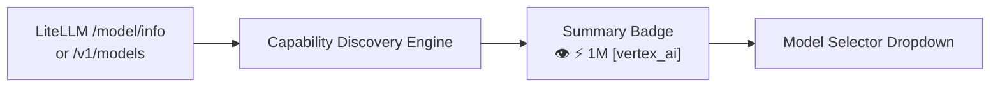

# AI Chat Assistant

The AI Chat Assistant provides an interactive copilot directly inside Local LLM Server Manager. You can control local engines, inspect hardware metrics, and troubleshoot generation errors through plain-language dialogue.

---

## Open the AI Assistant

Follow these steps to access the assistant interface:

1. Launch **Local LLM Server Manager**.
2. Click the **AI Assistant** tab in the top navigation bar.
3. Verify that the chat view loads with the header toolbar, suggestion chips, and composer bar.

```
+-----------------------------------------------------------------------+
|  🤖 AI Assistant & App Copilot       Model: gemini-2.5-flash   [Setup]|
+-----------------------------------------------------------------------+
|                                                                       |
|  [Chat Message History Area]                                          |
|                                                                       |
+-----------------------------------------------------------------------+
|  [⚡ Check live VRAM]  [🦙 Can I run Llama 70B?]  [🎨 Generate image]  |
+-----------------------------------------------------------------------+
|  [📎] [Enter prompt here...]                    [👁️ ⚡ 1M] [🚀 Send]    |
+-----------------------------------------------------------------------+
```

---

## Configure the Connection Gateway

The assistant requires a connection to an external gateway, such as a LiteLLM proxy or Vertex AI endpoint.

Follow these steps to configure your connection:

1. Click **⚙️ Setup & Endpoint** in the upper-right toolbar.
2. Enter your gateway URL in the **OpenAI-Compatible Endpoint URL** field (for example, `http://127.0.0.1:4000/v1`).
3. Enter your secret credential in the **API Key** field. Leave this field blank if your local LiteLLM server does not require authentication.
4. Enter the default model name in the **Model Identifier** field (for example, `vertex_ai/gemini-2.5-flash`).
5. Click **⚡ Test Connection**. The application validates network latency and queries available models.
6. Click **💾 Save Settings** to store your configuration in `settings.json`.

> [!TIP]
> Run a local LiteLLM container on port `4000`. LiteLLM translates OpenAI format requests into Google Vertex AI Gemini Flash calls with zero local GPU usage.

---

## Select Models & Inspect Capability Badges

The composer bar features a dynamic model selector dropdown. The discovery engine inspects remote model metadata and renders compact capability badges.



### Capability Badge Reference

Each badge informs you about the features supported by that specific model:

| Badge Icon | Capability Name | Meaning |
| :--- | :--- | :--- |
| `👁️` | **Vision** | The model accepts image attachments alongside text prompts. |
| `⚡` | **Function Calling** | The model supports autonomous tool calling and application control. |
| `1M` / `128k` | **Context Window** | The maximum input token capacity (`1M` = 1,000,000 tokens, `128k` = 128,000 tokens). |
| `[provider]` | **Provider Tag** | Identifies the hosting backend (e.g. `[vertex_ai]`, `[openai]`, `[anthropic]`). |

### Common Model Examples

* `👁️ ⚡ 1M [vertex_ai]` (`vertex_ai/gemini-2.5-flash`): Accepts images, executes tools, and supports massive 1-million-token contexts.
* `👁️ ⚡ 128k [openai]` (`gpt-4o`): Accepts images and executes tools with a 128,000-token context.
* `⚡ 128k [anthropic]` (`claude-3-5-haiku`): Fast text reasoning and tool calling without image input.

### Local Model Exclusion Filter

By default, the assistant excludes local LLMs (such as models hosted directly in Ollama) from the assistant dropdown.

> [!IMPORTANT]
> The assistant excludes local LLMs intentionally. Running assistant queries on local GPUs consumes memory needed for diffusion rendering and audio synthesis. External models guarantee zero VRAM impact on your creative engines.

---

## Attach Multimodal Images

You can supply visual context to vision-enabled models. Attach screenshots of ComfyUI errors, generation outputs, or reference pictures.

### Add Attachments

Choose one of the following methods to attach an image:

* **File Browser**: Click the attachment button (**📎**) next to the prompt text box. Select a `PNG`, `JPG`, `WEBP`, or `GIF` image.
* **Clipboard Paste**: Capture a screenshot with your operating system shortcut. Click inside the prompt text box and press **Ctrl+V**.

### Manage the Staged Image Tray

Staged images appear in a preview tray directly above the text box:

1. Review the generated thumbnail and filename.
2. Click the remove button (**✕**) on any card to delete unwanted attachments before sending.
3. Type your question (for example: *"Review this error message and suggest the correct resolution"*).
4. Click **🚀 Send** or press **Enter**.

```
+-----------------------------------------------------------------------+
| Staged Attachments:                                                   |
| [🖼️ error_screenshot.png  ✕]  [🖼️ comfyui_graph.png  ✕]              |
+-----------------------------------------------------------------------+
| [📎] Why did this ComfyUI node fail?            [👁️ ⚡ 1M] [🚀 Send]   |
+-----------------------------------------------------------------------+
```

---

## Tool Execution & Safety Controls

When you ask the assistant to perform an action, the model executes native C# tools autonomously.

### Inline Execution Cards

During tool calling, the assistant displays an execution card inside the chat response bubble:

* **Tool Name**: Displays the executed function (e.g., `get_gpu_vram_telemetry`).
* **Execution Time**: Shows tool duration in milliseconds.
* **Arguments**: Details the parameter values sent to the tool.
* **Result**: Displays the response data returned to the model.

```
+-------------------------------------------------------------------+
| 🤖 Copilot                                               14:32    |
|                                                                   |
| +---------------------------------------------------------------+ |
| | ⚡ Tool: calculate_hardware_fit                       12 ms   | |
| | Args: {"modelName": "llama3.3:70b", "quantization": "Q4_K_M"} | |
| | Result: {"verdict": "PERFECT FIT", "vramRequiredMb": 41200}   | |
| +---------------------------------------------------------------+ |
|                                                                   |
| Llama 3.3 70B in Q4_K_M quantization fits comfortably in your    |
| configured 48 GB VRAM pool.                                       |
+-------------------------------------------------------------------+
```

### Safety and Approval Boundaries

The assistant operates under strict safety policies defined in `Prompts/app-control.md`:

* The assistant cannot modify sensitive system directories or arbitrary executable paths.
* Sensitive values like API keys appear masked in tool outputs.
* You can cancel any running operation immediately by clicking **⏹️ Stop**.

> [!WARNING]
> Do not share your screen or logs while displaying unmasked API tokens. Always keep secret credentials in your private configuration files.

---

## Toolbar Actions & Quick Chips

### Suggestion Chips
Click any suggestion chip above the composer to trigger pre-built diagnostic tasks:

* **⚡ Check live VRAM and GPU telemetry**: Queries active VRAM allocation.
* **🦙 Can I run Llama 3.3 70B**: Runs a memory fit calculation.
* **🎨 Generate a scenic landscape**: Submits a prompt to your default image engine.
* **🛑 Unload all models from VRAM**: Frees GPU memory immediately.

### Header Controls
* **🔄 Reload Prompts**: Flushes cached markdown prompt files from memory immediately.
* **🧹 Clear Chat**: Deletes conversation history and resets token context.

---

## Related Documentation

* [Model Context Protocol (MCP) Tools](./mcp-tools.md): Learn how external agents access application tools.
* [Living Prompts & Workflow Presets](./flows-and-presets.md): Customize system prompts and automated workflows.
* [AI Assistant Technical Internals](../technical/ai-assistant-internals.md): Read the technical architecture specification.
