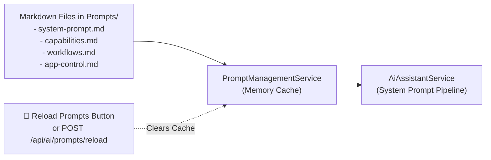
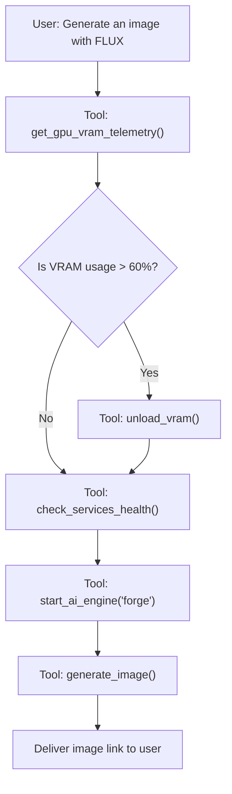

# Living Prompts & Workflow Presets

Local LLM Server Manager separates system instructions from compiled application code. The assistant reads instructions from modular markdown files called **Living Prompts**.

---

## What are Living Prompts?

Most AI tools hardcode system prompts directly into compiled binaries. Changing instructions requires code modifications and a software rebuild.

Local LLM Server Manager stores instructions as markdown documents in the `Prompts/` directory. You can edit prompt rules, adjust persona guidelines, and define automated multi-step workflows in any text editor. The application loads your updates immediately without requiring a restart.

---

## The Core Prompt Files

The `Prompts/` directory contains four modular templates:

| Prompt Document | Primary Focus | Contents |
| :--- | :--- | :--- |
| `system-prompt.md` | Persona & Identity | Defines assistant tone, operational responsibilities, and safety rules. |
| `capabilities.md` | Capabilities Reference | Documents port numbers, model sizing formulas, and engine endpoints. |
| `workflows.md` | Procedural Guides | Defines step-by-step sequences for image, video, audio, and VRAM switching. |
| `app-control.md` | Tool Control Rules | Governs tool invocation rules, argument validation, and error policies. |

---

## Template Details

### 1. `system-prompt.md` (Persona & Identity)
Sets the core identity of the assistant:
* **Persona**: Defines the assistant as the intelligent copilot for Local LLM Server Manager.
* **Tone**: Enforces concise, technically precise, and actionable communication.
* **Operating Rules**: Instructs the model to invoke tools proactively instead of asking the user to click buttons manually.

### 2. `capabilities.md` (Capabilities Reference)
Acts as the technical manual for the assistant:
* **Port Numbers**: Documents default ports for Ollama (`11434`), Forge (`7860`), ComfyUI (`8188`), and Kokoro TTS (`8880`).
* **Hardware Thresholds**: Defines memory sizing rules and fit badges (`PERFECT FIT`, `TIGHT FIT`, `RAM OFFLOAD`, `WILL NOT FIT`).
* **Video Capabilities**: Documents Diffusion Transformer (DiT) models like Wan 2.2 and LTX-Video 2.5.

### 3. `workflows.md` (Procedural Guides)
Instructs the assistant on multi-step task execution:
* **LLM Setup**: Check VRAM -> Calculate fit -> Check health -> Pull model.
* **Image Generation**: Inspect VRAM -> Unload LLM if memory is low -> Start image engine -> Generate image.
* **Video Generation**: Confirm 8 GB+ VRAM -> Verify ComfyUI status -> Queue video workflow.
* **Speech Synthesis**: Validate voice identifier -> Dispatch text to Kokoro TTS.

### 4. `app-control.md` (Tool Control Rules)
Defines exact triggers for calling application tools:
* Specifies which tool to run for specific user queries.
* Prohibits access to blocked system paths or unsafe directories.
* Mandates clear natural language summaries of returned JSON metrics.

---

## Directory Resolution Order

The `PromptManagementService` searches for the `Prompts/` directory in this exact order:

1. Directory path configured in `AppSettings.AiAssistantPromptsDirectory`.
2. Application base folder at `<AppBaseDir>/Prompts/`.
3. Current working directory at `<CurrentWorkingDir>/Prompts/`.
4. Development repository candidate directories.

> [!NOTE]
> To configure a custom prompts folder, open the **Settings** tab. Set your target directory path in the **AI Assistant Prompts Directory** field.

---

## Hot-Reload Prompts in Real Time

You can modify prompt files while Local LLM Server Manager is running.

Follow these steps to update and reload prompts:

1. Open any markdown file inside `Prompts/` using your preferred text editor.
2. Edit the prompt text (for example, add a custom workflow or adjust tone guidelines).
3. Save the file to disk.
4. Navigate to the **AI Assistant** tab in Local LLM Server Manager.
5. Click **🔄 Reload Prompts** in the header toolbar.
6. The assistant flushes its internal cache immediately. Your next chat interaction uses the new prompt content.

> [!TIP]
> You can also trigger a cache reload programmatically by sending an HTTP POST request to `/api/ai/prompts/reload`.

---

## Workflow Presets & Task Automation

You can combine multiple engines into unified automation chains. Add custom workflow definitions to `Prompts/workflows.md` to teach the assistant new procedures.

### Preset 1: Automated Script & Voiceover
Combines local text generation with speech synthesis:

1. The user asks for a spoken announcement.
2. The assistant generates a concise announcement script.
3. The assistant calls `synthesize_speech` with voice `af_heart`.
4. The assistant outputs the generated audio playback link.

### Preset 2: VRAM-Safe High-Resolution Imaging
Prevents GPU memory collisions when switching from chat to image rendering:

1. The assistant checks live GPU memory using `get_gpu_vram_telemetry`.
2. If an LLM occupies GPU VRAM, the assistant calls `unload_vram` to free memory.
3. The assistant starts Forge via `start_ai_engine("forge")`.
4. The assistant submits the prompt via `generate_image`.

### Preset 3: Hardware Fit & Automated Download
Evaluates system resources before initiating multi-gigabyte downloads:

1. The user asks: *"Can I run Qwen 2.5 Coder 32B?"*
2. The assistant calls `calculate_hardware_fit`.
3. If the result is `PERFECT FIT`, the assistant asks the user for download confirmation.
4. Upon confirmation, the assistant calls `pull_model("qwen2.5-coder:32b")`.

---

## Best Practices for Authoring Prompts

Follow these guidelines when editing prompt files:

* **Keep Rules Direct**: Use clear imperatives and short sentences.
* **State Trigger Conditions Clearly**: Specify exact phrases or intents that require tool execution.
* **Avoid Duplication**: Keep persona rules in `system-prompt.md` and tool policies in `app-control.md`.
* **Test Incrementally**: Reload prompts after editing each section and test with sample user prompts.

> [!IMPORTANT]
> Never put sensitive passwords or private API tokens in markdown prompt files. Store credentials securely in the application Settings tab.

---

## Related Documentation

* [AI & MCP Overview](./index.md): Understand the high-level architecture.
* [AI Chat Assistant](./assistant.md): Learn how the assistant renders chat messages.
* [Model Context Protocol (MCP)](./mcp-tools.md): Discover how MCP clients consume these tools.
* [AI Assistant Technical Internals](../technical/ai-assistant-internals.md): Read the full service implementation details.
