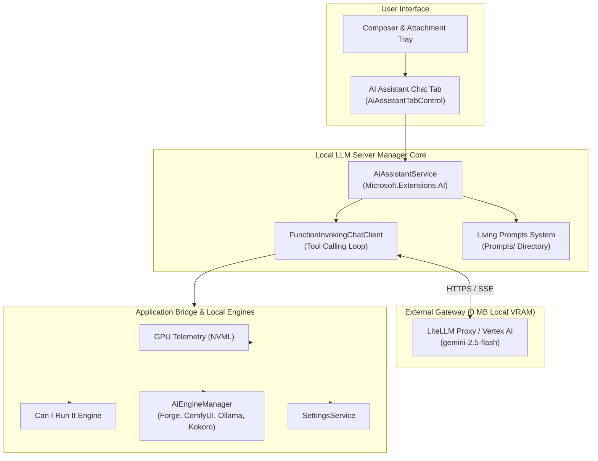

# AI & MCP Features Overview

Local LLM Server Manager provides an autonomous AI assistant and an integrated Model Context Protocol (MCP) server. The assistant gives you conversational control over local engines, hardware diagnostics, and creative workflows.

---

## Zero Local VRAM Architecture

Local generation engines consume significant GPU video memory. Stable Diffusion Forge, ComfyUI, and Ollama can fill all available VRAM during execution. Running a local assistant LLM simultaneously can cause CUDA out-of-memory errors or crash active rendering tasks.

Local LLM Server Manager solves this problem with a remote fallback architecture. The assistant routes chat requests and tool orchestration through an external API gateway. Supported gateways include:

* **LiteLLM Proxy**: Routes requests to models like Gemini 2.5 Flash, Claude 3.5 Haiku, or GPT-4o.
* **Google Cloud Vertex AI**: Connects directly to Google Gemini Flash endpoints.
* **OpenAI-Compatible Endpoints**: Connects to any standard remote API server.

This external architecture requires zero megabytes of local GPU video memory. Your graphics card remains completely free for local model inference and creative media generation.

> [!NOTE]
> External routing keeps the assistant operational during heavy generation tasks. You can query system health or unload memory even while rendering high-resolution images or video.

---

## Architectural Workflow

The diagram below shows how the AI assistant communicates with external models and local application subsystems:

---

## Key Capabilities

### 1. Conversational Application Control
Control the entire application using natural language. Instruct the assistant to start or stop backend engines, modify configuration values, and verify service health.

### 2. Multimodal Vision Support
Attach screenshots, error dialogs, or reference artwork to your prompts. The assistant analyzes images with vision-capable models to diagnose issues and explain results.

### 3. Real-Time Telemetry and Hardware Fitting
Check GPU VRAM allocation, hardware temperatures, and driver states. Ask the assistant to evaluate model compatibility before downloading large model files.

### 4. Creative Workflow Dispatch
Trigger image generation in Forge or ComfyUI, queue video rendering tasks, or synthesize speech audio with Kokoro TTS through simple chat instructions.

### 5. Living Prompts System
Customize assistant instructions through modular markdown documents on disk. Adjust persona guidelines, tool policies, and workflow procedures without recompiling the application.

### 6. Model Context Protocol (MCP) Host
Local LLM Server Manager runs a standard MCP server on port `5246` at `/mcp`. External tools like Claude Desktop or Cursor can discover and call application tools securely.

---

## Next Steps

Explore the detailed feature guides below:

* [AI Chat Assistant](./assistant.md): Learn how to open the assistant, select models, inspect capability badges, and attach images.
* [Model Context Protocol (MCP)](./mcp-tools.md): Discover available native tools, connect external MCP clients, and understand execution loops.
* [Living Prompts & Workflow Presets](./flows-and-presets.md): Customize markdown prompt templates and build multi-engine automation chains.
* [AI Assistant Technical Internals](../technical/ai-assistant-internals.md): Read the complete backend engineering and schema documentation.
