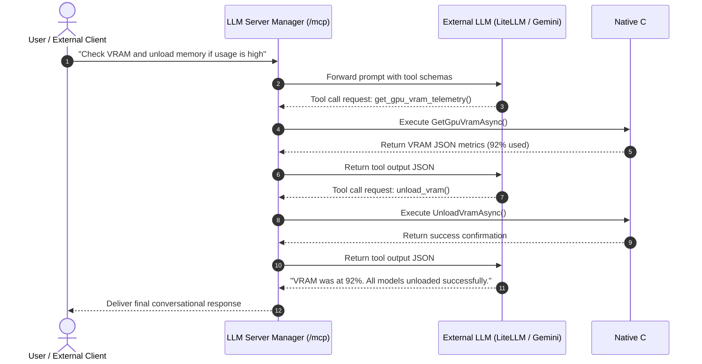

# Model Context Protocol (MCP) & Tools

Local LLM Server Manager integrates the Model Context Protocol (MCP). The application functions as an AI tool consumer and as a standards-compliant MCP server host.

---

## What is Model Context Protocol (MCP)?

The Model Context Protocol (MCP) is an open standard developed by Anthropic. MCP standardizes how AI applications connect with external tools, system telemetry, and data sources.

Instead of writing custom plugins for every client, MCP provides a unified communication interface. Local LLM Server Manager hosts a streamable HTTP and Server-Sent Events (SSE) endpoint at:

```
http://127.0.0.1:5246/mcp
```

External agents like Claude Desktop, Cursor, and command-line scripts can connect to this endpoint to inspect and control local AI engines.

> [!NOTE]
> The server complies with the MCP stateless specification. It exposes tools via standard JSON-RPC 2.0 messages over HTTP POST and SSE streams.

---

## Supported Built-in Tools

Local LLM Server Manager provides eight primary tool suites for native execution and external MCP consumption:

| Tool Identifier | Category | Primary Function |
| :--- | :--- | :--- |
| `get_gpu_vram_telemetry` | Telemetry | Reads real-time GPU allocation, total memory, used memory, and GPU name. |
| `calculate_hardware_fit` | Diagnostics | Evaluates memory fit across LLM, diffusion, and video models. |
| `check_services_health` | Operations | Verifies online status and latency for Ollama, Forge, ComfyUI, and Kokoro. |
| `start_ai_engine` / `stop_ai_engine` | Lifecycle | Launches or shuts down backend engine processes. |
| `unload_vram` | Memory | Flushes active models from GPU memory to prevent memory collisions. |
| `get_app_settings` / `update_app_setting` | Settings | Inspects and updates application configuration keys securely. |
| `list_installed_models` / `pull_model` | Catalog | Lists installed LLM models and pulls new weights from remote repositories. |
| `generate_image` / `generate_video` / `synthesize_speech` | Generation | Dispatches creative generation jobs to Forge, ComfyUI, or Kokoro TTS. |

---

## Deep Tool Specifications

### 1. VRAM Telemetry (`get_gpu_vram_telemetry`)
Queries hardware metrics directly through NVML CUDA or DirectML.

* **Parameters**: None.
* **Returned Data**: Total VRAM (MB), used VRAM (MB), free VRAM (MB), and GPU device name.
* **Example Prompt**: *"What is my current GPU memory usage?"*

### 2. Hardware Fit Engine (`calculate_hardware_fit`)
Calculates whether a target model fits into physical system hardware. The tool models parameter weights and KV cache memory requirements.

* **Parameters**:
  * `modelName` (string, required): Model architecture or file tag.
  * `parametersBillions` (number, optional): Model parameter size (e.g. `70.0`).
  * `quantization` (string, optional): Target quantization format (`Q4_K_M`, `FP8`, `Q8_0`).
  * `modality` (string, optional): Model category (`llm`, `diffusion`, `video`).
* **Returned Verdicts**:
  * `PERFECT FIT` (green): Model loads entirely into VRAM.
  * `TIGHT FIT` (amber): Model fits with minimal remaining memory headroom.
  * `RAM OFFLOAD` (yellow): Model splits layers between GPU VRAM and system RAM.
  * `WILL NOT FIT` (red): Model exceeds combined system memory resources.

### 3. Engine Manager (`start_ai_engine`, `stop_ai_engine`, `check_services_health`)
Controls the lifecycle of local engine processes.

* **Parameters for start/stop**: `engine` (`"forge"`, `"comfyui"`, or `"ollama"`).
* **Returned Data**: Process start status, process identifier (PID), or termination confirmation.
* **Health Check**: Probes ports `11434` (Ollama), `7860` (Forge), `8188` (ComfyUI), and `8880` (Kokoro) with a 2-second timeout.

### 4. Settings Manager (`get_app_settings`, `update_app_setting`)
Manages configuration values stored in `settings.json`.

* **Parameters for update**: `key` (string, required), `value` (string, required).
* **Security Guardrail**: Sensitive API keys always return masked as `******`.
* **Modifiable Keys**: `PreferredImageEngine`, `ComfyUiUrl`, `AudioEngineUrl`, `PreferredAudioVoice`, `SelectedThemeStyle`.

---

## Connect External MCP Clients

You can connect external desktop applications and coding agents to Local LLM Server Manager.

### Configure Claude Desktop

Follow these steps to connect Anthropic Claude Desktop:

1. Open the Claude Desktop configuration file:
   * **Windows**: `%APPDATA%\Claude\claude_desktop_config.json`
   * **macOS**: `~/Library/Application Support/Claude/claude_desktop_config.json`
2. Add the `local-llm-server-manager` entry under `mcpServers`:

```json
{
  "mcpServers": {
    "local-llm-server-manager": {
      "url": "http://127.0.0.1:5246/mcp"
    }
  }
}
```

3. Save the configuration file.
4. Restart **Claude Desktop**.
5. Click the hammer icon in the Claude composer bar. Verify that the Local LLM tools appear in the list.

> [!TIP]
> Ensure Local LLM Server Manager is running before launching your external MCP client. If you change the application port in Settings, update the URL in your configuration file.

---

## The Tool Calling Loop

The assistant uses `Microsoft.Extensions.AI.FunctionInvokingChatClient` to execute multi-turn tool loops automatically.



### Loop Execution Steps

1. The client submits a user prompt to the assistant service.
2. The service provides model schemas for all registered native tools.
3. The language model requests a tool call with specific arguments.
4. The invocation client intercepts the call and runs the C# method.
5. The method executes and returns a JSON result string.
6. The client passes the result back to the language model.
7. The model evaluates the result. If required, the model invokes another tool.
8. When the model completes all actions, the client streams the final answer to the user.

---

## Error Handling & Reliability

* **Graceful Degradation**: If an engine is offline, the tool returns an explicit error message instead of throwing an unhandled exception.
* **Strict Timeouts**: Health probes time out after 2 seconds. Creative generation tasks time out after 60 seconds.
* **Self-Correction**: Because tools return structured error messages, the language model can explain the exact missing setting or failed dependency to the user.

> [!IMPORTANT]
> If a tool fails due to a missing directory path, open the **Settings** tab in Local LLM Server Manager. Configure the executable path for the affected engine and retry the command.

---

## Related Documentation

* [AI Chat Assistant](./assistant.md): Learn how the in-app chat interface handles tool calls.
* [Living Prompts & Workflow Presets](./flows-and-presets.md): Customize the prompt rules governing tool selection.
* [AI Assistant Technical Internals](../technical/ai-assistant-internals.md): Read the technical C# interface definitions.
