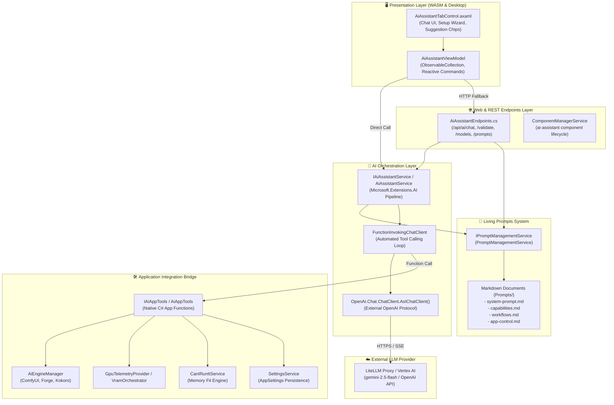
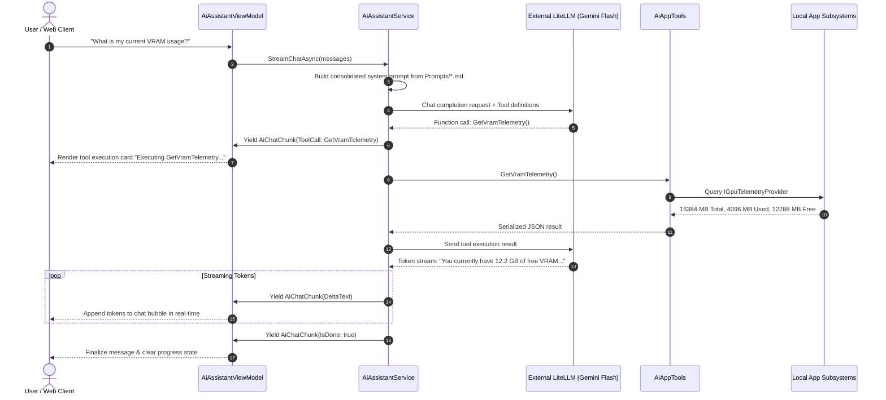

# In-App AI Assistant Architecture

The **In-App AI Assistant & Copilot** module enables natural language interaction, diagnostics, hardware estimation, and control within [LocalLLMServerManager](file:///C:/Users/Alias/repos/LocalLLMServerManager). Because local engines (Ollama, ComfyUI, Kokoro) may be offline or occupying precious VRAM, the assistant routes external queries to an external OpenAI-compatible API endpoint—specifically optimized for **LiteLLM** proxying to **Google Cloud Vertex AI Gemini Flash** (`vertex_ai/gemini-2.5-flash`).

---

## Architectural Overview

---

## Component Layers

### 1. Presentation Layer (UI/UX)
- **[AiAssistantViewModel](file:///C:/Users/Alias/repos/LocalLLMServerManager/LocalLLMServerManager.Shared/ViewModels/AiAssistantViewModel.cs)**:
  - Manages reactive state via `CommunityToolkit.Mvvm`: observable message history (`Messages`), user input text, loading state (`IsGenerating`), and setup wizard configuration.
  - Handles real-time streaming chunk updates (`DeltaText`) and tool execution events (`AiToolExecutionItem`).
  - Supports dual execution modes: direct in-process service execution when run in the native desktop app, and REST/SSE fallback (`/api/ai/chat`) when hosted in WebAssembly / browser clients.
- **[AiAssistantTabControl.axaml](file:///C:/Users/Alias/repos/LocalLLMServerManager/LocalLLMServerManager.Shared/Views/Controls/AiAssistantTabControl.axaml)**:
  - Claude / OpenWebUI-styled chat layout with custom message bubbles, status banners, tool execution progress cards, suggestion chips, and collapsible connection wizard.
  - Implements responsive styling using `DesignTokens.axaml` and `MatteTheme.axaml`.

### 2. Web API Endpoints Layer
- **[AiAssistantEndpoints.cs](file:///C:/Users/Alias/repos/LocalLLMServerManager/Endpoints/AiAssistantEndpoints.cs)**:
  - Exposes RESTful and SSE endpoints for frontend clients:
    - `GET /api/ai/status`: Reports assistant installation status, active endpoint, and loaded prompts.
    - `POST /api/ai/validate`: Validates credentials and endpoint connectivity with round-trip latency testing.
    - `GET /api/ai/models`: Queries available models on the external server (`/v1/models`).
    - `POST /api/ai/chat`: Non-streaming response (`AiChatResponse`) or Server-Sent Events streaming (`text/event-stream`).
    - `GET /api/ai/prompts` & `POST /api/ai/prompts/reload`: Inspects and hot-reloads living prompt files.
- **[ComponentManagerService](file:///C:/Users/Alias/repos/LocalLLMServerManager/Services/ComponentManagerService.cs)**:
  - Registers the `"ai-assistant"` pack alongside existing Video and Audio feature packs, allowing modular activation/deactivation.

### 3. Orchestration Layer
- **[IAiAssistantService](file:///C:/Users/Alias/repos/LocalLLMServerManager/LocalLLMServerManager.Shared/Interfaces/IAiAssistantService.cs) & [AiAssistantService](file:///C:/Users/Alias/repos/LocalLLMServerManager/Services/AiAssistantService.cs)**:
  - Implemented using Microsoft's official `Microsoft.Extensions.AI` standard abstraction.
  - Configures an `OpenAI.Chat.ChatClient` wrapped as `IChatClient` via `.AsIChatClient()`.
  - Decorated with `FunctionInvokingChatClient` to automatically parse LLM tool call requests, dispatch them to native C# methods, and feed tool execution results back to the LLM in an iterative loop.
  - Supports both multi-turn non-streaming chat (`SendChatAsync`) and asynchronous token streaming (`StreamChatAsync`).

### 4. Living Prompts System
- **[IPromptManagementService](file:///C:/Users/Alias/repos/LocalLLMServerManager/LocalLLMServerManager.Shared/Interfaces/IPromptManagementService.cs) & [PromptManagementService](file:///C:/Users/Alias/repos/LocalLLMServerManager/LocalLLMServerManager.Shared/Services/PromptManagementService.cs)**:
  - Loads prompt sections dynamically from markdown files located in `Prompts/`:
    - `system-prompt.md`: Identity, tone, and operational boundaries.
    - `capabilities.md`: Hardware sizing, multimodal engines, and API endpoints.
    - `workflows.md`: Execution steps for text, image, video, speech, and 3D pipelines.
    - `app-control.md`: Safe command invocation guidelines and natural language grammar.
  - Provides thread-safe caching with instant cache invalidation (`InvalidateCache()`) for runtime editing without application restarts.

### 5. Application Integration Bridge (App Control)
- **[IAiAppTools](file:///C:/Users/Alias/repos/LocalLLMServerManager/LocalLLMServerManager.Shared/Interfaces/IAiAppTools.cs) & [AiAppTools](file:///C:/Users/Alias/repos/LocalLLMServerManager/Services/AiAppTools.cs)**:
  - Exposes 12 native C# tools decorated with `[Description]` attributes for automated schema generation and LLM function invocation:
    1. `GetVramTelemetry`: Real-time GPU VRAM, total, used, free, and GPU name.
    2. `GetSystemHealth`: Status of all running backend AI engines.
    3. `ListInstalledModels`: Enumerates downloaded Ollama models and quantization details.
    4. `StartAiEngine`: Starts ComfyUI, SD-WebUI Forge, or Kokoro TTS.
    5. `StopAiEngine`: Shuts down target background engine.
    6. `UnloadAllVram`: Clears GPU VRAM allocations.
    7. `GetAppSettings`: Reads current configuration settings.
    8. `UpdateAppSetting`: Dynamically alters app settings.
    9. `EvaluateModelHardwareFit`: Runs the Can-I-Run-It estimation formula for LLMs, diffusion models, and video engines.
    10. `GenerateImage`: Dispatches an image generation prompt to the active ComfyUI/Forge engine.
    11. `SpeakText`: Triggers local Kokoro text-to-speech synthesis.
    12. `SearchDocumentation`: Performs full-text keyword searches across in-app ASD-STE100 user guides.

---

## Execution Sequence

