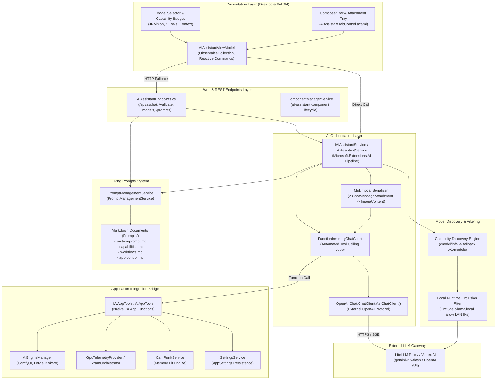
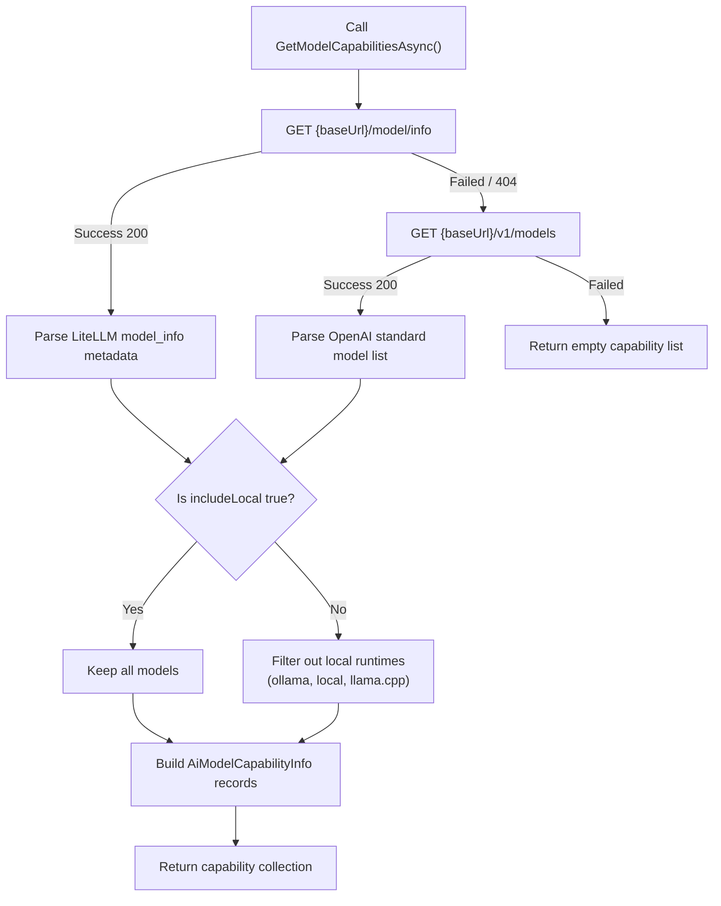
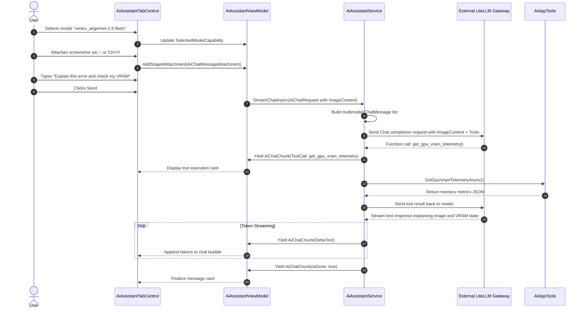

# In-AI Assistant Architecture

The In-AI Assistant provides natural language control and diagnostics for LocalLLMServerManager. Local engines run image, audio, and text generation on your graphics card. These local engines can consume all available video memory. Therefore, the assistant routes requests to an external API endpoint. The assistant uses a LiteLLM proxy connected to Google Cloud Vertex AI Gemini Flash.

::: info External Proxy Design
External routing keeps the assistant operational during heavy local generation tasks. The assistant requires zero megabytes of local GPU memory.
:::

---

## Architectural Overview

---

## Component Layers

### 1. Presentation Layer (UI/UX)

- **AiAssistantViewModel**:
  - Manages reactive state with `CommunityToolkit.Mvvm`.
  - Maintains `AvailableModelCapabilities` (`ObservableCollection<AiModelCapabilityInfo>`).
  - Synchronizes `SelectedModelCapability` with the active `SelectedModel`.
  - Manages `StagedAttachments` (`ObservableCollection<AiChatMessageAttachment>`).
  - Supports image paste actions from the system clipboard.
  - Supports dual execution: direct C# service calls in desktop mode and REST/SSE fallback in web mode.

- **AiAssistantTabControl.axaml**:
  - Implements a responsive chat interface styled with `DesignTokens.axaml`.
  - Features an interactive composer bar with:
    - **Model Selector Dropdown**: Displays models with compact capability badges (`👁️`, `⚡`, `1M`).
    - **Attachment Button (📎)**: Opens a file picker for images (`PNG`, `JPG`, `WEBP`, `GIF`).
    - **Clipboard Paste**: Captures `Ctrl+V` key events on the text input to stage images directly.
    - **Staged Image Tray**: Shows image preview thumbnails with removal buttons (`✕`).
    - **Status Indicators**: Shows tool execution cards and streaming token text.

### 2. Model Discovery and Exclusion Layer

The discovery engine queries remote endpoints to identify model capabilities.

#### LiteLLM Discovery Protocol
1. The service requests `GET {baseUrl}/model/info`.
2. LiteLLM returns rich capability metadata:
   - `max_input_tokens` and `max_output_tokens`.
   - `supports_vision` and `supports_function_calling`.
   - `litellm_provider` and deployment mode.
3. If `/model/info` fails, the service falls back to `GET {baseUrl}/v1/models`.
4. The fallback inspects model identifiers to infer vision and tool capabilities.

#### Local Model Exclusion Rules
LiteLLM can route requests to local engines. However, assistant requests must not use local GPU memory.

::: warning Exclusion Rule Logic
Do not filter models by IP address. LiteLLM frequently runs on local addresses (`127.0.0.1`) or local area network IPs.
Filter models strictly by provider name or model identifier prefix.
:::

- **Excluded Providers**:
  - `ollama`
  - `local`
  - `llama.cpp`
  - `vllm_local`
- **Excluded ID Prefixes**:
  - `ollama/`
  - `local/`
  - `llama/`
  - `ollama_chat/`
- **Exclusion Toggle**: Set query parameter `includeLocal=true` on `GET /api/ai/models` to include local models.

### 3. Web API Endpoints Layer

- **AiAssistantEndpoints.cs**:
  - `GET /api/ai/status`: Reports assistant installation status and active endpoint.
  - `POST /api/ai/validate`: Validates credentials with round-trip latency checks.
  - `GET /api/ai/models`: Returns `List<AiModelCapabilityInfo>`. Accepts `endpoint`, `apiKey`, and `includeLocal` parameters.
  - `POST /api/ai/chat`: Executes chat completions. Accepts multimodal message attachments.
  - `GET /api/ai/prompts`: Returns loaded system prompt sections.
  - `POST /api/ai/prompts/reload`: Flushes prompt memory caches immediately.

### 4. Orchestration and Multimodal Pipeline

- **IAiAssistantService & AiAssistantService**:
  - Built on `Microsoft.Extensions.AI` abstractions.
  - Serializes `AiChatMessageAttachment` instances into `Microsoft.Extensions.AI.ImageContent`.
  - Supports binary byte buffers and base64 data URIs.
  - Wraps `OpenAI.Chat.ChatClient` with `FunctionInvokingChatClient`.
  - Automatically executes native C# tools and returns results to the language model.
  - Streams tokens asynchronously via `StreamChatAsync`.

### 5. Living Prompts System

- **IPromptManagementService & PromptManagementService**:
  - Loads markdown files from the `Prompts/` directory:
    - `system-prompt.md`: Defines tone and operational boundaries.
    - `capabilities.md`: Defines hardware sizing and multimodal capabilities.
    - `workflows.md`: Defines execution steps for image, video, and audio tasks.
    - `app-control.md`: Defines safety rules for app tool calls.
  - Caches prompt content in memory.
  - Provides immediate cache invalidation through `InvalidateCache()`.

### 6. Application Integration Bridge (App Control)

- **IAiAppTools & AiAppTools**:
  - Exposes 12 native C# tools for autonomous LLM function calling:
    - `GetGpuVramTelemetryAsync`: Reads live GPU memory usage.
    - `CheckServicesHealthAsync`: Checks backend engine health.
    - `ListInstalledModelsAsync`: Lists installed local Ollama models.
    - `StartAiEngineAsync`: Starts ComfyUI, Forge, or Ollama.
    - `StopAiEngineAsync`: Stops running backend engines.
    - `UnloadVramAsync`: Flushes models from video memory.
    - `GetAppSettingsAsync`: Reads application settings.
    - `UpdateAppSettingAsync`: Updates configuration values.
    - `CalculateHardwareFitAsync`: Calculates model memory fit.
    - `GenerateImageAsync`: Triggers local image generation workflows.
    - `SynthesizeSpeechAsync`: Generates speech with Kokoro TTS.
    - `QueryAppDocumentationAsync`: Searches local documentation guides.

---

## Multimodal Execution Sequence

