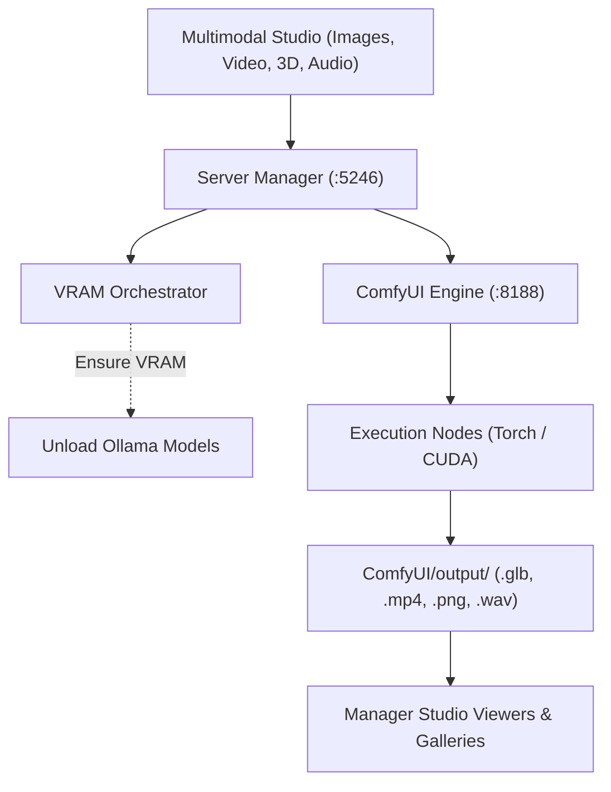

# ComfyUI Engine Integration

ComfyUI is a modular, node-based graph execution engine for generative AI. ComfyUI powers the Multimodal Studio in Local LLM Server Manager for images, video synthesis, 3D meshes, and audio generation.

This guide explains how to connect ComfyUI on port `8188`, manage engine processes, run API workflows, and configure output file routing.

---

## Engine Overview

* **Default Endpoint**: `http://127.0.0.1:8188`
* **Health Check URL**: `GET http://127.0.0.1:8188/system_stats`
* **Execution Script**: `run_nvidia_gpu.bat` (Windows) or `main.py` (Linux)
* **Supported Modalities**: High-resolution images (FLUX, SDXL), video generation (Wan 2.2, HunyuanVideo), 3D mesh synthesis (TRELLIS V2, Hunyuan3D v2), and audio generation (Stable Audio Open)

---

## Configuring ComfyUI Connection

Follow these steps to configure your ComfyUI installation:

1. Open the **Local LLM Server Manager** dashboard.
2. Select the **Settings** tab.
3. Locate the **ComfyUI Executable Path** input field.
4. Enter the path to your startup script (for example: `C:\AI\ComfyUI\run_nvidia_gpu.bat`).
5. Locate the **ComfyUI URL** field and verify the default address (`http://127.0.0.1:8188`).
6. Click **Save Settings**.

> [!TIP]
> Click **Auto-Detect Installed Tools** on the Settings tab. The manager scans your system and sets the ComfyUI paths automatically.

---

## Starting and Stopping ComfyUI

The manager provides process lifecycle management for ComfyUI.

### Booting ComfyUI
1. Open the **Studio** tab or **Settings** tab.
2. Click **Boot ComfyUI**.
3. Watch the health indicator badge in the top header. The badge turns green when ComfyUI reports healthy system statistics.
4. On Windows, the manager registers the process with a Win32 Job Object. The job object tracks all background Python workers.

### Stopping ComfyUI
1. Click **Stop ComfyUI**.
2. The manager terminates the parent process and all child workers instantly.
3. Your GPU releases all cached weights and CUDA allocations.

### Freeing Memory Without Stopping
You can flush ComfyUI VRAM without terminating the server:
* Click **Free Engine VRAM** in the Studio header.
* The manager sends `POST http://127.0.0.1:8188/free` with parameters `{"free_memory": true, "unload_models": true}`.
* ComfyUI unloads active checkpoints and latent caches while the server stays online.

> [!NOTE]
> The [VRAM Orchestrator](./index.md) triggers this cleanup automatically when you switch between text models and ComfyUI generation tasks.

---

## Workflow Execution Architecture

Local LLM Server Manager executes workflows through ComfyUI's REST and WebSocket interfaces.

### How Workflow Execution Works
1. You select a generation preset in the Multimodal Studio (such as **TRELLIS V2 3D Mesh** or **Wan 2.2 Video**).
2. The manager loads the corresponding workflow template from the `Workflows/` directory.
3. The manager replaces template parameters (prompt text, seed, resolution, and step count) with your inputs.
4. The manager calls `VramOrchestrator.EnsureVramForComfyUiAsync()` to clear idle LLMs from GPU memory.
5. The manager posts the workflow JSON payload to `http://127.0.0.1:8188/prompt`.
6. The manager listens to the ComfyUI WebSocket stream (`/ws`) for live execution progress.

### Exporting Custom Workflows from ComfyUI
You can export custom node graphs for use in the manager:

1. Open your ComfyUI web interface in a browser (`http://127.0.0.1:8188`).
2. Click the gear icon to open ComfyUI **Settings**.
3. Enable the **Enable Dev mode Options** checkbox.
4. Close the settings dialog.
5. Build and test your node graph.
6. Click **Save (API Format)** in the ComfyUI menu. ComfyUI downloads a JSON file.
7. Move the exported JSON file into the `Workflows/` directory in Local LLM Server Manager.
8. Refresh the Studio tab. Your custom workflow appears in the preset selection list.

> [!IMPORTANT]
> Always use **Save (API Format)**. Standard ComfyUI save files contain interface layout metadata that the ComfyUI API endpoint rejects.

---

## Output File Routing

ComfyUI writes generated artifacts to its internal `output/` directory. The manager monitors this directory and routes files to interactive viewers:

| File Extension | Artifact Type | Target Studio Viewer |
| :--- | :--- | :--- |
| `.glb`, `.gltf` | 3D Mesh | Interactive 360° WebGL orbital viewer |
| `.mp4`, `.webm` | Video | Desktop video player with timeline scrub controls |
| `.wav`, `.mp3`, `.flac` | Audio & Speech | Interactive waveform player and visualizer |
| `.png`, `.webp`, `.jpg` | High-Res Image | High-resolution image gallery and lightbox |

### Accessing Output Files
* View generated assets directly inside each Studio tab gallery.
* Click any gallery item to open the interactive viewer.
* Click **Open Output Folder** in the Studio header to view output files in your file manager.
* Configure custom storage directories for media files in the **Settings** tab.

> [!WARNING]
> Video generation workflows and 3D mesh exports create large files. Clean up unused artifacts regularly to preserve drive storage.

---

## Related Documentation

* [Engines & VRAM Orchestrator Overview](./index.md)
* [Stable Diffusion Forge Integration](./sd-forge.md)
* [Multimodal Image Generation Guide](../studio/image-generation.md)
