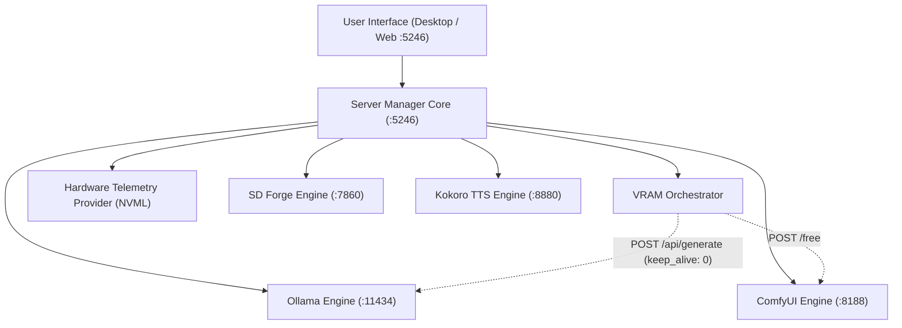
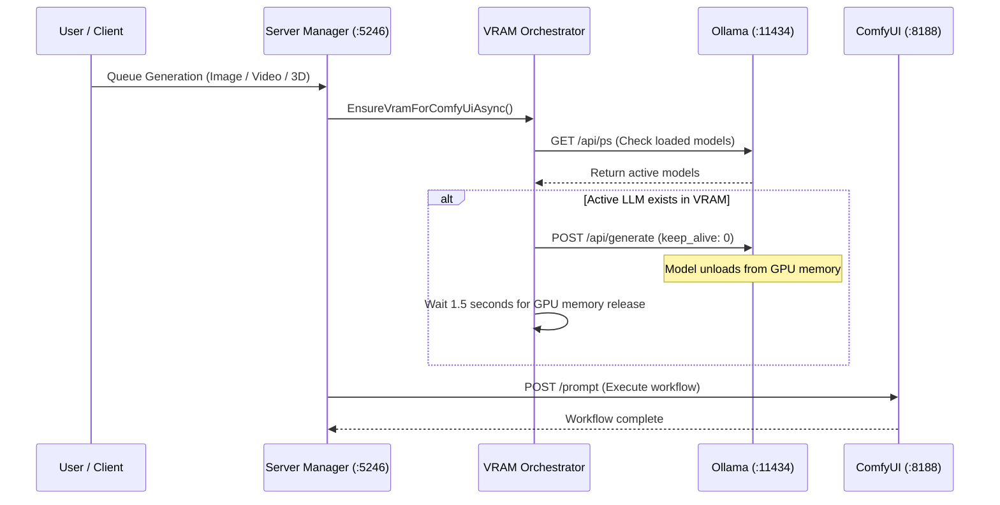

# Engines & VRAM Orchestrator Overview

Local LLM Server Manager coordinates local artificial intelligence engines through a single dashboard. The manager controls large language models, image generators, video generators, audio synthesizers, and 3D mesh engines.

This document explains the engine architecture, hardware telemetry monitoring, and the proactive VRAM Orchestrator.

---

## Supported Engines

The manager supports four dedicated AI engine backends:

| Engine | Default Port | Modality | Primary Tasks | Health Endpoint |
| :--- | :--- | :--- | :--- | :--- |
| **Ollama** | `:11434` | Text / Code / Vision | LLM inference, chat, code generation | `GET /` |
| **Stable Diffusion Forge** | `:7860` | Image | Checkpoint inference, LoRA styling, CivitAI models | `GET /sdapi/v1/progress` |
| **ComfyUI** | `:8188` | Image / Video / 3D / Audio | Node workflows, FLUX, Wan 2.2, TRELLIS V2 | `GET /system_stats` |
| **Kokoro TTS** | `:8880` | Speech | High-speed local speech synthesis | `GET /v1/audio/speech` |

> [!NOTE]
> You can install optional engines on demand. Use the **Settings** tab to discover existing engine installations or install modular feature packs.

---

## Background Server Manager Architecture

Local LLM Server Manager runs a background service on port `5246`. The service provides reverse proxying, hardware telemetry, and process containment.

### Process Isolation and Job Objects
On Windows, the server manager assigns spawned engine processes to a Win32 Job Object. When you close the manager, Windows terminates all child engine processes automatically. This mechanism prevents orphaned background tasks and lingering VRAM allocations.

On Linux, the manager terminates process groups cleanly with POSIX signals.

---

## Hardware Telemetry Bar

The top telemetry bar displays live GPU and system memory statistics.

### Telemetry Features
* **GPU Detection**: Reads hardware information through NVML CUDA interfaces with OS fallbacks.
* **VRAM Utilization Bar**: Shows allocated memory, active model memory, and free VRAM in real time.
* **Interactive Breakdown**: Displays model weight sizes, KV cache reservations, and driver overhead.
* **System RAM Monitor**: Shows host RAM consumption for hybrid offloading scenarios.

> [!TIP]
> Inspect the telemetry bar before you load large models. Ensure your GPU has sufficient free memory for the requested context length.

---

## The VRAM Orchestrator

Consumer graphics cards possess finite video memory. Running an 8-billion parameter text model alongside a diffusion model causes Out-Of-Memory (OOM) errors.

The **VRAM Orchestrator** prevents memory crashes automatically.

### Automatic Model Unloading Workflow
1. A user queues a generation job in ComfyUI or SD Forge.
2. The orchestrator calls `GET http://127.0.0.1:11434/api/ps` to detect active LLM instances in GPU memory.
3. If active models exist, the orchestrator sends `POST http://127.0.0.1:11434/api/generate` with parameter `{"keep_alive": 0}`.
4. Ollama unloads the model weights from VRAM immediately.
5. The orchestrator pauses for 1.5 seconds. This delay allows the GPU driver to reclaim freed memory.
6. The manager forwards the multimodal task to the target engine.

### Freeing ComfyUI Memory
When you switch from image workflows back to text workflows, the orchestrator releases ComfyUI memory:
* The orchestrator sends `POST http://127.0.0.1:8188/free` with payload `{"free_memory": true, "unload_models": true}`.
* ComfyUI unloads cached diffusion checkpoints and latent tensors.
* Your GPU returns to an idle memory state.

> [!IMPORTANT]
> The VRAM Orchestrator operates automatically during workflow execution. You do not need to unload models manually before starting image, 3D, or video jobs.

---

## Next Steps

Select a guide to configure a specific engine:

* [Ollama LLM Engine Setup](./ollama.md)
* [Stable Diffusion Forge Setup](./sd-forge.md)
* [ComfyUI Engine Setup](./comfyui.md)
* [Kokoro TTS Engine Setup](./kokoro-tts.md)
* [Find & Download Models Guide](./model-management.md)
