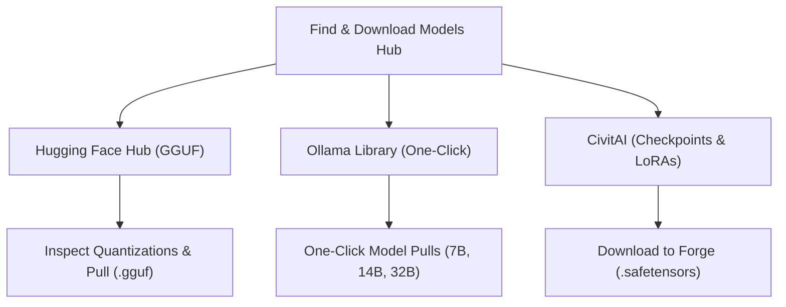
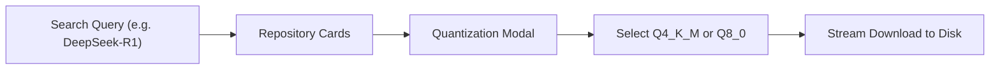

# Model Hubs & Downloads Guide

Local LLM Server Manager simplifies model acquisition through integrated search hubs. You can search, evaluate, and download models without using command-line tools.

This guide explains how to pull GGUF models from Hugging Face Hub, download official Ollama models, and download image weights from CivitAI.

---

## The Find & Download Models Interface

Open the **Find & Download Models** tab from the primary navigation bar. The interface organizes model discovery into three tabs:

---

## Hugging Face Hub (GGUF Search)

The **Hugging Face Hub** tab connects to the Hugging Face API to find community-quantized GGUF models.

### Step-by-Step Search and Download

1. Select the **Hugging Face Hub (GGUF)** sub-tab.
2. Type a model family name into the search bar (for example: `DeepSeek-R1-Distill-GGUF` or `Qwen2.5-Coder`).
3. Press **Enter** or click **Search**.
4. Use the modality filters to filter results by input and output types (**Text**, **Image**, **Audio**, **Video**).
5. Review the search results list. Each card displays the repository author, download count, and like count.
6. Click any repository card to open the file quantization inspector modal.
7. Select your target quantization file (for example: `model-Q4_K_M.gguf`).
8. Click **Pull Selected**.
9. Monitor the download progress bar and transmission speed on the dashboard.

### Quantization Selection Guide

Quantization reduces model weight precision to conserve VRAM and RAM. Use this table to select the best quantization level for your hardware:

| Quantization | Bits / Weight | Quality Loss | Memory Required | Recommended Hardware |
| :--- | :--- | :--- | :--- | :--- |
| **`Q4_K_M`** | ~4.5 bits | Very Low | Baseline (Medium) | **Recommended**: 8 GB–16 GB GPUs. Best speed and size balance. |
| **`Q5_K_M`** | ~5.5 bits | Extremely Low | +15% over Q4 | 12 GB–16 GB GPUs. Higher reasoning accuracy. |
| **`Q8_0`** | 8.0 bits | Negligible | +80% over Q4 | 24 GB+ GPUs. Matches 16-bit floating-point performance. |
| **`Q3_K_M`** | ~3.5 bits | Noticeable | -20% vs Q4 | Limited VRAM environments. Noticeable accuracy degradation. |
| **`Q2_K`** | ~2.5 bits | High | -35% vs Q4 | Memory-constrained systems only. Not recommended for coding. |

> [!TIP]
> Always choose **`Q4_K_M`** as your starting point. It offers the best compromise between text generation quality, speed, and GPU memory usage.

---

## Ollama Official Library

The **Ollama Library** sub-tab provides curated one-click downloads for verified open-weight models.

### Pulling Curated Models
1. Select the **Ollama Library** sub-tab.
2. Locate the model card for your desired architecture:
   * **Llama 3.2**: Meta's lightweight conversational and reasoning models.
   * **DeepSeek-R1**: Advanced chain-of-thought reasoning models.
   * **Qwen 2.5 Coder**: Specialized code generation models.
   * **Phi-3**: Compact, highly capable Microsoft models.
3. Click the model size button that matches your VRAM capacity:
   * Click **Pull 7B (4.7 GB)** for 8 GB GPUs.
   * Click **Pull 14B (7.9 GB)** for 12 GB–16 GB GPUs.
   * Click **Pull 32B (19 GB)** for 24 GB GPUs.
4. The manager sends a pull request to Ollama on port `11434`.
5. Ollama streams download chunks and layer verification directly to the UI progress bar.

> [!NOTE]
> Downloaded Ollama models appear immediately in your **My Models** tab and become available in connected chat clients.

---

## CivitAI Search (Stable Diffusion & LoRA)

The **CivitAI** sub-tab integrates with the CivitAI model repository for image and style assets.

### Finding Image Generation Models

1. Select the **CivitAI** sub-tab.
2. Enter your search keywords (for example: `Juggernaut XL`, `Realistic Vision`, or `Pony`).
3. Set the **Category Filter** dropdown:
   * **Checkpoint**: Complete base image generation models.
   * **LoRA**: Small adapter files that apply artistic styles or characters.
   * **VAE**: Variational Autoencoders for color and detail refinement.
4. Review the **Can I Run It** hardware compatibility badge on each card:
   * **Full VRAM**: The model runs entirely in your GPU memory.
   * **Partial Offload**: The model spills into system RAM.
   * **OOM**: The model exceeds total system memory.
5. Click a model card to open the version details and image preview.
6. Click **⬇ Download to Forge**.
7. The manager downloads the `.safetensors` file into the target directory configured in your settings (`models/Stable-diffusion` or `models/Lora`).

> [!IMPORTANT]
> Verify your **Forge / SD Models Directory** in the **Settings** tab before downloading CivitAI models. The manager routes files based on this configured path.

---

## Managing and Deleting Installed Models

Unused model weights consume substantial disk space. You can manage installed models from the **My Models** tab:

1. Open the **My Models** tab.
2. Review the list of installed models and their file sizes.
3. Click the **Delete** icon on any model card that you no longer need.
4. Confirm the deletion prompt.
5. The manager frees the disk space immediately.

> [!WARNING]
> Deleting a model removes the model weights from disk permanently. You must download the model again if you require it later.

---

## Related Documentation

* [Engines & VRAM Orchestrator Overview](./index.md)
* [Ollama LLM Engine Setup](./ollama.md)
* [Stable Diffusion Forge Setup](./sd-forge.md)
