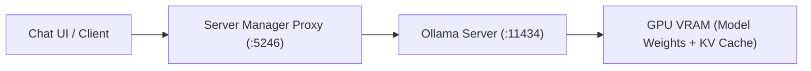

# Ollama LLM Engine Setup

Ollama serves local large language models through an optimized, high-performance C++ backend. Local LLM Server Manager monitors and manages Ollama directly on port `11434`.

This guide explains how to connect Ollama, manage model context lengths, estimate KV cache memory, and configure concurrent models.

---

## Engine Overview

* **Default Endpoint**: `http://127.0.0.1:11434`
* **Health Check URL**: `GET http://127.0.0.1:11434/`
* **Supported Models**: GGUF language models, code assistants, vision models, and reasoning models
* **Model Formats**: Standard Ollama manifests and custom `.gguf` imports

> [!NOTE]
> Local LLM Server Manager detects running Ollama instances automatically. If Ollama runs as a background service, the manager connects without manual intervention.

---

## Connecting Ollama to the Manager

Follow these steps to connect your Ollama installation:

1. Download and install Ollama from the official website if Ollama is not yet installed.
2. Start the Ollama background daemon.
3. Open the **Local LLM Server Manager** dashboard at `http://localhost:5246` or in the desktop application.
4. Select the **My Models** tab.
5. Check the **Ollama** status indicator in the top status bar:
   * **Green (Online)**: The manager communicates with Ollama on port `11434`.
   * **Red (Offline)**: Ollama is stopped. Start the service or verify the port in **Settings**.



---

## Loading and Running Models

To run an installed model:

1. Open your preferred chat client (such as Open WebUI, LibreChat, or the built-in AI Assistant).
2. Configure the client base URL to point to `http://localhost:5246/api/models` or directly to `http://localhost:11434`.
3. Select your desired model from the model list.
4. Send a prompt.
5. Watch the **VRAM Monitor** on the manager dashboard. The monitor updates live as Ollama loads the model weights into GPU memory.

> [!TIP]
> Use the [Find & Download Models](./model-management.md) tab to pull new models with one click. The manager streams download progress and layer verification directly.

---

## Managing Context Length and KV Cache

Long context windows require significant GPU memory. In addition to static model weights, the model reserves memory for the Key-Value (KV) attention cache.

### The Context Length Slider
1. Open the **My Models** tab.
2. Click any installed model card to open the model details inspector.
3. Locate the **Context Length Slider**.
4. Drag the slider to adjust the target token window from `2,048` tokens up to `32,768` tokens (or higher for supported architectures).

### KV Cache Memory Estimation
The manager calculates required VRAM dynamically as you move the slider:

| Context Window | 7B Model (FP16 KV) | 14B Model (FP16 KV) | 70B Model (FP16 KV) |
| :--- | :--- | :--- | :--- |
| **2,048 tokens (2K)** | ~0.25 GB | ~0.50 GB | ~1.25 GB |
| **8,192 tokens (8K)** | ~1.00 GB | ~2.00 GB | ~5.00 GB |
| **16,384 tokens (16K)** | ~2.00 GB | ~4.00 GB | ~10.00 GB |
| **32,768 tokens (32K)** | ~4.00 GB | ~8.00 GB | ~20.00 GB |

The **Can I Run It** badge displays the compatibility status:
* **Full VRAM**: Model weights and KV cache fit entirely in GPU memory.
* **Partial Offload**: Some layers spill into system RAM. Generation speed decreases.
* **Out of Memory (OOM)**: Combined memory exceeds system limits. Reduce the context length.

> [!IMPORTANT]
> A larger context length directly consumes more VRAM. If your GPU has 16 GB VRAM and a model requires 14 GB, limit context to 8K tokens to prevent OOM errors.

---

## Multi-Model Concurrency Configuration

By default, Ollama unloads previous models when you query a new model. You can configure Ollama to keep multiple models in VRAM at the same time.

### Setting `OLLAMA_MAX_LOADED_MODELS`

Set the `OLLAMA_MAX_LOADED_MODELS` environment variable to run multiple models concurrently:

#### On Windows:
1. Open the Windows Start Menu.
2. Type `environment variables` and select **Edit the system environment variables**.
3. Click the **Environment Variables** button.
4. Click **New** under **System variables** or **User variables**.
5. Enter `OLLAMA_MAX_LOADED_MODELS` in the **Variable name** field.
6. Enter `3` (or your desired limit) in the **Variable value** field.
7. Click **OK** to save the variable.
8. Restart Ollama to apply the change.

#### On Linux:
1. Open terminal.
2. Edit the Ollama systemd override configuration:
   ```bash
   sudo systemctl edit ollama.service
   ```
3. Add the following lines:
   ```ini
   [Service]
   Environment="OLLAMA_MAX_LOADED_MODELS=3"
   ```
4. Save the file and reload systemd:
   ```bash
   sudo systemctl daemon-reload
   sudo systemctl restart ollama
   ```

### Related Concurrency Settings

You can tune additional environment variables for advanced workloads:

| Variable | Default | Recommended | Description |
| :--- | :--- | :--- | :--- |
| `OLLAMA_MAX_LOADED_MODELS` | `1` (or `3`) | `2`–`4` | Maximum models kept loaded in VRAM simultaneously. |
| `OLLAMA_NUM_PARALLEL` | `1` | `2`–`4` | Number of parallel request slots per loaded model. |
| `OLLAMA_KEEP_ALIVE` | `5m` | `10m` | Time duration models remain in VRAM after the last request. |

> [!WARNING]
> Running multiple models concurrently increases total VRAM consumption. Verify your free GPU VRAM on the telemetry bar before loading secondary models.

---

## Related Documentation

* [Engines & VRAM Orchestrator Overview](./index.md)
* [Find & Download Models Guide](./model-management.md)
* [Quickstart Onboarding Guide](../getting-started/quickstart.md)
