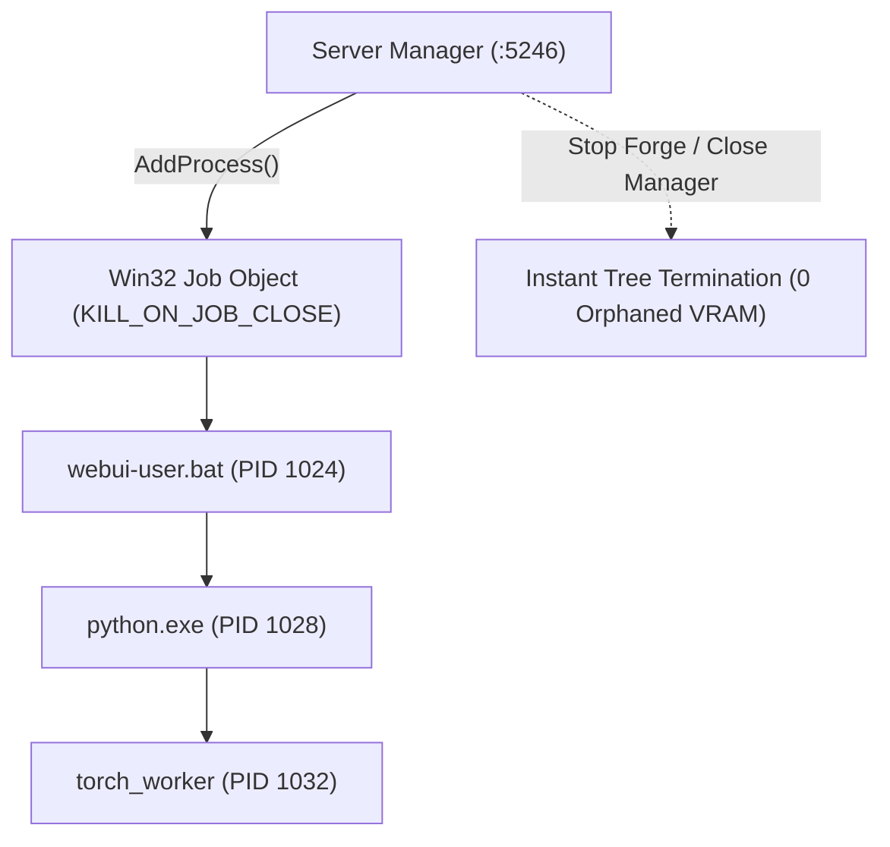
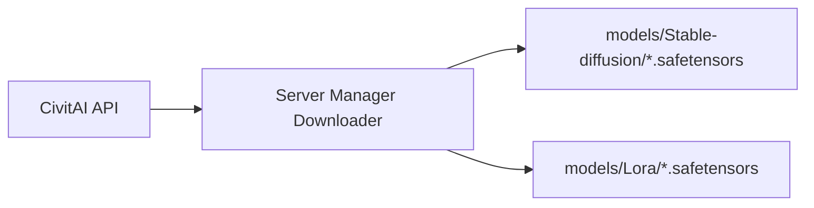

# Stable Diffusion Forge Integration

Stable Diffusion WebUI Forge is an optimized inference environment for image generation. Forge supports SD 1.5, SDXL, and FLUX.1 models with lower VRAM overhead than standard WebUI implementations.

Local LLM Server Manager provides lifecycle management, process containment via Win32 Job Objects, and direct CivitAI model downloads for Forge.

---

## Engine Overview

* **Default Endpoint**: `http://127.0.0.1:7860`
* **Health Check URL**: `GET http://127.0.0.1:7860/sdapi/v1/progress`
* **Default Launch Script**: `webui-user.bat` (Windows) or `webui.sh` (Linux)
* **Supported Architectures**: SD 1.5, SDXL, Pony, FLUX.1 (Schnell / Dev), SD 3.5

> [!NOTE]
> SD Forge runs on port `7860` by default. If you use a custom port, update the endpoint URL in the **Settings** tab.

---

## Configuring Model Directories

Forge requires specific directory structures for diffusion checkpoints, LoRAs, and VAE files.

```
Forge Root /
├── models/
│   ├── Stable-diffusion/   <-- Checkpoint models (.safetensors)
│   ├── Lora/               <-- LoRA style weights (.safetensors)
│   └── VAE/                <-- Variational autoencoders (.safetensors)
└── webui-user.bat
```

### Setting the Directory Path
1. Open the **Local LLM Server Manager** dashboard.
2. Navigate to the **Stable Diffusion** tab or open the **Settings** tab.
3. Locate the **Forge / SD Models Directory** input field.
4. Enter the absolute path to your Forge models folder (for example: `C:\AI\SD_Forge\models`).
5. Locate the **Forge Executable Path** field.
6. Enter the path to your launch script (for example: `C:\AI\SD_Forge\webui-user.bat`).
7. Click **Save Path**. The manager writes your configuration to `settings.json`.

> [!TIP]
> Use the **Auto-Detect Installed Tools** button on the Settings tab. The manager scans all connected drives and populates your paths automatically.

---

## Booting and Stopping Forge Cleanly

Python machine learning applications spawn multiple sub-processes. Terminating a parent batch script often leaves orphaned Python processes running in the background. These orphaned processes hold GPU VRAM hostage.

### Clean Termination with Win32 Job Objects
Local LLM Server Manager uses Windows **Win32 Job Objects** to guarantee complete process cleanup:



1. When you click **Boot SD Forge**, the manager creates the process inside a monitored Win32 Job Object.
2. Windows binds all subsequent child processes (Python runtimes, PyTorch CUDA workers, and API listeners) to that job object.
3. When you click **Stop SD Forge** or exit the manager, the operating system terminates every process in the tree instantly.
4. Your graphics card releases all allocated VRAM immediately without requiring a system reboot.

### How to Start and Stop the Engine
* **To Start Forge**: Navigate to the **Stable Diffusion** tab. Click **Boot SD Forge**. Check the terminal output window or wait for the health badge to turn green.
* **To Stop Forge**: Click **Stop SD Forge**. The manager terminates the job object and clears the status indicator.

> [!IMPORTANT]
> The [VRAM Orchestrator](./index.md) communicates with Forge before launching heavy jobs. The orchestrator unloads active text models from Ollama automatically when Forge starts.

---

## Downloading Models from CivitAI

You can search and download community checkpoints and LoRA styling weights directly from CivitAI without leaving the dashboard.



### Step-by-Step Download Procedure

1. Open the **Stable Diffusion** tab in the manager dashboard.
2. Select the **CivitAI** search view.
3. Type your search query into the search bar (for example: `DreamShaper`, `Juggernaut XL`, or `Detail Tweaker`).
4. Select a category from the **Model Type** dropdown:
   * **Checkpoint**: Full base model weights.
   * **LoRA**: Lightweight styling and character adapters.
   * **VAE**: Color correction and latent decoders.
5. Review the **Can I Run It** badge on each result card:
   * **Full VRAM**: Model fits your hardware with optimal generation speed.
   * **Partial Offload**: Model requires CPU memory offloading.
   * **Out of Memory**: Model size exceeds total available VRAM.
6. Click your preferred model card to open the version selector.
7. Click **⬇ Download to Forge**.
8. The manager downloads the `.safetensors` file directly to the appropriate folder (`models/Stable-diffusion` or `models/Lora`).
9. Monitor the download progress bar on the dashboard.

> [!WARNING]
> Full diffusion checkpoints (especially SDXL and FLUX) range from 6 GB to 24 GB in file size. Confirm that your target storage drive has adequate free space before starting large downloads.

---

## Related Documentation

* [Engines & VRAM Orchestrator Overview](./index.md)
* [Model Hubs & Downloads Guide](./model-management.md)
* [Windows Process Validation Reference](../technical/validation.md)
