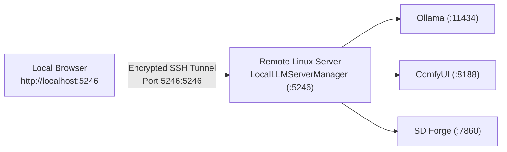

# Remote Access & Reverse Proxy Setup

Local LLM Server Manager operates on `http://127.0.0.1:5246` by default. You can access the dashboard and APIs remotely across your local area network (LAN) or over secure SSH tunnels.

---

## Remote Access Options

Choose the connection method that best fits your workflow:

| Method | Target Environment | Security Level | Setup Effort |
| :--- | :--- | :--- | :--- |
| **LAN Access** | Home / Office Network | Network Firewall Required | Minimal (Automatic) |
| **SSH Port Forwarding** | Remote Linux / Cloud Host | Encrypted SSH Tunnel | Low (1 command) |
| **Caddy Reverse Proxy** | Domain / Public Network | Reverse Proxy + Authentication | Moderate (Config file) |

---

## 1. Local Area Network (LAN) Access

The installer and background service support automatic LAN IP detection.

### Find Your LAN Endpoints
1. Open the **Settings** tab in the desktop application.
2. Review the **Network Endpoints** panel:
   - **Local Dashboard**: `http://localhost:5246`
   - **Network Dashboard**: `http://<LAN-IP>:5246` (for example, `http://10.0.0.21:5246`)
   - **Network MCP Endpoint**: `http://<LAN-IP>:5246/mcp`
3. Access the dashboard from any smartphone, tablet, or secondary laptop connected to the same Wi-Fi network.

> [!WARNING]
> Do not expose port `5246` directly to the public internet without an authentication proxy.

---

## 2. Remote Access via SSH Port Forwarding

If you run the application on a headless Linux host, use SSH port forwarding to access the WebAssembly dashboard on your local client machine.



### Steps to Forward Ports
1. Open your local terminal.
2. Establish an SSH connection with local port forwarding:
   ```bash
   ssh -L 5246:localhost:5246 user@your-linux-server
   ```
3. Start the application in headless service mode on the remote server:
   ```bash
   dotnet run -- --service
   ```
   *(Or verify that the `systemd` daemon is running: `sudo systemctl status localllmmanager`)*
4. Open `http://localhost:5246` in your local web browser.
5. All dashboard controls, VRAM monitors, and 3D WebGL viewers operate at full local speed over the encrypted tunnel.

---

## 3. Caddy Reverse Proxy Configuration

To expose services securely behind an authentication gateway (such as Tinyauth or Authelia), use the following Caddyfile configuration on your reverse proxy server.

Replace `10.0.0.21` with your server's actual local IP address, and `yourdomain.com` with your domain name:

```txt
# Local LLM Server Manager Dashboard & Unified Proxy
manager.yourdomain.com {
    forward_auth * unix//var/run/tinyauth.sock {
        uri /auth
    }
    reverse_proxy 10.0.0.21:5246
}

# ComfyUI Engine (Video, 3D & Image Workflows)
comfy.yourdomain.com {
    forward_auth * unix//var/run/tinyauth.sock {
        uri /auth
    }
    reverse_proxy 10.0.0.21:8188
}

# Stable Diffusion WebUI Forge
forge.yourdomain.com {
    forward_auth * unix//var/run/tinyauth.sock {
        uri /auth
    }
    reverse_proxy 10.0.0.21:7860
}

# Ollama LLM Inference API
ollama.yourdomain.com {
    forward_auth * unix//var/run/tinyauth.sock {
        uri /auth
    }
    reverse_proxy 10.0.0.21:11434
}
```

### Configuration Instructions
1. Open your Caddy configuration file (`/etc/caddy/Caddyfile`) on your proxy host.
2. Paste the configuration block above.
3. Update IP addresses and domain names to match your network.
4. Reload Caddy:
   ```bash
   sudo systemctl reload caddy
   ```
5. Test connectivity by navigating to `https://manager.yourdomain.com` in your browser.

---

## Related Documentation

- [Getting Started & Installation](./installation.md)
- [First-Time Configuration](./configuration.md)
- [System Architecture Specification](../technical/architecture.md)
