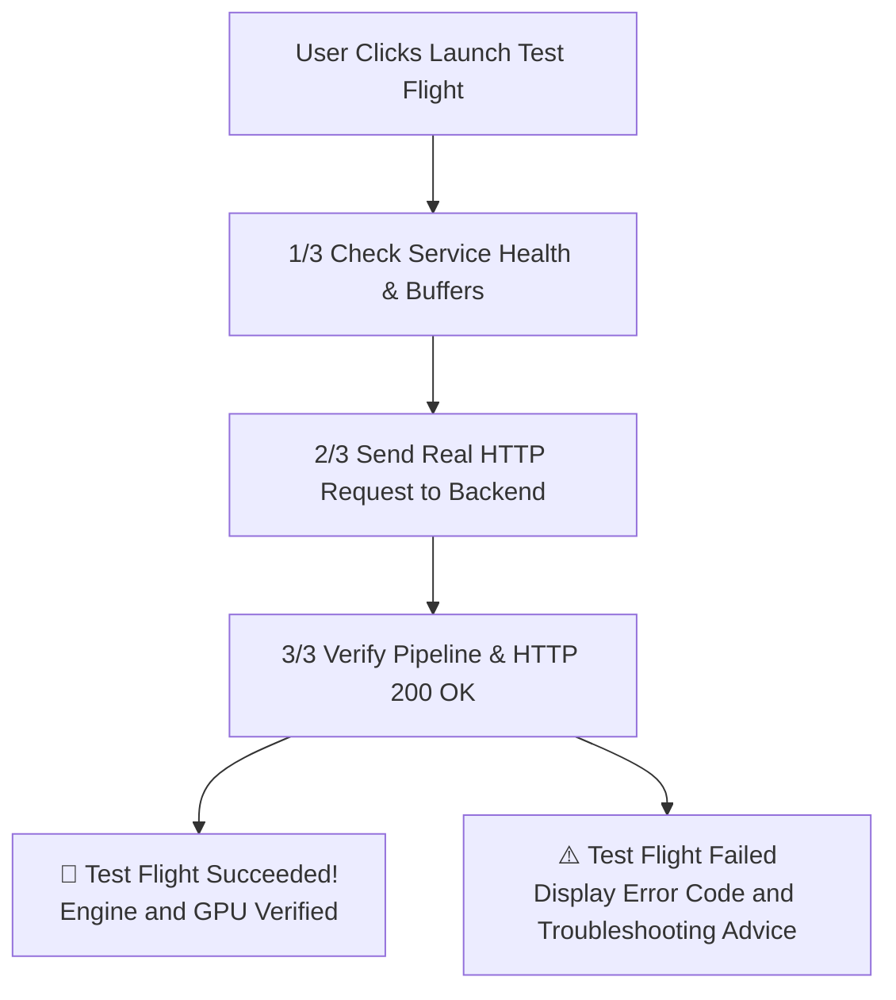

# Real Engine Test Flight

Local LLM Server Manager includes an in-app **Test Flight** verification runner. This tool verifies that your local AI engines respond to real network requests before you begin long creative tasks.

---

## Why Use Test Flight?

Generative tasks like video rendering and 3D mesh reconstruction consume significant time and GPU memory. If an engine path is incorrect, or if a Python dependency is missing, the generation fails after minutes of processing.

The Test Flight runner executes a lightweight end-to-end check in seconds:
- Verifies network connectivity to the target engine port.
- Sends an actual inference payload with minimal step counts.
- Verifies that GPU VRAM allocation succeeds without memory errors.
- Reports a clear pass or fail verdict before you queue real workloads.

---

## Supported Test Flight Modalities

You can test four distinct engine backends:

| Modality | Target Backend | Port | Test Payload | Expected Response |
| :--- | :--- | :--- | :--- | :--- |
| **Text** | Ollama | `:11434` | `POST /api/generate` with starter prompt | HTTP 200 with text stream |
| **Image** | Stable Diffusion Forge | `:7860` | `POST /sdapi/v1/txt2img` (steps: 1) | HTTP 200 with preview image |
| **Video** | ComfyUI | `:8188` | `POST /prompt` with workflow header | HTTP 200 with prompt ID |
| **Audio** | Kokoro TTS | `:8880` | `POST /v1/audio/speech` (voice: `af_heart`) | HTTP 200 with audio stream |

---

## How to Run a Test Flight

Follow these steps to run a test flight on your system:

1. Open the **Local LLM Server Manager** desktop window.
2. Click the **Studio** tab on the navigation bar.
3. Locate the **Test Flight** control panel in the studio header.
4. Select your target modality from the **Modality** dropdown:
   - Select **Text** to test Ollama.
   - Select **Image** to test Stable Diffusion Forge.
   - Select **Video** to test ComfyUI.
   - Select **Audio** to test Kokoro TTS.
5. Select a starter prompt from the prompt selector, or type a custom prompt.
6. Check the **VRAM Clearance** indicator. Confirm that your GPU reports sufficient free memory.
7. Click **🚀 Launch Test Flight**.
8. Observe the three-stage progress bar:
   - Stage 1: Checks service health and allocates memory buffers.
   - Stage 2: Sends the HTTP request to the selected backend.
   - Stage 3: Verifies pipeline response and HTTP status codes.
9. Review the result banner:
   - A green banner confirms that the engine operates correctly.
   - A red banner displays the exact HTTP status code and error description.

> [!TIP]
> Run a Test Flight immediately after installing a new engine or updating GPU drivers.

> [!IMPORTANT]
> If a Test Flight fails with a connection error, open **Settings**. Verify that the engine port matches the running service.

---

## Troubleshooting Test Flight Failures

Use this table to resolve common Test Flight errors:

| Error Symptom | Probable Cause | Action |
| :--- | :--- | :--- |
| **Connection Refused** | The target engine is stopped. | Start the engine from the dashboard or your terminal. |
| **HTTP 404 Not Found** | The engine runs on a different port. | Change the port number in the **Settings** tab. |
| **HTTP 500 Out of Memory** | Active models consume all VRAM. | Click **Unload All VRAM** in the top navigation bar. |
| **Timeout after 30 Seconds** | The model is loading from slow storage. | Move model files to an NVMe solid-state drive. |

---

## Related Documentation

- [Getting Started Overview](./index.md)
- [Engines & VRAM Overview](../engines/index.md)
- [Multimodal Studio Overview](../studio/index.md)
