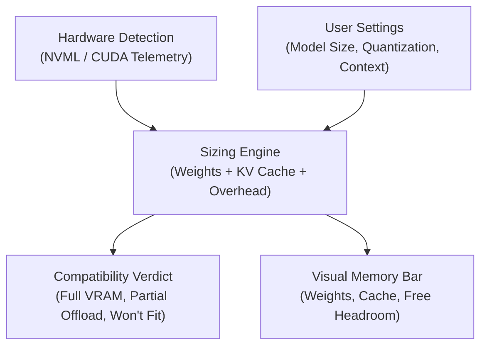
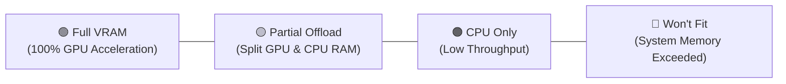

# Can I Run It — Hardware Compatibility & Performance Estimator

The **Can I Run It** workspace calculates whether an AI model can execute on your local hardware. It displays memory allocation, layer distribution, and throughput estimates before you download model weights.


---

## 1. Overview and Core Purpose

Large language models and diffusion networks require significant hardware resources. The **Can I Run It** tool prevents system out-of-memory errors. It checks your hardware specifications against model requirements in real time.



---

## 2. Hardware Telemetry Card

The top panel displays your current system specifications:

| Metric | Source | Function |
| :--- | :--- | :--- |
| **Detected GPU** | NVML / CUDA driver | Identifies the primary graphics accelerator. |
| **VRAM Capacity** | Live GPU memory query | Shows dedicated video memory and free space. |
| **System RAM** | Operating system query | Shows host system memory for CPU offloading. |
| **Refresh Telemetry** | User action button | Queries hardware status to capture memory changes. |

---

## 3. Supported Modalities

Select a modality tab at the top of the estimator:

* **Text LLMs**: Estimates GGUF models for Ollama and llama.cpp runtimes.
* **Image Generation**: Estimates FLUX.1, SDXL, and SD 1.5 diffusion models.
* **Video Generation**: Estimates Wan 2.2, LTX-Video 2.5, and HunyuanVideo DiT architectures.
* **Audio & Speech**: Estimates Kokoro TTS and music generation models.
* **3D Generation**: Estimates TRELLIS and Hunyuan3D mesh reconstruction pipelines.

---

## 4. Parameter Configuration

Adjust the input sliders to model your target workload:

### Model Preset Profile
Select a standard model profile from the dropdown menu (e.g., `Llama 3.1 8B`, `Qwen 2.5 32B`, `DeepSeek R1 70B`). The tool populates default parameters automatically.

### Model Size (Parameter Count)
Use the slider to adjust the parameter scale from 0.5 billion to 70 billion parameters.

### Quantization Level
Select the compression precision:
* **FP16**: Full 16-bit floating point precision (no quality loss, highest VRAM).
* **Q8_0**: 8-bit quantization (near-lossless, moderate VRAM savings).
* **Q4_K_M**: 4-bit medium quantization (industry standard, 50% VRAM reduction).
* **Q2_K**: 2-bit aggressive quantization (lowest VRAM, lower output quality).

### Context Window Length
Set the token context buffer between 2,048 and 131,072 tokens. Longer context lengths increase memory consumption.

### KV Cache Quantization Precision
Select the precision of the Key-Value attention cache (`FP16`, `Q8_0`, or `Q4_0`). Setting KV cache quantization to `Q4_0` reduces cache memory usage by up to 70%.

---

## 5. Compatibility Verdict and Performance

The right panel shows the execution verdict and predicted speed:



### Verdict Categories

| Badge | Status | Behavior | Performance Impact |
| :--- | :--- | :--- | :--- |
| **Full VRAM** | 🟢 Fits 100% in VRAM | All model layers execute on the GPU. | Maximum inference speed (e.g., ~169 tok/s). |
| **Partial Offload** | 🟡 GPU + CPU RAM | Critical layers run on GPU; remainder runs in RAM. | Moderate speed reduction due to PCIe transfer overhead. |
| **CPU Only** | 🟠 System RAM Only | Model exceeds total VRAM capacity. | Low throughput (1 to 5 tok/s). |
| **Won't Fit** | 🔴 Out of Memory | Model exceeds combined VRAM and system RAM. | Execution blocked to prevent application crash. |

---

## 6. Visual Memory Allocation Bar

The visual breakdown bar displays four color-coded memory segments:

```
[ ■ Weights (29.5%) | ■ Context/KV (3.1%) | ■ Overhead (3.7%) | ■ Free Headroom (63.7%) ]
```

1. **Model Weights (Cyan)**: Static memory required to store loaded model tensors.
2. **Context / KV Cache (Purple)**: Dynamic memory allocated for conversation tokens.
3. **Runtime Overhead (Grey)**: CUDA runtime buffers and frame memory.
4. **Free Headroom (Dark Blue)**: Remaining unused video memory on the GPU.

---

## 7. Ambient Compatibility Badges Across the App

The sizing engine powers ambient compatibility badges throughout the application:

* **Hugging Face Hub**: Each search result card displays a live fit badge.
* **CivitAI Hub**: Checkpoint and LoRA cards display GPU compatibility status.
* **Ollama Local Library**: Installed models display instantaneous VRAM fit calculations.
* **Diagnostic Test Flight**: Pre-flight verification blocks runs when VRAM headroom is insufficient.
