# Collaborative UI Debugging with AvaloniaMcp & DevTools

Local LLM Server Manager includes an in-app debugging mode designed for live, collaborative problem-solving between software developers and AI coding assistants (such as Antigravity). 

By uniting **Avalonia F12 DevTools** for human visual inspection with the **AvaloniaMcp** Model Context Protocol server for AI-driven programmatic inspection, teams can diagnose visual defects, inspect runtime data contexts, catch silent XAML binding errors, and verify fixes in real time.

---

## Architecture & Dual-Channel Inspection

Collaborative debugging operates on a dual-channel architecture:

1. **Human Developer Channel**: The developer interacts with the running desktop application, evaluates ergonomics and visual aesthetics, and uses built-in F12 DevTools to inspect layout bounds, active styles, and element trees interactively.
2. **AI Assistant Channel**: The AI coding assistant connects through the `AvaloniaMcp` protocol server over a local named pipe, querying visual trees, serialized ViewModel state, and binding diagnostic logs via structured JSON-RPC tool calls.

```
+-------------------------------------------------------------------------+
|                           DEVELOPER WORKSPACE                           |
|  - Runs application in Debug mode                                       |
|  - Inspects visual layout & controls via F12 DevTools                   |
|  - Reports visual anomalies or UX friction in conversation              |
+------------------------------------+------------------------------------+
                                     |
                                     v
+-------------------------------------------------------------------------+
|                  AVALONIA RUNTIME PROCESS (PID: {pid})                  |
|                                                                         |
|  - AppBuilder.Configure<App>()                                          |
|      .UsePlatformDetect()                                               |
|      .UseMcpDiagnostics()        <-- AvaloniaMcp Named Pipe Endpoint    |
|      .LogToTrace()                                                      |
|                                                                         |
|  - Named Pipe Endpoint: `avalonia-mcp-{pid}`                            |
|  - Process Discovery File: `%TEMP%/avalonia-mcp/{pid}.json`             |
|  - UI Diagnostic Logger (Binding error trace capture)                   |
+------------------------------------+------------------------------------+
                                     | Named Pipe (JSON-RPC)
                                     v
+-------------------------------------------------------------------------+
|                  AVALONIA MCP SERVER (`avaloniamcp`)                    |
|                                                                         |
|  - Global .NET Tool (`dotnet avalonia-mcp`)                             |
|  - Exposes 15 MCP Tools to AI Assistant over stdio                      |
+------------------------------------+------------------------------------+
                                     | MCP Protocol (stdio)
                                     v
+-------------------------------------------------------------------------+
|                        ANTIGRAVITY AI ASSISTANT                         |
|  - Discovers running UI app instance (`discover_apps`)                  |
|  - Queries visual/logical trees, DataContexts, & broken bindings        |
|  - Mutates properties live to test layout hypotheses                    |
|  - Captures element screenshots for visual inspection                   |
|  - Formulates and applies codebase fixes directly                       |
+-------------------------------------------------------------------------+
```

### Production Isolation & Security

All debugging and diagnostic bridges are conditionally compiled:

* **Conditional Project References**: `AvaloniaMcp.Diagnostics` and `Avalonia.Diagnostics` are included in `LocalLLMServerManager.csproj` only when `'$(Configuration)' == 'Debug'`.
* **Preprocessor Directives**: Initialization calls (`UseMcpDiagnostics()` and `this.AttachDevTools()`) are wrapped in `#if DEBUG` preprocessor blocks.
* **Release Cleanliness**: In `Release` builds, no named pipe server is started, no discovery files are generated, F12 DevTools cannot be activated, and the compiled binaries contain zero runtime overhead or external attack surface.
* **IPC Security**: Named pipes bind exclusively to local OS inter-process communication (`%TEMP%/avalonia-mcp/`) accessible only by the current authenticated user session.

---

## Launching in Debug Mode

To enable collaborative debugging, compile and launch the project under the `Debug` configuration.

### Command

Run the following command from the repository root:

```bash
dotnet run -c Debug
```

### Startup Initialization

When launched in `Debug` configuration, the application executes the following startup sequence:

1. **AppBuilder Diagnostics**: In `Program.cs`, `BuildAvaloniaApp()` invokes `.UseMcpDiagnostics()` and `.LogToTrace()`.
2. **Named Pipe Creation**: `AvaloniaMcp.Diagnostics` allocates a local named pipe identified as `avalonia-mcp-{pid}` where `{pid}` is the process ID of the running application.
3. **Discovery Metadata**: A JSON discovery file is written to `%TEMP%/avalonia-mcp/{pid}.json` containing the process ID, application name, start time, and named pipe endpoint.
4. **DevTools Attachment**: In `Views/MainWindow.axaml.cs`, the window constructor calls `this.AttachDevTools()`, registering the `F12` global shortcut.
5. **Diagnostic Logging**: The `UiDiagnosticLogger` registers trace listeners to intercept Avalonia binding warnings and errors.

---

## Human Developer: Using F12 DevTools

The built-in Avalonia DevTools provide immediate visual inspection without requiring external browsers or agents.

### Opening DevTools

1. Ensure the desktop application window is focused.
2. Press <kbd>F12</kbd>.
3. A separate **Avalonia DevTools** diagnostic window opens.

### Key DevTools Capabilities

#### 1. Visual Tree & Logical Tree Inspection
* **Visual Tree**: Displays every rendered visual primitive (e.g., `Border`, `ContentPresenter`, `TextBlock`, `LayoutTransformControl`). Use this to determine actual render sizes, margins, padding, clipping rectangles, and alignment.
* **Logical Tree**: Displays controls as declared in high-level XAML markup (e.g., `Button`, `ListBox`, `Grid`), making it straightforward to match UI elements with their source `.axaml` files.
* **Pointer Selection**: Click the crosshair icon in the DevTools toolbar, then click any element in the main application window to jump directly to that element in the tree.

#### 2. Property Inspector & Live Editing
* Selecting any node in the tree shows all registered Avalonia properties in the right-hand panel.
* **Property Precedence**: Observe whether a property value originates from a local assignment, an active style setter, an inherited value, or default metadata.
* **Live Property Modification**: Double-click editable values (such as `Width`, `Height`, `Margin`, `HorizontalAlignment`, `Background`, or `IsVisible`) to change them at runtime. This allows rapid verification of layout fixes before editing source code.

#### 3. Style Debugging
* The **Styles** tab lists every style rule currently evaluated against the selected control.
* Active rules are highlighted, while overridden or unmatched rules are dimmed.
* **Pseudo-Class Tracking**: Observe dynamic pseudo-classes such as `:pointerover`, `:pressed`, `:focus`, and `:disabled` update live as you interact with the UI.

#### 4. Event Tracking & Layout Diagnostics
* The **Events** tab records routed events (pointer moved, pointer pressed, key down) bubbling or tunneling through the tree.
* Use this to diagnose why a button click is not reaching an expected handler or if an invisible overlay is intercepting pointer input.

---

## AI Assistant: Connecting via AvaloniaMcp

AI assistants connect to the running application using the open-source `avaloniamcp` Model Context Protocol server.

### 1. Installing the Global Tool

Install the `avaloniamcp` global .NET tool from NuGet:

```bash
dotnet tool install -g avaloniamcp
```

To update an existing installation to the latest release:

```bash
dotnet tool update -g avaloniamcp
```

### 2. Running the MCP Server

Start the server using standard stdio communication:

```bash
dotnet avalonia-mcp
```

The server automatically monitors `%TEMP%/avalonia-mcp/`, discovers any active Avalonia application running with `.UseMcpDiagnostics()`, and bridges MCP tool calls directly to the application's UI thread via the local named pipe.

### 3. MCP Client Configuration

To configure Antigravity, Claude Desktop, Cursor, or other MCP-compatible AI clients, add the server to your configuration file (e.g., `mcpServers` block):

```json
{
  "mcpServers": {
    "avalonia_mcp": {
      "command": "dotnet",
      "args": ["avalonia-mcp"]
    }
  }
}
```

### 4. CLI Verification & Diagnostics

You can verify the connection manually using the `avaloniamcp` CLI:

```bash
# Discover running Avalonia processes
dotnet avalonia-mcp cli discover_apps

# List open windows
dotnet avalonia-mcp cli list_windows

# Check for active binding errors
dotnet avalonia-mcp cli get_binding_errors

# Inspect top-level visual elements
dotnet avalonia-mcp cli get_visual_tree --maxDepth 3
```

---

## The 15 AvaloniaMcp Tools

`avaloniamcp` exposes 15 specialized tools to AI assistants, categorized into five operational domains:

| Category | Tool Name | Parameters | Description |
| :--- | :--- | :--- | :--- |
| **Inspection** | `list_windows` | *None* | Lists all open windows, titles, dimensions, positions, and window states. |
| | `get_visual_tree` | `maxDepth` *(optional)* | Returns the complete rendered visual hierarchy with element types, names, bounds, and visibility. |
| | `get_logical_tree` | `maxDepth` *(optional)* | Returns the logical hierarchy matching the developer's XAML markup declarations. |
| | `find_control` | `name`, `typeName`, `text` *(optional)* | Fast lookup of UI elements by name (`#Name`), control type, or displayed text. |
| | `get_control_properties` | `controlId` | Dumps all registered Avalonia properties, current values, types, and inheritance sources for an element. |
| **Data & Bindings** | `get_data_context` | `controlId` *(optional)* | Serializes the bound ViewModel properties and values into clean JSON. |
| | `get_binding_errors` | *None* | Retrieves all active and logged Avalonia binding errors, including target properties and source paths. |
| **Visual & Styles** | `take_screenshot` | `controlId` *(optional)* | Captures a high-resolution base64 PNG of the entire window or a specific control for visual analysis. |
| | `get_applied_styles` | `controlId` | Inspects matching style selectors, active setters, and pseudo-classes (`:pointerover`, `:pressed`). |
| | `get_resources` | `controlId` *(optional)* | Enumerates XAML resources (brushes, colors, geometry, templates) accessible at the element's scope. |
| | `get_focused_element` | *None* | Returns the currently focused control and its keyboard tab navigation index. |
| **Interaction** | `click_control` | `controlId` | Programmatically triggers a click event and executes bound `ICommand` handlers. |
| | `input_text` | `controlId`, `text` | Types text into `TextBox` or other editable input controls. |
| | `set_property` | `controlId`, `propertyName`, `value` | Mutates control properties at runtime to test layout fixes live on the UI thread. |
| **Discovery** | `discover_apps` | *None* | Discovers all running Avalonia applications instrumented with `AvaloniaMcp.Diagnostics`. |

### Tool Deep Dive

#### `list_windows`
Returns an array of active desktop windows, indicating whether each window is active, minimized, normal, or maximized, along with screen coordinates and dimensions (`X`, `Y`, `Width`, `Height`).

#### `get_visual_tree`
Generates a structured tree representation of every visual element. Each node includes a unique `controlId`, type name (e.g., `Avalonia.Controls.Button`), element name, bounds, and visibility state. Limiting `maxDepth` prevents overwhelming output on deeply nested layouts.

#### `get_logical_tree`
Summarizes the UI hierarchy from the perspective of XAML logical parenting. This view omits internal layout primitives (such as internal borders and presenters), making it easier to reason about high-level component organization.

#### `find_control`
Allows the AI assistant to search across the UI hierarchy in a single step. For example, calling `find_control(name: "HuggingFaceSearchBox")` or `find_control(text: "Download")` quickly returns the target `controlId` without traversing the entire tree.

#### `get_control_properties`
Fetches the full property dictionary of a specific control. Includes layout metrics (`Margin`, `Padding`, `HorizontalAlignment`, `ActualWidth`), state properties (`IsEnabled`, `IsVisible`), and control-specific configurations.

#### `get_data_context`
Inspects the ViewModel instance bound to the target control. The server traverses the object graph and serializes properties, collections, and commands into JSON. If a control has no local `DataContext`, it inherits and inspects the ancestor context.

#### `get_binding_errors`
Queries the in-app diagnostic log for binding failures. This captures silent failures where Avalonia encounters a missing ViewModel property, invalid cast, or null path element during evaluation.

#### `take_screenshot`
Renders the specified control or the entire window into an off-screen render target and returns a base64-encoded PNG image. This enables multimodal AI models to visually inspect alignment, clipping, contrast, and layout rendering.

#### `get_applied_styles`
Returns the cascade of styles matching the control. Identifies active selectors, applied setters, and pseudo-classes, pinpointing whether an unintended theme rule or local style is overriding expected colors or margins.

#### `get_resources`
Inspects local and inherited XAML `ResourceDictionary` trees. Enables verifying whether brush keys (e.g., `AccentColorBrush`, `SystemControlBackgroundBaseMediumBrush`) resolve to intended color definitions.

#### `get_focused_element`
Returns the element currently holding keyboard focus. Useful for diagnosing keyboard navigation bugs, focus trapping, or broken tab indexing.

#### `click_control`
Dispatches a synthetic pointer click event on the UI thread for the target control. Verifies whether button commands execute correctly and updates the UI state accordingly.

#### `input_text`
Sets text on editable controls, raising corresponding text change and binding notification events to simulate user data entry.

#### `set_property`
Dispatches a property update directly to the Avalonia property system on the UI thread. The AI assistant can test candidate values (e.g., changing `Width` from `NaN` to `200`, or `IsVisible` from `false` to `true`) and immediately verify the visual outcome before modifying files.

#### `discover_apps`
Scans local IPC registration files in `%TEMP%/avalonia-mcp/` and reports all detectable Avalonia instances with their process IDs and executable paths.

---

## Diagnostic Logging & Binding Error Inspection

In XAML-based frameworks, data binding errors fail silently by default to prevent application crashes during render loops. However, silent failures lead to empty lists, unresponsive buttons, and blank labels that are difficult to diagnose from application logs alone.

### Common Binding Failure Modes

1. **Path Typo**: The XAML binding `{Binding ModelTitel}` references a misspelled property (`ModelTitle`).
2. **Missing Notification**: A ViewModel property lacks `SetProperty(ref _field, value)` or `[ObservableProperty]`, preventing UI updates when values change.
3. **Null Path Navigation**: Binding `{Binding SelectedEngine.Config.Port}` fails because `SelectedEngine` or `Config` is null during initialization.
4. **Type Conversion Mismatch**: Binding a string to an enum property without an appropriate `IValueConverter`.

### In-App Diagnostic Logger (`UiDiagnosticLogger`)

To capture these issues, `LocalLLMServerManager` includes a dedicated `UiDiagnosticLogger` service:

* **Trace Interception**: Hooks into Avalonia's internal `Trace.Listeners` and `Logger` system, filtering for `LogEventLevel.Warning` and `LogEventLevel.Error` on the `Binding` log category.
* **Ring Buffer Storage**: Stores recent entries in a bounded circular buffer (capped at 250 entries) to prevent unbounded memory growth during long debugging sessions.
* **Structured Records**: Each diagnostic entry captures:
  * Timestamp (UTC)
  * Target control type and name
  * Bound target property name
  * Source path expression
  * Full exception or warning message

### Example Diagnostic Log Entry

When `get_binding_errors` is called, the AI assistant receives structured error information:

```json
[
  {
    "timestamp": "2026-09-18T20:15:32.410Z",
    "target": "Avalonia.Controls.Button #FilterLoraButton",
    "property": "Command",
    "sourcePath": "ToggleLoraFilterCommand",
    "message": "Could not find property 'ToggleLoraFilterCommand' on 'CivitaiSearchViewModel'."
  }
]
```

This precise output immediately indicates that `CivitaiSearchViewModel` lacks the expected command or named it differently (e.g., `FilterLoraCommand`), eliminating guesswork.

---

## Collaborative Bug-Hunting Workflow

The diagram below illustrates the typical workflow between the developer, the running application, the `avaloniamcp` server, and the AI assistant:

```mermaid
sequenceDiagram
    autonumber
    actor Dev as Developer
    participant App as Avalonia App (Debug)
    participant MCP as avaloniamcp Server
    participant AI as Antigravity AI

    Dev->>App: Launch via `dotnet run -c Debug`
    App->>MCP: Register named pipe in %TEMP%/avalonia-mcp/
    Dev->>App: Interacts with UI (e.g. Hugging Face / CivitAI Hub)
    Dev->>AI: Reports symptom: "The CivitAI LoRA toggle button does not activate"
    
    rect rgb(30, 40, 60)
        Note over AI,MCP: Autonomous AI Inspection Loop
        AI->>MCP: `discover_apps()`
        MCP-->>AI: Returns active process ID
        AI->>MCP: `find_control(name: "FilterLoraButton")`
        MCP-->>AI: Returns controlId "c-1048"
        AI->>MCP: `get_control_properties(controlId: "c-1048")`
        MCP-->>AI: Returns IsEnabled: false, Classes: []
        AI->>MCP: `get_binding_errors()`
        MCP-->>AI: Returns Command binding error on ToggleLoraFilterCommand
        AI->>MCP: `get_data_context(controlId: "c-1048")`
        MCP-->>AI: Returns ViewModel state (FilterType: Checkpoint)
    end

    AI->>Dev: Explains root cause: XAML bound to non-existent command
    AI->>App: Applies code fix in CivitaiSearchViewModel.cs & XAML
    AI->>AI: Runs `dotnet test`, `npm run lint`, `npx tsc --noEmit`
    Dev->>App: Validates fix live in the desktop UI
```



### Step-by-Step Problem Resolution

1. **Reproduction**: The developer reproduces a UI glitch or unexpected state in the running application.
2. **Report**: The developer describes the observation to the AI assistant (e.g., *"The Hugging Face search box doesn't submit when pressing Enter"* or *"The status badge is clipped"*).
3. **Targeted Inspection**: 
   * The AI assistant calls `find_control` to locate the relevant element.
   * Calls `get_data_context` to inspect current ViewModel state.
   * Calls `get_binding_errors` to check for silent binding failures.
4. **Visual Verification**: If the issue involves alignment or styling, the AI assistant calls `take_screenshot` or `get_applied_styles`.
5. **Interactive Prototyping**: The AI assistant can invoke `set_property` to verify whether a proposed property change resolves the issue live.
6. **Codebase Modification**: The AI assistant updates the appropriate `.axaml` or `.cs` file in the repository.
7. **Verification**: The AI assistant runs automated quality gates (`npm run lint`, `npx tsc --noEmit`, `dotnet test`).
8. **Confirmation**: The developer reviews the running UI and confirms the fix.

---

## Developer Quick Reference

| Action | Command / Shortcut | Purpose |
| :--- | :--- | :--- |
| **Launch in Debug Mode** | `dotnet run -c Debug` | Launches app with DevTools and `AvaloniaMcp` active. |
| **Toggle DevTools** | <kbd>F12</kbd> (in app) | Opens the interactive Avalonia DevTools inspector window. |
| **Install MCP Tool** | `dotnet tool install -g avaloniamcp` | Installs the global MCP server on developer machines. |
| **Update MCP Tool** | `dotnet tool update -g avaloniamcp` | Updates `avaloniamcp` to the latest version. |
| **Test MCP Connection** | `dotnet avalonia-mcp cli discover_apps` | Lists active Avalonia instances available for debugging. |
| **Inspect Binding Errors** | `dotnet avalonia-mcp cli get_binding_errors` | Dumps current binding diagnostic log directly to terminal. |
| **Run Unit Tests** | `dotnet test` | Executes solution test suite. |
| **Build Documentation** | `npm run docs:build` | Verifies VitePress documentation builds cleanly with zero errors. |
| **Lint Codebase** | `npm run lint` | Runs ESLint across TypeScript and tooling scripts. |
| **Typecheck Codebase** | `npx tsc --noEmit` | Runs TypeScript typechecker. |
