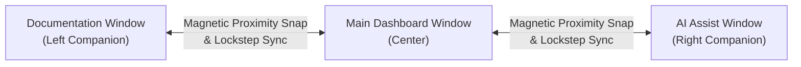
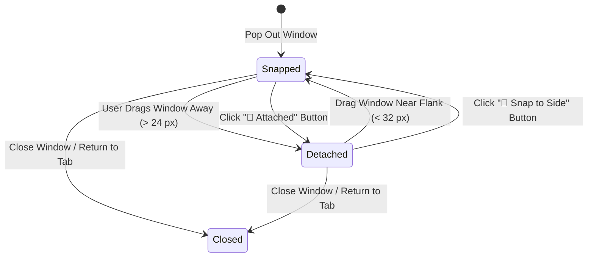

# Magnetic Companion Windows

Local LLM Server Manager features a flexible multi-window architecture. You can pop out application tabs into independent companion windows, snap them magnetically to the main window, and manage multi-monitor workspaces with ease.

---

## Overview

The desktop application provides two detachable companion windows:
1. **AI Assist Companion Window**: Pops out the AI Chat Assistant for continuous prompt assistance and troubleshooting. Snaps to the **right flank** of the main window.
2. **Documentation Companion Window**: Pops out this documentation guide for side-by-side reading. Snaps to the **left flank** of the main window.

---

## Pop Out a Companion Window

Follow these steps to detach a tab into a companion window:

1. Open the **Local LLM Server Manager** desktop application.
2. To pop out documentation:
   - Click the pop-out icon (**⧉ Pop Out**) in the **Documentation** tab header.
   - The Documentation companion window appears on the left flank of the main window.
3. To pop out the AI Assistant:
   - Click the pop-out icon (**⧉ Pop Out**) in the **AI Assistant** tab header.
   - The AI Assist companion window appears on the right flank of the main window.

> [!NOTE]
> When you pop out a tab, the main window collapses the tab content and displays a banner confirming that the companion window is active.

---

## Magnetic Snapping Behavior

The `WindowSnapManager` service controls window docking through three mechanisms:

### 1. Lockstep Synchronization
When a companion window is snapped:
- Moving the main window moves the snapped companion window in lockstep.
- Resizing the main window height resizes the snapped companion window height to match.
- Minimizing the main window minimizes all snapped companion windows simultaneously.

### 2. The Magnet Button Toggle
Each companion window includes an interactive magnet button in its custom title bar:
- **`🧲 Attached`**: Indicates that the window is docked to the main window flank.
- Click the button to detach the window. The button text changes to **`🧲 Snap to Side`**.
- Click the button again to snap the window back to its assigned flank.

### 3. Proximity Snapping & Drag Detachment
You can detach or dock companion windows naturally using mouse gestures:
- **Drag to Detach**: Click and drag the companion window title bar away from the main window. When the distance exceeds the detachment threshold (24 pixels), the companion detaches automatically.
- **Proximity Snap**: Drag an unattached companion window close to its assigned flank (within 32 pixels). The window snaps into place magnetically and re-engages lockstep tracking.

---

## Multi-Monitor Workflows

Companion windows are ideal for multi-monitor setups:

1. Pop out the **AI Assist** window.
2. Drag the AI Assist window to your secondary display.
3. Keep your primary display focused on 3D mesh reconstruction or video generation in the **Studio**.
4. Capture screenshots with **Ctrl+V** inside the detached AI Assist window to ask questions while monitoring renders live.

---

## Restore Tabs into the Main Window

To return a companion window back into the main tab layout:

1. Click the close button (**✕**) in the companion window title bar.
2. The companion window unhooks from `WindowSnapManager`.
3. The main window restores the tab content in place.

---

## Related Documentation

- [AI Chat Assistant Guide](../ai-and-mcp/assistant.md)
- [Application Configuration Guide](../getting-started/configuration.md)
- [Collaborative UI Debugging](./collaborative-debugging.md)
