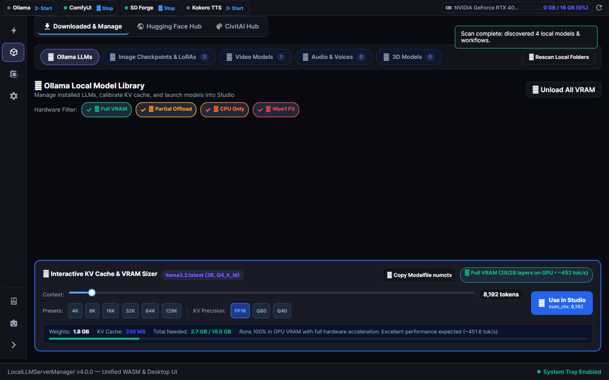

## Overview

Local LLM Server Manager is a cross-platform orchestrator for local artificial intelligence engines. The application operates on Windows and Linux. The system coordinates Large Language Models, image generation, 3D mesh reconstruction, video synthesis, and speech generation.

### User Interface Layout

| Layout Section | Primary Function | Active Elements |
| :--- | :--- | :--- |
| **Telemetry Header & Ribbon** | Live Hardware & Engine Monitoring | GPU name, real-time VRAM allocation bar, interactive engine status cards (Ollama, ComfyUI, SD Forge, Kokoro TTS) with live status dots, tooltips, and click-to-manage toggles. |
| **Activity Rail** | Workspace Domain Navigation | Primary navigation across Models (Local, Hugging Face, CivitAI), Multimodal Studio, Can I Run It (Hardware Fit), and Settings, plus Copilot and Documentation sidebar launcher buttons. |
| **Fluid Studio Canvas & Dock** | Creative Generation Center | Modality selector bar (`🎨 Image`, `💬 Text`, `🎬 Video`, `🧊 3D Mesh`, `🎙️ Audio`), generous center stage preview canvas, style preset bar, and bottom creative prompt dock with parameters flyout (`⚙️ Settings`). |
| **Docked Copilot & Knowledge** | Unified Assistant & Guides Sidebar | Right-side docked sidebar hosting interactive Copilot AI chat (`🤖 Copilot`) and procedural documentation guides (`📖 Knowledge`) with seamless tab switching, magnetic companion pop-out, and contextual prompt transfer. |
| **Companion Windows** | Floating Multi-Window System | Detachable Documentation and AI Assist windows with magnetic flank docking and lockstep tracking. |

## Core Capabilities

- **Automated VRAM Management**: Prevent out-of-memory errors during heavy diffusion or 3D tasks.
- **Real Engine Test Flight**: Verify engine network connectivity and inference pipelines with one click.
- **Model Discovery**: Search and download models from Hugging Face Hub and CivitAI directly.
- **Unified Reverse Proxy**: Route all AI engine traffic through a single port (`5246`).
- **Flexible Deployment**: Run as a native Avalonia desktop application, system tray app, or headless background service.
- **Magnetic Companion Windows**: Detach helper windows and dock them magnetically to the main application window.
- **Model Context Protocol**: Give AI coding assistants secure control over your local AI infrastructure.

## Documentation Sections

Explore the documentation guides to set up and operate your local AI stack:

- [Getting Started Overview](./getting-started/index.md): Review system requirements and core concepts.
- [Installation Guide](./getting-started/installation.md): Install the application on Windows or Linux.
- [First-Time Configuration](./getting-started/configuration.md): Auto-detect engines, configure ports, and set model paths.
- [Quickstart Tutorial](./getting-started/quickstart.md): Download your first model and run your first prompt.
- [Real Engine Test Flight](./getting-started/test-flight.md): Verify engine responsiveness and GPU allocation before generating.
- [Remote Access & Reverse Proxy](./getting-started/remote-access.md): Configure LAN access, SSH tunnels, and Caddy reverse proxy.
- [Multimodal Studio Guide](./studio/index.md): Generate images, videos, audio tracks, and 3D meshes.
- [LoRA Art Styles & CivitAI](./studio/lora-styles.md): Apply custom visual styles to diffusion models.
- [AI Chat Assistant](./ai-and-mcp/assistant.md): Configure external LiteLLM models and multimodal diagnostics.
- [Magnetic Companion Windows](./guide/companion-windows.md): Dock floating helper windows with magnetic snap controls.
- [Troubleshooting Guide](./getting-started/troubleshooting.md): Resolve VRAM issues, port conflicts, and network errors.
- [Documentation Style Guide](./standards/ste-100.md): Review writing standards for this documentation site.
- [Technical Reference](./technical/index.md): Read system architecture specifications and developer guides.

