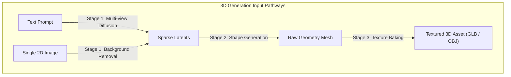
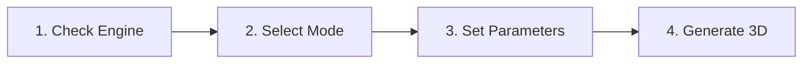

# 3D Mesh Reconstruction

The 3D Mesh Studio reconstructs textured 3D models from 2D images or text descriptions. It communicates directly with ComfyUI on port `8188` to run neural 3D reconstruction nodes.

The studio outputs production-ready 3D assets in industry-standard `.glb` and `.obj` formats.

---

## Supported 3D Models

The studio integrates two modern open-source 3D reconstruction engines:

| Engine | Primary Architecture | Input Modalities | Best Use Case |
| :--- | :--- | :--- | :--- |
| **TRELLIS V2** | Sparse-structure latents & multi-view flow matching | Image-to-3D & Text-to-3D | Sharp mechanical geometry, detailed props, and clean topology. |
| **Hunyuan3D v2** | Two-stage diffusion & textured mesh generator | Image-to-3D & Text-to-3D | Watertight organic models, creature sculpts, and complex characters. |

> [!NOTE]
> Install ComfyUI 3D custom nodes via ComfyUI-Manager. For detailed installation steps, refer to the [ComfyUI & 3D Guide](../engines/comfyui.md).

---

## Hardware Requirements and Memory Allocation

Reconstructing 3D neural fields requires substantial GPU memory:

* **Recommended VRAM:** 12 GB to 16 GB dedicated GPU memory.
* **Minimum VRAM:** 8 GB (requires lower poly-count settings).
* **Automated VRAM Offloading:** The VRAM Orchestrator automatically clears Ollama language models from GPU memory before 3D reconstruction begins.

> [!IMPORTANT]
> If your GPU has 8 GB of VRAM, close all other GPU applications before launching 3D workflows.

---

## Generation Pipelines

The studio supports two distinct input pipelines:

### 1. Image-to-3D Pipeline

The Image-to-3D pipeline reconstructs geometry from a reference image:

* Supply an image with a single subject against a neutral background.
* The backend node automatically segments the subject and removes background noise.
* The pipeline estimates depth, multi-view consistency, and back-face geometry.

> [!TIP]
> Generate your source image in the [Image Studio](./image-generation.md) using FLUX or SDXL. Include the phrase `"isolated on white background, 3D asset"` in your prompt.

### 2. Text-to-3D Pipeline

The Text-to-3D pipeline generates a multi-view visual concept first. It then converts that concept into an orbital 3D mesh automatically.

---

## Step-by-Step 3D Mesh Generation

Follow these steps to reconstruct a 3D asset:

### Step 1: Verify 3D Engine Status

1. Open the **Workflows** tab in the top navigation bar.
2. Click **📦 3D Mesh** in the modality selector.
3. Verify the **ComfyUI** status pill in the header. Ensure the status displays **Online**.

### Step 2: Choose Generation Mode

Select your input mode:

* Click **📝 Text to 3D** to describe an object with text prompts.
* Click **🖼️ Image to 3D** to supply a source reference image.

### Step 3: Configure Geometry and Export Options

1. **3D Prompt:** Describe the object, physical materials, and surface textures.
2. **Export Format:** Select `GLB` or `OBJ` from the format selector.
3. **Mesh Quality / Poly Count:** Select your desired polygon density:
   * `Standard`: Balanced poly count optimized for real-time game engines.
   * `High Detail`: Dense mesh topology optimized for offline rendering and digital sculpting.

### Step 4: Generate 3D Mesh

1. Click **📦 Step 4: Generate 3D Mesh / Splat**.
2. Monitor the 4-stage pipeline progress tracker.
3. Wait for the sparse-structure and texture generation passes to finish.
4. Inspect the rendered asset in the 3D viewport canvas.

---

## 360° Orbital WebGL Viewport

The right panel features an interactive WebGL canvas that renders generated `.glb` meshes in real time:

### Viewport Navigation Controls

Interact with your 3D model using standard orbital camera controls:

* **Rotate (Orbit):** Click and drag with the left mouse button to rotate the camera around the asset.
* **Pan:** Click and drag with the right mouse button to shift the camera position horizontally and vertically.
* **Zoom:** Scroll the mouse wheel up or down to inspect fine texture details.
* **Wireframe Toggle:** Click the wireframe button to inspect polygon edge flow and quad density.
* **Lighting Modes:** Switch between studio lighting, flat ambient light, and untextured clay modes.

---

## Exporting and Downloading 3D Files

Once reconstruction completes, click the export buttons below the 3D canvas:

* **⬇️ Export GLB:**
  * Downloads a binary glTF file with embedded UV textures, normal maps, and PBR materials.
  * Compatible with Godot, Unreal Engine 5, Unity, and Three.js web applications.
* **⬇️ Export OBJ:**
  * Downloads a standard wavefront OBJ file accompanied by MTL material definitions.
  * Compatible with Blender, Autodesk Maya, 3ds Max, and 3D printing slicers.

---

## Custom ComfyUI 3D Workflows

You can export custom 3D workflows from ComfyUI and run them through Local LLM Server Manager:

1. Open ComfyUI in your web browser (`http://127.0.0.1:8188`).
2. Open the ComfyUI settings dialog and enable **Enable Dev mode Options**.
3. Click **Save (API Format)** to export your workflow as a `.json` file.
4. Copy the JSON file into the `Workflows/` directory in Local LLM Server Manager.
5. Open the studio. The new custom 3D workflow appears automatically in the preset dropdown.

---

## Related Documentation

* [Studio Overview](./index.md) — Architectural overview and feature pack management.
* [Image Generation Guide](./image-generation.md) — Create reference images for Image-to-3D pipelines.
* [ComfyUI Engine Setup](../engines/comfyui.md) — Install TRELLIS and Hunyuan3D custom nodes.
