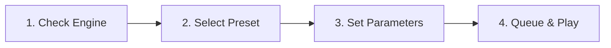

# Audio & Music Synthesis

The Audio Studio provides a comprehensive workstation for speech synthesis, ambient sound design, and full-song music creation.

The studio routes generation tasks through the Kokoro TTS engine on port `8880` and ComfyUI on port `8188`.

---

## Audio Generation Subsystems

The studio provides three specialized generation pipelines:

| Engine / Model | Primary Function | Duration / Output | Minimum Hardware |
| :--- | :--- | :--- | :--- |
| **Kokoro TTS** | High-speed text-to-speech narration. | Instant streaming (<100ms) | CPU or 2 GB VRAM |
| **Stable Audio Open 3.0** | Text-to-SFX, ambient loops, and instruments. | Up to 47 seconds at 44.1 kHz | 4 GB - 8 GB VRAM |
| **YuE Music Generator** | Full-song generation from lyrics and style tags. | Full-length song arrangements | 12 GB - 16 GB VRAM |

> [!NOTE]
> Speech and audio synthesis require the **Audio Feature Pack (`ext_audio`)**. Install this pack through the **Settings** tab if the audio controls are disabled.

---

## Detailed Model Capabilities

### 1. Kokoro TTS Engine

Kokoro TTS generates natural human speech with minimal latency. It uses an ONNX runtime architecture for efficient CPU and GPU inference:

* **Voice Catalog:** Choose from more than 50 distinct voice profiles across American and British accents.
  * `af_heart`: Warm, natural female narration. Recommended for storytelling and audiobooks.
  * `af_bella`: Bright, modern female voice for dynamic assistant responses.
  * `am_adam`: Clear, authoritative male voice for technical documentation.
  * `am_michael`: Resonant broadcaster voice for media and podcasts.
* **OpenAI API Compatibility:** The server proxy exposes standard `/v1/audio/speech` endpoints for third-party frontends.

### 2. Stable Audio Open 3.0

Stable Audio Open generates stereo sound effects and acoustic textures from text descriptions:

* **Sound Effects:** Create Foley effects such as footsteps, thunder, laser pulses, and mechanical clicks.
* **Ambient Soundscapes:** Produce loopable background audio for games, videos, and relaxation tracks.
* **Instrumental Samples:** Generate drum beats, synth arpeggios, and orchestral chords for music production.

### 3. YuE Full-Song Music Generator

YuE is a foundation model that writes and performs complete songs:

* **Dual-Track Generation:** Synthesizes structured vocal lines and instrumental backing tracks simultaneously.
* **Lyric Alignment:** Follows verse, chorus, and bridge formatting provided in your text prompt.
* **Genre Flexibility:** Supports rock, synthwave, acoustic pop, orchestral, and jazz musical styles.

---

## Audio Presets & Starter Chips

Use the Studio Preset Bar to configure audio parameters with one click:

* **🎙️ Natural Storyteller (`tts_narrator`):** Selects `af_heart` voice profile with balanced pacing.
* **📻 Energetic Broadcaster (`tts_radio`):** Selects `am_michael` with expressive inflection.
* **🌧️ Ambient Soundscape (`audio_sfx_ambient`):** Configures Stable Audio Open for a 30-second environmental loop.
* **🎸 Full Song Generator (`audio_song_yue`):** Configures YuE workflow parameters for multi-verse song creation.

> [!TIP]
> Click starter prompt chips above the text box to test your audio engine immediately:
> * `[🎙️ Natural Storyteller Sample]`: Staged narration script.
> * `[🌧️ Rainy Cyberpunk Ambience]`: City rain with neon hum.
> * `[🎵 Retro Synthwave Melody]`: 80s analog bassline and drum machine groove.

---

## Step-by-Step Audio Generation

Follow these steps to synthesize speech or music:



### Step 1: Verify Audio Engine Status

1. Open the **Workflows** tab in the top navigation bar.
2. Click **🎵 Audio** in the modality selector.
3. Check the engine status pill in the card header.
4. Verify that the status shows **Online**.

### Step 2: Choose Preset or Workflow

1. Open the **Workflow** dropdown menu.
2. Select **Kokoro TTS**, **Stable Audio Open**, or **YuE Song Generator**.
3. Choose a curated preset from the Studio Preset Bar.

### Step 3: Configure Duration and Prompts

1. **Duration (s):** Set the audio duration between `5` and `300` seconds. Use shorter durations for rapid sound effect testing.
2. **Seed:** Set a numeric seed or leave blank for randomized variations.
3. **Prompt Text:**
   * For **Kokoro TTS:** Type or paste the narration script.
   * For **Stable Audio:** Describe instruments, environment, acoustic space, and tempo (BPM).
   * For **YuE:** Include genre tags and lyrics labeled with `[Verse]` and `[Chorus]` markers.
4. **Negative Prompt:** List acoustic flaws to prevent, such as distortion, clipping, or background hiss.

### Step 4: Queue Generation and Listen

1. Click **🎵 Step 4: Queue Audio Generation Workflow**.
2. Observe the 4-stage tracker during audio sampling and VAE decoding.
3. Click the **Play** button when generation finishes.

---

## Interactive Waveform Visualizer & Player

The bottom section of the Audio Studio contains an integrated player bar:

* **Waveform Visualizer:** Displays dynamic amplitude peak bars that animate during audio playback.
* **Play / Pause (`▶️` / `⏸️`):** Toggle playback of the currently loaded track.
* **Track Title Badge:** Displays the active audio filename and duration metadata.
* **Audio Track Dropdown:** Select previously generated WAV and MP3 files from the current session.
* **Download Button:** Export the raw uncompressed WAV audio file to your local computer.

---

## OpenAI API Audio Proxy

Local LLM Server Manager routes OpenAI-compatible audio requests through port `5246`. External chat frontends such as Open WebUI or LibreChat can stream speech directly:

```bash
curl http://localhost:5246/v1/audio/speech \
  -H "Content-Type: application/json" \
  -d '{
    "model": "kokoro",
    "input": "System check complete. All local AI engines are operational.",
    "voice": "af_heart",
    "response_format": "mp3"
  }' \
  --output voice_output.mp3
```

> [!IMPORTANT]
> The reverse proxy unifies audio ports. You do not need to expose individual backend ports when connecting remote clients over SSH.

---

## Related Documentation

* [Studio Overview](./index.md) — Architecture and modular feature pack guide.
* [Kokoro TTS Engine Guide](../engines/kokoro-tts.md) — Voice installation and performance tuning.
* [ComfyUI Engine Guide](../engines/comfyui.md) — Manage ComfyUI audio nodes and execution queues.
