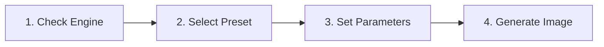

# Image Generation

The Image Studio provides a local environment to generate high-resolution images. You can generate images through Stable Diffusion WebUI Forge or ComfyUI.

The studio supports FLUX.1, SDXL, and Stable Diffusion 1.5 base models.

---

## Supported Model Families

Select the model family that matches your GPU memory and artistic goals:

| Model Family | Native Resolution | Minimum VRAM | Recommended Use Case |
| :--- | :--- | :--- | :--- |
| **FLUX.1 (dev / schnell)** | 1024 × 1024 | 12 GB | Best text rendering, complex prompts, and realistic anatomy. |
| **SDXL (Stable Diffusion XL)** | 1024 × 1024 | 8 GB | Photorealism, cinematic lighting, and custom community styles. |
| **Stable Diffusion 1.5** | 512 × 512 | 4 GB | High-speed rendering and lightweight game assets. |

> [!NOTE]
> You can download base models and checkpoints directly through the [Model Management](../engines/model-management.md) tab from Hugging Face or CivitAI.

---

## Generation Procedure

Follow these steps to generate an image:



### Step 1: Check Backend Engine Status

1. Open the **Workflows** tab in the top navigation bar.
2. Click **🎨 Images** in the modality selector.
3. Check the engine status pill in the header.
4. Verify that the status shows **Online**.
5. Click **Toggle Forge Engine** if the status shows **Offline**.

### Step 2: Choose a Preset or Starter Style

Select a preset from the Studio Preset Bar to configure optimal resolutions automatically:

* **Standard Square (1024 × 1024):** Default setting for general art and character portraits.
* **Landscape Wallpaper (1344 × 768):** Wide aspect ratio for environments and desktop backgrounds.
* **Portrait Photo (768 × 1152):** Vertical aspect ratio for full-body human figures and posters.
* **Classic SD 1.5 (512 × 512):** Lightweight resolution for legacy models and rapid drafting.

> [!TIP]
> Click a starter prompt chip above the prompt box. The chip populates proven prompts and selects the matching preset instantly.

### Step 3: Configure Generation Parameters

Set the parameters in the configuration panel:

1. **Workflow Model:** Type or select your checkpoint name (for example, `SDXL Base` or `flux1-dev`).
2. **Positive Prompt:** Describe all subjects, styles, lighting, and camera angles that you want in the image.
3. **Negative Prompt:** List unwanted elements such as blur, distortion, or watermark artifacts.
4. **Resolution (Width × Height):** Set the image dimensions. Keep dimensions aligned to multiples of 64 or 16.
5. **Sampling Steps:**
   * Use **4 to 8 steps** for FLUX.1-schnell.
   * Use **20 to 30 steps** for SDXL and SD 1.5.
   * Use **25 to 50 steps** for FLUX.1-dev.
6. **CFG Scale (Guidance Scale):**
   * Set **1.0** for FLUX models.
   * Set **5.0 to 7.0** for SDXL models.
   * Set **7.0 to 8.5** for SD 1.5 models.
7. **Sampler and Scheduler:** Select an approved sampler algorithm:
   * `Euler` or `Euler a`: Fast, general-purpose convergence.
   * `DPM++ 2M Karras`: High detail for photorealistic textures.
   * `UniPC`: High-speed generation with fewer steps.
8. **Seed:** Enter a numeric value between `1` and `999999999`. Enter `-1` or leave random to generate new variations.

### Step 4: Launch Generation

1. Click **🎨 Launch Forge Image Studio (Port 7860)** or **Generate Image**.
2. Observe the 4-stage progress tracker during diffusion execution.
3. Inspect the completed image in the output gallery.

> [!IMPORTANT]
> The application automatically saves rendered images to `outputs/images/` with embedded prompt and parameter metadata.

---

## Applying LoRAs (Low-Rank Adaptations)

LoRAs are compact model files (typically 50 MB to 200 MB). A LoRA modifies an existing checkpoint into a specific character, clothing style, or visual aesthetic.

### How to Download LoRAs

1. Open the **Stable Diffusion (CivitAI)** tab.
2. Set the **Type** dropdown filter to **LoRA**.
3. Sort results by **Highest Rated** or **Most Downloaded**.
4. Type your desired aesthetic into the search bar (for example, `Pixel Art XL` or `Detail Tweaker`).
5. Click **⬇ Download to Forge**. The system stores the file in your models directory.

### Popular Community LoRA Styles

| Style Category | Search Term | Recommended Base Model | Effect |
| :--- | :--- | :--- | :--- |
| **Pixel Art** | `Pixel Art XL` | SDXL | Generates authentic 16-bit sprites and backgrounds. |
| **Retro 3D** | `PS1 Graphics` | SDXL / SD 1.5 | Recreates jagged low-polygon PlayStation 1 aesthetics. |
| **Anime & Cartoon** | `Cel Shaded` | SDXL / Pony V6 | Applies clean outlines and flat anime color fills. |
| **Micro-Detail** | `Detail Tweaker XL` | SDXL / FLUX | Sharpens skin pores, fabric weaves, and rim lighting. |

### Method 1: Using LoRAs in Prompts (Forge & WebUI)

Add the trigger tag directly into your positive prompt box:

```text
<lora:pixel_art_xl:0.8> a cyberpunk street market at night, 16-bit retro game asset
```

* Specify the filename of the LoRA between the colons.
* Add a weight value at the end (typically `0.6` to `1.0`).
* Lower the weight if the style distorts facial anatomy or colors.

### Method 2: Using LoRAs in ComfyUI

When using ComfyUI as your studio backend:

1. Add a **Load LoRA** node to your ComfyUI canvas.
2. Connect the `MODEL` output from your Checkpoint Loader into the `model` input of the LoRA node.
3. Connect the `CLIP` output into the `clip` input of the LoRA node.
4. Select your downloaded LoRA filename inside the node dropdown menu.
5. Set `strength_model` and `strength_clip` to `0.8`.
6. Connect the modified outputs into your positive prompt and KSampler nodes.

---

## VRAM Management and Hardware Fit

High-resolution diffusion models require dedicated GPU VRAM. Review these memory guidelines:

* **Automated LLM Offload:** The VRAM Orchestrator automatically unloads Ollama models before diffusion starts.
* **FLUX Models:** FLUX.1-dev requires at least 12 GB VRAM in FP8 or NF4 quantization.
* **Resolution Limits:** Do not set resolutions above 1024 × 1024 on GPUs with 8 GB VRAM. Use high-resolution fix or latent upscalers instead.

> [!WARNING]
> Generating at resolutions above 1536 × 1536 without tiling causes Out-Of-Memory errors on 16 GB GPUs. Use the standard presets to maintain safe VRAM bounds.

---

## Related Documentation

* [Studio Overview](./index.md) — Learn about modular feature packs and presets.
* [Video Generation Guide](./video-generation.md) — Transform static images into animated video clips.
* [3D Mesh Reconstruction Guide](./3d-mesh.md) — Convert generated 2D images into 3D meshes.
* [SD Forge Engine Guide](../engines/sd-forge.md) — Configure your local Forge installation.
* [CivitAI & Model Hub Guide](../engines/model-management.md) — Manage checkpoints and embeddings.
