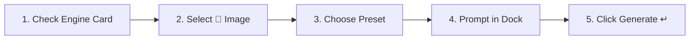

# Image Generation

The Image Studio provides a local environment to generate high-resolution images. You can generate images through Stable Diffusion WebUI Forge or ComfyUI.

The studio supports FLUX.1, SDXL, and Stable Diffusion 1.5 base models.

---

## Supported Model Families

Select the model family that matches your GPU memory and artistic goals:

| Model Family | Native Resolution | Minimum VRAM | Recommended Use Case |
| :--- | :--- | :--- | :--- |
| **FLUX.1 (dev / schnell)** | 1024 × 1024 | 12 GB | Best text rendering, complex prompts, and realistic anatomy. |
| **SDXL (Stable Diffusion XL)** | 1024 × 1024 | 8 GB | Photorealism, cinematic lighting, and custom community styles. |
| **Stable Diffusion 1.5** | 512 × 512 | 4 GB | High-speed rendering and lightweight game assets. |

> [!NOTE]
> You can download base models and checkpoints directly through the [Model Management](../engines/model-management.md) tab from Hugging Face or CivitAI.

---

## Generation Procedure

Follow these steps to generate an image using the Fluid Studio Canvas and Creative Prompt Dock:


```mermaid
flowchart LR
    E["1. Check Engine Card"] --> M["2. Select 🎨 Image"]
    M --> P["3. Choose Preset"]
    P --> D["4. Prompt in Dock"]
    D --> G["5. Click Generate ↵"]
```

### Step 1: Check Backend Engine Status
1. Check the **SD Forge** card in the Telemetry Header or Ribbon.
2. Ensure the status dot is green (**Online**).
3. If stopped, click **▷ Start** on the card to launch the engine on port `7860`.

### Step 2: Select Image Modality
1. Open the **Studio** workspace from the left Activity Rail.
2. In the top modality selector bar, click **🎨 Image**.
3. The Center Stage canvas activates the interactive Image Viewport with pan/zoom preview controls.

### Step 3: Choose a Style Preset or Starter Prompt
Select a preset from the Studio Preset Bar or click a starter prompt chip directly within the canvas:
* **Standard Square (1024 × 1024):** Default setting for general art and character portraits.
* **Landscape Wallpaper (1344 × 768):** Wide aspect ratio for environments and desktop backgrounds.
* **Portrait Photo (768 × 1152):** Vertical aspect ratio for full-body human figures and posters.
* **Classic SD 1.5 (512 × 512):** Lightweight resolution for legacy models and rapid drafting.

### Step 4: Enter Prompt & Fine-Tune in Dock
1. **Prompt Textarea:** Describe your subject, lighting, and composition in the autosizing prompt dock.
2. **Parameters Flyout (`⚙️ Settings`):** Click the settings button to slide open fine-tuning sliders:
   * **Steps:** 20 to 30 steps for SDXL, 4 to 8 for FLUX schnell.
   * **CFG Scale:** 5.0 to 7.0 for SDXL, 1.0 for FLUX.
   * **Denoise:** Adjust denoising strength (default: 0.75).
   * **Seed:** Numeric seed (`-1` for randomized variations).
   * **Aspect Ratio:** Click `1:1`, `16:9`, `9:16`, or `4:3` pills.
3. **Reference Attachment (`📎`):** Optionally attach an image for image-to-image or style conditioning.

### Step 5: Click Generate ↵
1. Click the prominent **Generate ↵** action button in the dock.
2. Forge WebUI processes the prompt via GPU diffusion sampling.
3. Inspect the completed image in the interactive Center Stage canvas.

> [!IMPORTANT]
> The application automatically saves rendered images to `outputs/images/` with embedded prompt and parameter metadata.

---

## Applying LoRAs (Low-Rank Adaptations)

LoRAs are compact model files (typically 50 MB to 200 MB). A LoRA modifies an existing checkpoint into a specific character, clothing style, or visual aesthetic.

### How to Download LoRAs

1. Open the **Stable Diffusion (CivitAI)** tab.
2. Set the **Type** dropdown filter to **LoRA**.
3. Sort results by **Highest Rated** or **Most Downloaded**.
4. Type your desired aesthetic into the search bar (for example, `Pixel Art XL` or `Detail Tweaker`).
5. Click **⬇ Download to Forge**. The system stores the file in your models directory.

### Popular Community LoRA Styles

| Style Category | Search Term | Recommended Base Model | Effect |
| :--- | :--- | :--- | :--- |
| **Pixel Art** | `Pixel Art XL` | SDXL | Generates authentic 16-bit sprites and backgrounds. |
| **Retro 3D** | `PS1 Graphics` | SDXL / SD 1.5 | Recreates jagged low-polygon PlayStation 1 aesthetics. |
| **Anime & Cartoon** | `Cel Shaded` | SDXL / Pony V6 | Applies clean outlines and flat anime color fills. |
| **Micro-Detail** | `Detail Tweaker XL` | SDXL / FLUX | Sharpens skin pores, fabric weaves, and rim lighting. |

### Method 1: Using LoRAs in Prompts (Forge & WebUI)

Add the trigger tag directly into your positive prompt box:

```text
<lora:pixel_art_xl:0.8> a cyberpunk street market at night, 16-bit retro game asset
```

* Specify the filename of the LoRA between the colons.
* Add a weight value at the end (typically `0.6` to `1.0`).
* Lower the weight if the style distorts facial anatomy or colors.

### Method 2: Using LoRAs in ComfyUI

When using ComfyUI as your studio backend:

1. Add a **Load LoRA** node to your ComfyUI canvas.
2. Connect the `MODEL` output from your Checkpoint Loader into the `model` input of the LoRA node.
3. Connect the `CLIP` output into the `clip` input of the LoRA node.
4. Select your downloaded LoRA filename inside the node dropdown menu.
5. Set `strength_model` and `strength_clip` to `0.8`.
6. Connect the modified outputs into your positive prompt and KSampler nodes.

---

## VRAM Management and Hardware Fit

High-resolution diffusion models require dedicated GPU VRAM. Review these memory guidelines:

* **Automated LLM Offload:** The VRAM Orchestrator automatically unloads Ollama models before diffusion starts.
* **FLUX Models:** FLUX.1-dev requires at least 12 GB VRAM in FP8 or NF4 quantization.
* **Resolution Limits:** Do not set resolutions above 1024 × 1024 on GPUs with 8 GB VRAM. Use high-resolution fix or latent upscalers instead.

> [!WARNING]
> Generating at resolutions above 1536 × 1536 without tiling causes Out-Of-Memory errors on 16 GB GPUs. Use the standard presets to maintain safe VRAM bounds.

---

## Related Documentation

* [Studio Overview](./index.md) — Learn about modular feature packs and presets.
* [Video Generation Guide](./video-generation.md) — Transform static images into animated video clips.
* [3D Mesh Reconstruction Guide](./3d-mesh.md) — Convert generated 2D images into 3D meshes.
* [SD Forge Engine Guide](../engines/sd-forge.md) — Configure your local Forge installation.
* [CivitAI & Model Hub Guide](../engines/model-management.md) — Manage checkpoints and embeddings.
