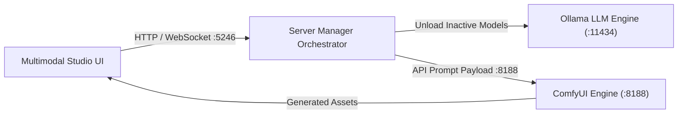
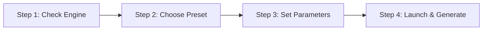

# Multimodal Studio Overview

Multimodal Studio provides a unified creative environment in Local LLM Server Manager. You can generate images, synthesize videos, create audio tracks, and reconstruct 3D meshes from one interface.

The studio connects directly to your local AI backends. It integrates with ComfyUI, Stable Diffusion WebUI Forge, and the Kokoro TTS engine.

---

## Key Capabilities

* **Image Generation:** Create high-resolution artwork with FLUX.1, SDXL, and Stable Diffusion 1.5 checkpoints.
* **Video Generation:** Synthesize realistic video clips with Wan 2.2, LTX-Video 2.5, and HunyuanVideo models.
* **Audio & Music Synthesis:** Produce natural speech with Kokoro TTS, sound effects with Stable Audio Open, and full songs with YuE.
* **3D Mesh Reconstruction:** Convert images and text into textured 3D meshes with TRELLIS V2 and Hunyuan3D v2.

---

## Studio Modalities

The studio interface includes dedicated workspaces for each creative modality:

| Studio Modality | Primary Backend Engine | Typical Hardware Demand | Output Formats |
| :--- | :--- | :--- | :--- |
| [Image Generation](./image-generation.md) | ComfyUI / SD Forge | 6 GB - 12 GB VRAM | PNG, WebP, JPEG |
| [Video Generation](./video-generation.md) | ComfyUI (Wan / LTX) | 8 GB - 16 GB VRAM | MP4 |
| [Audio & Music](./audio-and-music.md) | Kokoro TTS / ComfyUI | CPU or 2 GB - 6 GB VRAM | WAV, MP3, FLAC |
| [3D Mesh](./3d-mesh.md) | ComfyUI 3D Nodes | 12 GB - 16 GB VRAM | GLB, OBJ |

---

## Modular Feature Packs

Local LLM Server Manager keeps the base application download small. Specialized studio backends run as optional Feature Packs.

### Available Feature Packs

1. **Video Feature Pack (`ext_video`)**:
   * Provides ComfyUI custom nodes for Wan 2.2, LTX-Video 2.5, and HunyuanVideo.
   * Includes video workflow templates and video player components.
   * Requires approximately 14.2 GB disk storage and 8 GB minimum GPU VRAM.

2. **Audio Feature Pack (`ext_audio`)**:
   * Provides the Kokoro FastAPI TTS service and voice weights.
   * Includes Stable Audio Open presets and waveform visualizer tools.
   * Requires approximately 350 MB disk storage for speech and runs on CPU or GPU.

### How to Install Feature Packs

You can install feature packs through the installer or inside the application settings:

1. **Application Settings:**
   * Open the **Settings** tab.
   * Locate the **Feature Packs** section.
   * Click **Install** next to `ext_video` or `ext_audio`.

2. **Command-Line Installer:**
   * Run the installer executable with feature flags:
   ```bash
   LocalLLMServerManager-Setup.exe /COMPONENTS="main,ext_video,ext_audio"
   ```

> [!NOTE]
> You can install or remove feature packs at any time. The application updates your workflow menus without a system restart.

---

## ComfyUI Backend Integration

ComfyUI serves as the execution engine for advanced video, audio, and 3D pipelines. Local LLM Server Manager communicates with ComfyUI through its native WebSocket and REST API on port `8188`.



### Automated VRAM Orchestrator

Generating large video frames or 3D meshes requires substantial GPU memory. The built-in VRAM Orchestrator protects your system from Out-Of-Memory (OOM) crashes:

1. You trigger a heavy generation job in the Studio.
2. The orchestrator checks available GPU VRAM.
3. The orchestrator unloads idle Ollama text models from VRAM.
4. ComfyUI receives the workflow payload and allocates VRAM for diffusion weights.
5. The orchestrator restores Ollama service after the studio workflow finishes.

> [!TIP]
> Check the hardware fit badge in the studio header before generation. A green badge indicates sufficient GPU memory. A yellow badge indicates that the orchestrator must unload text models.

---

## Sequential 4-Step Studio Workflow

Every studio modality follows the same four-step sequential pathway:



1. **Step 1: Check Engine Status:**
   * Verify the status indicator pill in the modality header.
   * Click **Toggle Engine** if the backend engine is offline.

2. **Step 2: Choose Preset:**
   * Select a curated studio preset from the dropdown bar.
   * Click a starter prompt chip to load proven settings instantly.

3. **Step 3: Configure Parameters:**
   * Enter your text prompt and negative prompt.
   * Adjust resolution, seed, frame count, or duration.

4. **Step 4: Launch and Generate:**
   * Click the primary generation button.
   * Monitor progress in the 4-stage pipeline tracker.

---

## 4-Stage Pipeline Progress Tracker

When generation starts, the Studio displays an interactive 4-stage progress tracker:

* **Stage 1 (VRAM & Weights):** Allocates GPU memory and loads neural network weights.
* **Stage 2 (Sampling & Denoising):** Executes iterative diffusion sampling steps with live percentage updates.
* **Stage 3 (Encoding & Assembly):** Runs VAE decoding and packages the output file into MP4, WAV, or GLB.
* **Stage 4 (Ready & Complete):** Displays the output file in the interactive preview canvas.

> [!IMPORTANT]
> Click **Cancel Generation** in the progress tracker to stop an active job safely. The server aborts the backend process and releases GPU VRAM.

---

## Diagnostic Test Flight

The Studio includes a built-in diagnostic test flight wizard. Use this wizard to verify your hardware and engine configuration:

1. Click **Diagnostic Test Flight** in the Studio header.
2. Select your target modality: **Image**, **Video**, or **Audio**.
3. Choose a verified test prompt chip.
4. Review the automated pre-flight checks for engine health and VRAM clearance.
5. Click **Launch Test Flight**.
6. Inspect the generated preview asset to confirm system readiness.

> [!WARNING]
> Do not close the application window during an active generation job. Closing the window interrupts network transfers and leaves temporary cache files on disk.

---

## Next Steps

Explore the detailed guides for each studio modality:

* [Image Generation Guide](./image-generation.md) — Generate images with FLUX, SDXL, and LoRAs.
* [Video Generation Guide](./video-generation.md) — Synthesize videos with Wan 2.2 and LTX-Video.
* [Audio & Music Synthesis Guide](./audio-and-music.md) — Generate speech with Kokoro TTS and music with YuE.
* [3D Mesh Reconstruction Guide](./3d-mesh.md) — Reconstruct 3D assets with TRELLIS V2 and Hunyuan3D.
* [ComfyUI Engine Setup](../engines/comfyui.md) — Configure your ComfyUI backend and custom nodes.
