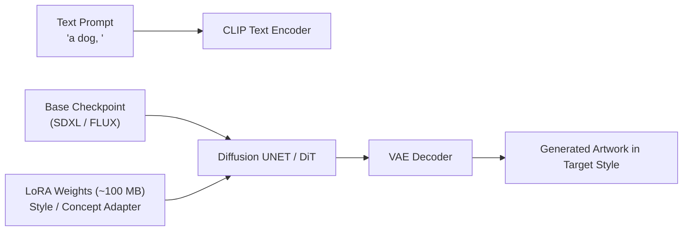

# LoRA Art Styles & CivitAI Guide

Low-Rank Adaptations (LoRAs) allow you to apply specific visual styles, character designs, and concepts without downloading full multi-gigabyte checkpoint models.

---

## What is a LoRA?

A base checkpoint model (such as SDXL, FLUX, or Pony V6) requires 4 GB to 12 GB of storage. In contrast, a LoRA file is compact (typically 50 MB to 200 MB).

The LoRA acts as a targeted adapter layer. It modifies model weights during generation to produce a specific style or subject:



---

## Download LoRAs from CivitAI

You can search and download LoRAs directly from CivitAI inside the manager:

1. Open **Local LLM Server Manager**.
2. Click the **CivitAI Models** tab on the navigation bar.
3. Select **LoRA** from the **Type** filter dropdown.
4. Select **Highest Rated** or **Most Downloaded** from the **Sort** dropdown.
5. Type an art style keyword in the search box (see reference table below).
6. Press `Enter` to search.
7. Click on a model card to inspect preview thumbnails, trigger words, and base model compatibility.
8. Click **⬇ Download to Forge**. The manager streams the file directly into your configured LoRA directory.

---

## Popular Style Keywords Reference

Use these search terms to find established community LoRA styles:

| Style Category | Recommended Search Keywords | Visual Result |
| :--- | :--- | :--- |
| **Pixel Art & Retro** | `Pixel Art XL`, `16-bit`, `Retro 3D`, `Gameboy` | Authentic sprite graphics, isometric levels, dot-matrix art |
| **Animation & Anime** | `Cel Shaded`, `Studio Ghibli`, `90s Anime Style` | Clean line art, vibrant watercolors, retro animation aesthetics |
| **3D & Game Assets** | `Claymation`, `Low Poly`, `Chibi Figurine` | Tactile plasticine figures, stylized game meshes, clay models |
| **Realism Enhancers** | `Detail Tweaker XL`, `Cinematic Lighting` | Skin pores, micro-textures, neon rim lights, dramatic shadows |

---

## How to Apply a LoRA in Generation

### Method 1: In Prompts (Stable Diffusion WebUI Forge)
Include the LoRA trigger syntax directly in your text prompt. Set the weight between `0.5` and `1.0`:

```text
<lora:pixel_art_xl:1.0> a cybernetic dog in a neon alley, 16-bit pixel art style
```

### Method 2: In ComfyUI Workflows
Use a **Load LoRA** node in your ComfyUI node graph:
1. Open the ComfyUI workflow editor.
2. Add a **Load LoRA** node between your **Load Checkpoint** node and **KSampler**.
3. Connect the `MODEL` and `CLIP` outputs to the LoRA inputs.
4. Select your downloaded LoRA from the dropdown menu.
5. Adjust `strength_model` (recommended: `0.8`) and `strength_clip` (recommended: `0.8`).

---

## Related Documentation

- [Multimodal Studio Overview](./index.md)
- [Image Generation Guide](./image-generation.md)
- [CivitAI & Hugging Face Model Management](../engines/model-management.md)
