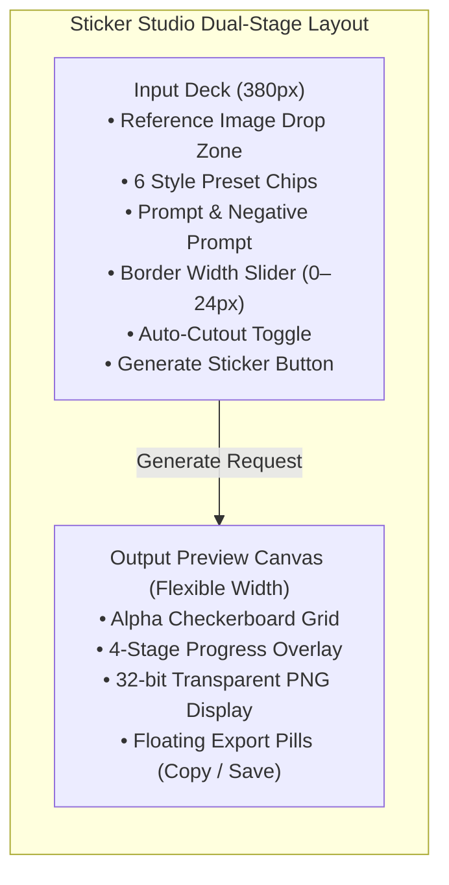
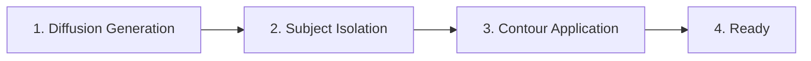

# Sticker Studio

Sticker Studio provides an automated workflow to convert reference images and ideas into die-cut vinyl stickers. The studio runs entirely on your local machine through Stable Diffusion WebUI Forge or ComfyUI.

Every generated sticker includes a clean, die-cut border and an alpha-transparent background ready for production or digital sharing.

---

## Key Capabilities

* **Local Engine Inference:** Generate artwork through local Stable Diffusion Forge or ComfyUI instances.
* **Curated Style Presets:** Select from six specialized sticker art styles with pre-tuned prompt keywords.
* **Auto-Cutout Isolation:** Automatically detect and remove image backgrounds to isolate the primary subject.
* **Die-Cut Contour Tuner:** Adjust white contour border thickness from 0 px to 24 px in real time.
* **Transparent Alpha Canvas:** Inspect generated assets over an alternating high-contrast checkerboard grid.
* **One-Click Export:** Copy 32-bit transparent PNGs to your system clipboard or save files to disk.

---

## Interface Layout: Dual-Stage Workspace

Sticker Studio uses a dynamic dual-stage canvas layout designed for creative focus:

### 1. Left Column: Input Deck (380 px)
The scrollable Input Deck contains all input controls:
* **Reference Image Drop Zone:** Drag and drop PNG, JPG, or WebP reference images up to 25 MB.
* **Style Preset Chips:** Select from six curated art styles to inject prompt keywords instantly.
* **Prompt & Negative Prompt:** Customize positive prompt descriptions and unwanted visual artifacts.
* **Contour Settings:** Toggle automated background cutout and adjust border width between 0 px and 24 px.
* **Generate Sticker Button:** Start local inference and watch the pipeline progress.

### 2. Right Column: Output Preview Canvas
The flexible output canvas displays your rendering results:
* **Alpha Checkerboard Grid:** High-contrast dark tiles (`#12161c` and `#1a202c`) highlight edge transparency and white die-cut contours.
* **Generating Overlay:** Displays indeterminate progress bars and stage status messages during generation.
* **Export Action Pills:** Quick-action buttons to copy transparent PNGs to the clipboard or save files to disk.

---

## Curated Style Presets

Sticker Studio provides six curated art styles. Each preset injects specialized positive and negative tokens into your generation request:

| Preset Name | Icon | Default Border | Injected Positive Tokens | Injected Negative Tokens |
| :--- | :---: | :---: | :--- | :--- |
| **Die-Cut Vinyl** | 🏷️ | 12 px | `bold white die-cut border, vector sticker, clean lineart, glossy finish, solid white background` | `photorealistic, noisy, blurry, gradient background, complex background, text, watermark` |
| **Holographic** | 🌈 | 14 px | `holographic foil sticker, iridescent rainbow sheen, metallic edge, prismatic reflections` | `matte, flat, dull colors, noisy background` |
| **Chibi Anime** | 👾 | 12 px | `chibi kawaii sticker, oversized head, bold clean lines, cel shaded, sticker cutout` | `realistic proportions, dark, gritty, sketchy, rough lines` |
| **80s Retro** | 📼 | 16 px | `retro 80s synthwave sticker, neon cyan and magenta, halftone dots, badge contour` | `modern, minimalist, monochrome, muted colors` |
| **Pop Art** | 🎨 | 12 px | `pop art comic sticker, bold ink outlines, vibrant flat colors, dot pattern` | `soft shading, realism, muted, blurry` |
| **Watercolor** | 🖌️ | 10 px | `watercolor illustration sticker, soft pigment bleeding, crisp white border` | `harsh vector, digital CGI, photorealism, muddy colors` |

> [!TIP]
> You can append custom prompt terms while preserving preset tokens. The studio automatically combines your custom text with the selected preset tokens.

---

## 4-Stage Generation Pipeline

When you click **Generate Sticker**, the request executes across four automated stages:

1. **Stage 1: Diffusion Generation:**
   * Routes the prompt and parameters to your local Stable Diffusion Forge or ComfyUI backend.
   * Renders the subject with high contrast against an isolated solid background.
2. **Stage 2: Subject Isolation:**
   * Removes background pixels automatically when **Auto-Cutout** is active.
   * Produces a clean RGBA transparent mask of the primary subject.
3. **Stage 3: Contour Application:**
   * Dilates the subject alpha mask by the chosen border radius ($0\text{ to }24\text{ px}$).
   * Applies a solid white die-cut contour band around the outer boundary.
4. **Stage 4: Ready:**
   * Renders the completed 32-bit transparent PNG onto the alpha checkerboard canvas.
   * Activates the floating export action pills.

---

## Step-by-Step Generation Procedure

Follow these steps to create a sticker:

### Step 1: Verify Engine Status
1. Check the **Telemetry Ribbon** in the titlebar.
2. Confirm that **Forge** or **ComfyUI** shows an active green status dot.
3. If the engine is offline, open the **Engines** view and start the service.

### Step 2: Provide Input Reference or Prompt
1. In the **Input Deck**, drag and drop an image into the **Drop Zone**, or click **Browse Files**.
2. Alternatively, leave the drop zone empty and type a description into the **Custom Prompt** field.

### Step 3: Select a Style Preset
1. Click a style preset chip (for example, **🏷️ Die-Cut Vinyl** or **🌈 Holographic**).
2. The studio loads the default border width and token settings for that style.

### Step 4: Configure Contour Settings
1. Verify that **Auto-Cutout** is checked.
2. Adjust the **Die-Cut Border Width** slider between `0` and `24 px` (default: `12 px`).
   * Set `0 px` for borderless transparent cutouts.
   * Set `8–14 px` for standard die-cut stickers.
   * Set `16–24 px` for bold graphic badges.

### Step 5: Generate and Export
1. Click **✨ Generate Sticker**.
2. Watch the progress tracker during diffusion and contour processing.
3. When generation completes, inspect the result on the checkerboard canvas.
4. Click **📋 Copy PNG** to copy the 32-bit transparent image to your clipboard.
5. Click **💾 Save File** to save the sticker to your `outputs/stickers/` folder.

> [!NOTE]
> Clipboard export writes a native 32-bit ARGB/PNG bitmap. You can paste the sticker directly into Discord, Slack, Photoshop, or office documents.

---

## Hardware Fit & VRAM Guidelines

Sticker generation uses standard diffusion models. Review these memory guidelines for optimal performance:

| Checkpoint Family | Recommended Resolution | Minimum VRAM | Recommended Engine |
| :--- | :--- | :--- | :--- |
| **SDXL Sticker Checkpoints** | 1024 × 1024 | 8 GB | Stable Diffusion Forge |
| **SD 1.5 Sticker Checkpoints** | 512 × 512 | 4 GB | Stable Diffusion Forge |
| **FLUX.1-schnell** | 1024 × 1024 | 12 GB | ComfyUI / Forge |

> [!IMPORTANT]
> The built-in VRAM Orchestrator automatically unloads inactive Ollama text models before sticker diffusion starts. This prevents out-of-memory errors on 8 GB and 12 GB GPUs.

---

## Related Documentation

* [Multimodal Studio Overview](./index.md) — Learn about studio architecture and modalities.
* [Image Generation Guide](./image-generation.md) — General diffusion settings and parameter tuning.
* [LoRA Art Styles Guide](./lora-styles.md) — Download custom sticker LoRAs from CivitAI.
* [Stable Diffusion Forge Engine](../engines/sd-forge.md) — Configure your local Forge installation.
* [ComfyUI Engine Guide](../engines/comfyui.md) — Manage ComfyUI workflows and custom nodes.
