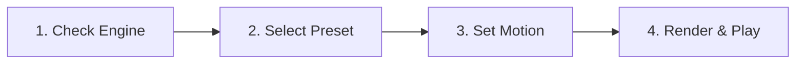

# Video Generation

The Video Studio synthesizes AI video clips directly on your local system. It executes state-of-the-art Diffusion Transformer (DiT) architectures through ComfyUI backend integration.

You can generate video clips from text descriptions or animate existing images.

---

## Supported Video Models

Local LLM Server Manager supports modern open-weight video diffusion models:

| Model | Modality | Minimum VRAM | Characteristics |
| :--- | :--- | :--- | :--- |
| **Wan 2.2 (14B)** | Text-to-Video & Image-to-Video | 14 GB | State-of-the-art visual realism, complex prompt fidelity, and natural physics. |
| **Wan 2.2 (1.3B)** | Text-to-Video & Image-to-Video | 8 GB | Compact DiT model optimized for consumer GPUs with fast generation cycles. |
| **LTX-Video 2.5** | Text-to-Video | 8 GB | High-speed video synthesis engine with rapid sampling and efficient memory usage. |
| **HunyuanVideo 1.5** | Text-to-Video | 14 GB | High-aesthetic cinematic motion quality and expansive artistic dynamic range. |

> [!NOTE]
> Video generation requires the **Video Feature Pack (`ext_video`)**. If this feature pack is missing, install it from the **Settings** tab.

---

## Curated Video Presets

The Studio Preset Bar provides pre-tuned configurations to avoid manual parameter errors:

* **⚡ Quick 480p Preview (`quick_480p`):**
  * Resolution: `832 × 480`
  * Frame Count: `32 frames`
  * Frame Rate: `16 FPS`
  * Duration: Approximately 2 seconds
  * Recommended for fast prompt validation and camera angle tests.

* **🎬 Cinematic HD 720p (`cinematic_720p`):**
  * Resolution: `1280 × 720`
  * Frame Count: `48 frames`
  * Frame Rate: `16 FPS`
  * Duration: Approximately 3 seconds
  * Recommended for widescreen presentation and rich background scenery.

* **📱 Vertical Reel 9:16 (`vertical_reel_9_16`):**
  * Resolution: `480 × 832`
  * Frame Count: `48 frames`
  * Frame Rate: `16 FPS`
  * Recommended for portrait mobile feeds and short-form social content.

* **🌟 High-Fidelity Master (`high_fps_master`):**
  * Resolution: `1024 × 576`
  * Frame Count: `64 frames`
  * Frame Rate: `24 FPS`
  * Recommended for smooth motion rendering and final video exports.

---

## Step-by-Step Video Generation

Follow these steps to generate a video clip:

### Step 1: Verify Engine and Hardware Fit

1. Open the **Workflows** tab in the top navigation bar.
2. Click **🎬 Video** in the modality selector.
3. Verify the **ComfyUI** status pill in the header. Ensure the pill shows **Online**.
4. Check the **Hardware Fit** badge.
   * 🟢 **Ready:** Your GPU has sufficient free memory.
   * 🟡 **LLM Auto-Unload:** The VRAM Orchestrator will unload Ollama models before video synthesis starts.
   * 🔴 **Exceeds GPU Limit:** The selected resolution requires more VRAM than your GPU provides. Switch to a lower preset.

### Step 2: Choose Preset and Starter Motion

1. Select a preset from the **Video Preset** dropdown menu.
2. Click one of the starter prompt chips to load a verified motion template:
   * `[🐕 Golden Retriever Beach]`: Fast outdoor motion preset.
   * `[🌆 Cyberpunk Rain 720p]`: Complex atmospheric rain and neon reflections.
   * `[☕ Cozy Cafe Steam]`: Subtle fluid dynamics and gentle lighting.
   * `[🚀 Space Nebula Flyby]`: High-speed cosmic camera motion.

### Step 3: Configure Motion and Prompts

1. **Workflow Model:** Select your target engine model (for example, `Wan 2.2 14B` or `LTX-Video 2.5`).
2. **Resolution:** Specify dimensions (such as `832x480` or `1280x720`).
3. **Prompt:** Describe the subject, action, motion direction, and environment. Use clear motion verbs.
4. **Negative Prompt:** Specify unwanted artifacts such as camera shake, distortion, flicker, or static freeze.
5. **Frame Count:** Set the total number of frames (`16` to `120`, in increments of 8).
6. **Seed:** Set a numeric seed to reproduce specific movements, or randomize the value.

### Step 4: Launch Generation and Monitor Stages

1. Click **🎬 Step 4: Generate Video**.
2. Monitor the **4-Stage Pipeline Tracker**:
   * **Stage 1 (VRAM & Weights):** Loads DiT checkpoint into GPU memory.
   * **Stage 2 (Sampling & Denoising):** Generates latent video frames with progress percentage.
   * **Stage 3 (Encoding & Assembly):** Decodes video latents with VAE and packages the MP4 container.
   * **Stage 4 (Ready & Complete):** Sends the MP4 video to the preview player.

> [!TIP]
> Expand the **Live Engine Log** drawer inside the progress tracker to view real-time WebSocket communication from ComfyUI.

---

## Interactive Video Player

The right panel features an integrated video preview player for reviewing rendered clips:

### Player Features and Controls

* **Timeline Scrubbing Slider:** Drag the progress slider to inspect motion frame-by-frame.
* **Play / Pause (`⏯️`):** Start or pause video playback.
* **Playback Speed Selector (0.5x – 2x):**
  * Select `0.5x` to evaluate slow-motion stability and anatomical consistency.
  * Select `1.0x` for real-time playback.
  * Select `1.5x` or `2.0x` for fast clip review.
* **Loop Toggle (`🔄`):** Enable loop playback to evaluate seamless repeating animations.
* **Metadata Badges:** View clip duration, resolution, frame rate (FPS), and seed directly over the video canvas.
* **Export MP4 (`⬇️ Export`):** Click the button to save the MP4 video to your local downloads folder.

### Recent Video Renders Gallery

Below the main controls, the **Recent Video Renders** carousel lists previously generated clips:

1. Click **🔄 Refresh Gallery** to sync new outputs from disk.
2. Click any clip thumbnail in the carousel to load that video into the interactive player.
3. Review the resolution and duration metadata labels under each thumbnail.

---

## VRAM Optimization and Safety Guidelines

Video generation demands significant compute resources. Apply these guidelines to maintain stability:

1. **Start with 480p:** Always test new motion prompts using the `Quick 480p Preview` preset before rendering in 720p HD.
2. **Close Unused Browser Tabs:** Hardware-accelerated browser tabs consume GPU memory needed by large diffusion models.
3. **Monitor GPU Temperatures:** Video generation creates continuous GPU load during denoising passes. Ensure adequate PC airflow.

> [!WARNING]
> Video synthesis cannot be paused once sampling begins. If you need to stop generation, click **Cancel Generation** in the stage tracker to abort the job safely.

---

## Related Documentation

* [Studio Overview](./index.md) — Architectural overview and feature pack installation.
* [Image Generation Guide](./image-generation.md) — Generate still images and starting frames for I2V.
* [ComfyUI Engine Guide](../engines/comfyui.md) — Manage ComfyUI background services and custom nodes.
* [Can I Run It Tool](../getting-started/troubleshooting.md) — Calculate exact VRAM requirements for video models.
