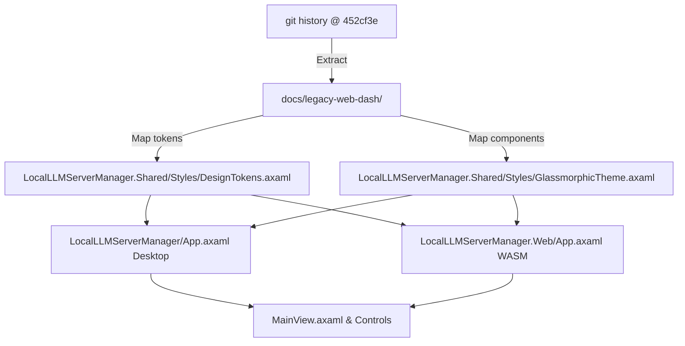

# Design Specification: Legacy Web Dashboard Glassmorphic Styling Integration for Avalonia Desktop & WASM

**Date:** 2026-08-08  
**Status:** Approved  
**Scope:** Extract pre-Avalonia legacy web dashboard styling system (`index.css`, `index.html`, `app.js`) and implement a unified, glassmorphic XAML theme (`DesignTokens.axaml`, `GlassmorphicTheme.axaml`) layered over `Semi.Avalonia` for both Desktop (`LocalLLMServerManager`) and WebAssembly (`LocalLLMServerManager.Web`).

---

## 1. Overview & Goals

Before Avalonia UI was introduced, the Local LLM Server Manager possessed a vibrant, glassmorphic web dashboard UI with dark backdrop blur, linear gradients (`#8b5cf6` purple, `#06b6d4` cyan, `#c084fc` accent), glowing card borders, telemetry pills, and custom micro-animations.

This specification outlines:
1. **Extraction**: Retrieving the complete legacy web dashboard files (`index.html`, `index.css`, `app.js`) from git commit `452cf3e` (v1.6.0) into `docs/legacy-web-dash/` as a permanent reference style suite.
2. **Translation**: Converting CSS root variables, glass gradients, border glows, font stacks, and component styles into native Avalonia `ResourceDictionary` design tokens and control templates.
3. **Unified Avalonia Styling**: Creating `LocalLLMServerManager.Shared/Styles/DesignTokens.axaml` and `LocalLLMServerManager.Shared/Styles/GlassmorphicTheme.axaml` to style cards, tab bars, telemetry pills, buttons, inputs, progress bars, and modal overlays across both Desktop and WebAssembly targets.

---

## 2. Extraction of Legacy Web Dashboard

The legacy files from commit `452cf3e` (v1.6.0) will be extracted to `docs/legacy-web-dash/`:
- `docs/legacy-web-dash/index.html`: Web layout markup, tab structures, telemetry headers, and modal markup.
- `docs/legacy-web-dash/index.css`: Glassmorphic design system tokens (`:root`), radial background animations, glowing card borders, button states, progress bars, and modal styles.
- `docs/legacy-web-dash/app.js`: Client-side logic, SSE progress listeners, CivitAI search, and modal interactions.

---

## 3. Design Tokens & Color Palette Mapping

The CSS variables from `index.css` map directly to Avalonia XAML resources in `LocalLLMServerManager.Shared/Styles/DesignTokens.axaml`:

| CSS Variable | CSS Value | Avalonia Resource Key | Avalonia Type |
| :--- | :--- | :--- | :--- |
| `--bg-dark` | `hsl(222, 25%, 6%)` (`#0b0e14`) | `BgDarkColor` / `BgDarkBrush` | `Color` / `SolidColorBrush` |
| `--bg-surface` | `hsla(222, 20%, 12%, 0.45)` | `BgSurfaceBrush` | `SolidColorBrush` |
| `--bg-card` | `hsla(222, 18%, 15%, 0.55)` | `BgCardBrush` | `SolidColorBrush` |
| `--border-color` | `hsla(222, 20%, 30%, 0.35)` | `GlassBorderBrush` | `SolidColorBrush` |
| `--border-glow` | `hsla(250, 80%, 70%, 0.15)` | `BorderGlowBrush` | `SolidColorBrush` |
| `--primary` | `hsl(258, 90%, 66%)` (`#8b5cf6`) | `PrimaryColor` / `PrimaryBrush` | `Color` / `SolidColorBrush` |
| `--primary-glow` | `hsla(258, 90%, 66%, 0.3)` | `PrimaryGlowBrush` | `SolidColorBrush` |
| `--secondary` | `hsl(192, 95%, 48%)` (`#06b6d4`) | `SecondaryColor` / `SecondaryBrush` | `Color` / `SolidColorBrush` |
| `--secondary-glow` | `hsla(192, 95%, 48%, 0.3)` | `SecondaryGlowBrush` | `SolidColorBrush` |
| `--accent` | `hsl(280, 85%, 60%)` (`#c084fc`) | `AccentColor` / `AccentBrush` | `Color` / `SolidColorBrush` |
| `--text-main` | `hsl(210, 20%, 95%)` | `TextMainBrush` | `SolidColorBrush` |
| `--text-muted` | `hsl(218, 15%, 65%)` | `TextMutedBrush` | `SolidColorBrush` |
| `--online` | `hsl(142, 76%, 45%)` (`#22c55e`) | `OnlineBrush` | `SolidColorBrush` |
| `--offline` | `hsl(354, 70%, 54%)` (`#ef4444`) | `OfflineBrush` | `SolidColorBrush` |
| Gradient Accent | `linear-gradient(90deg, #8b5cf6 0%, #06b6d4 100%)` | `PrimaryGradientBrush` | `LinearGradientBrush` |
| Glass Radial | Radial dark glow gradient | `GlassBackgroundBrush` | `RadialGradientBrush` |

---

## 4. Glassmorphic Control Templates & Styles

`LocalLLMServerManager.Shared/Styles/GlassmorphicTheme.axaml` will define reusable styles and control templates:

1. **`Border.glass-card` / `Card`**:
   - Background: `BgCardBrush` with subtle inner border `GlassBorderBrush`.
   - CornerRadius: `12`.
   - Box-shadow / Glow: Subtle outer glow effect using `BorderGlowBrush`.
   - Hover state: Smooth background highlight and border glow transition.

2. **`TabControl.glass-tabs` & `TabItem`**:
   - Horizontal tab bar with pill-shaped active tab selector (`PrimaryGradientBrush`).
   - Inactive tabs with `TextMutedBrush` and smooth hover transitions.

3. **`Border.telemetry-pill`**:
   - Capsule border (`CornerRadius="16"` or `20`) with dark glass background, telemetry status indicator dot (`OnlineBrush` / `OfflineBrush`), and crisp mono-font text.

4. **`Button.glass-primary` & `Button.glass-secondary`**:
   - Primary: Gradient fill (`PrimaryGradientBrush`), rounded corners (`8`), glowing hover state.
   - Secondary: Glass surface background with cyan border glow on hover.

5. **`ProgressBar.glass-progress`**:
   - Track: Dark rounded container (`BgDarkBrush`).
   - Indicator: `PrimaryGradientBrush` fill with rounded ends.

6. **`TextBox.glass-input`**:
   - Dark semi-transparent background with crisp border and glowing focus indicator (`PrimaryBrush`).

---

## 5. Solution Integration Architecture

### File Structure Changes
- **[NEW]** `docs/legacy-web-dash/index.html`
- **[NEW]** `docs/legacy-web-dash/index.css`
- **[NEW]** `docs/legacy-web-dash/app.js`
- **[NEW]** `LocalLLMServerManager.Shared/Styles/DesignTokens.axaml`
- **[NEW]** `LocalLLMServerManager.Shared/Styles/GlassmorphicTheme.axaml`
- **[MODIFY]** `LocalLLMServerManager.Shared/LocalLLMServerManager.Shared.csproj` (Include `Styles/*.axaml` as `AvaloniaXaml` / `AvaloniaResource`)
- **[MODIFY]** `LocalLLMServerManager/App.axaml` (Include shared design tokens and glassmorphic theme)
- **[MODIFY]** `LocalLLMServerManager.Web/App.axaml` (Include shared design tokens and glassmorphic theme)
- **[MODIFY]** `LocalLLMServerManager.Shared/Views/MainView.axaml` and sub-controls (`TelemetryHeaderControl.axaml`, `CivitaiTabControl.axaml`, `EngineStudioTabControl.axaml`, `HuggingFaceTabControl.axaml`, `OllamaModelsTabControl.axaml`, `SettingsTabControl.axaml`) to apply glassmorphic styles.

---

## 6. Verification & Test Plan

1. **Extraction Verification**: Confirm `docs/legacy-web-dash/index.html`, `index.css`, and `app.js` match `git show 452cf3e:wwwroot/...`.
2. **Build Verification**:
   - Run `dotnet build LocalLLMServerManager.csproj`
   - Run `dotnet build LocalLLMServerManager.Web/LocalLLMServerManager.Web.csproj`
   - Ensure 0 compilation errors or XAML resource parsing failures.
3. **Automated Test Suite**:
   - Run `dotnet test` (all unit and integration tests must pass 100%).
4. **Lint & Type Check**:
   - Run `dotnet format --verify-no-changes` or standard project linting.
