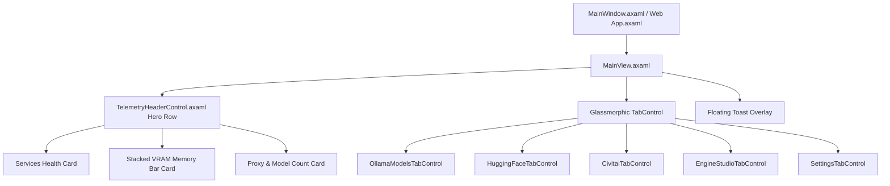

# Design Specification: Modern Glassmorphic Avalonia UI & Web Dashboard Overhaul

**Date:** 2026-08-09  
**Status:** Approved  
**Scope:** Transform the Avalonia UI Desktop (`LocalLLMServerManager`) and WebAssembly (`LocalLLMServerManager.Web`) dashboard into a modern, responsive, glassmorphic application matching the aesthetic, layout, and visual telemetry of the original web dashboard.

---

## 1. Objectives & Key Improvements

1. **Responsive Window & Modern Chrome**:
   - Expand `MainWindow.axaml` default size from `960x680` to `1280x840` (`MinWidth="1024" MinHeight="700"`), enabling fluid layout scaling and eliminating unnecessary scrollbars.
   - Enable OS transparency (`TransparencyLevelHint="Mica, AcrylicBlur, Transient"`), `Background="Transparent"`, and `ExtendClientAreaToDecorationsHint="True"` for a sleek, dark window titlebar with custom drag area.

2. **Hero Telemetry & Health Header**:
   - Re-implement the 3-card Hero Row from the web dashboard in `TelemetryHeaderControl.axaml`:
     - **Card 1: Services Health Status**: 3 live status indicators for Ollama API (🟢/🔴), Stable Diffusion Forge (🟢/🔴), and ComfyUI Studio (🟢/🔴) with status labels.
     - **Card 2: Hero Stacked VRAM Visual Bar**: GPU name display, numerical readout (`4.2 GB / 16.0 GB Used`), dual-segment memory progress bar (purple/cyan gradient for loaded model memory vs dark glass for free VRAM), and an inline "Unload VRAM" button.
     - **Card 3: System & Orchestrator Proxy**: Installed models counter (`12 Models`), YARP proxy status (`Active 🟢`), and manual refresh button.

3. **Custom Glassmorphic Tab Navigation (`GlassmorphicTheme.axaml`)**:
   - Replace standard Avalonia tabs with custom `TabControl` and `TabItem` control templates:
     - Pill container navigation bar with `BgSurfaceBrush` glass background and 12px rounded corners.
     - Active tab item features a vibrant `PrimaryGradientBrush` fill (`#8b5cf6` to `#06b6d4`), bold text, elevated glow shadow (`0 4 15 #408b5cf6`), and smooth hover transitions.
     - Icons and headers for each view: 🦙 My Models, 🤗 HuggingFace Hub, 🎨 CivitAI Models, 📦 3D & ComfyUI Studio, ⚙️ Settings.

4. **Fluid Card & Grid Layouts Across Sub-Views**:
   - Refine `OllamaModelsTabControl`, `HuggingFaceTabControl`, `CivitaiTabControl`, `EngineStudioTabControl`, and `SettingsTabControl` with responsive grid cards (`glass-card`), badges (`GGUF`, `LoRA`, `Checkpoint`), and typography powered by `Avalonia.Fonts.Inter`.

---

## 2. Architecture & XAML Component Structure

---

## 3. Modified & Created Files

- **[MODIFY]** `Views/MainWindow.axaml` (Set 1280x840, Mica/AcrylicBlur transparency, ExtendClientAreaToDecorationsHint)
- **[MODIFY]** `LocalLLMServerManager.Shared/Styles/GlassmorphicTheme.axaml` (Add TabControl & TabItem pill templates, button glow effects, card shadows)
- **[MODIFY]** `LocalLLMServerManager.Shared/Views/Controls/TelemetryHeaderControl.axaml` (3-card hero row layout, stacked VRAM memory bar, health badges)
- **[MODIFY]** `LocalLLMServerManager.Shared/Views/MainView.axaml` (Apply custom glass tab bar styles and header layout)
- **[MODIFY]** `LocalLLMServerManager.Shared/Views/Controls/OllamaModelsTabControl.axaml` (2-column responsive model cards, KV cache panel)
- **[MODIFY]** `LocalLLMServerManager.Shared/Views/Controls/EngineStudioTabControl.axaml` (Forge & ComfyUI studio engine cards)
- **[MODIFY]** `LocalLLMServerManager.Shared/Views/Controls/CivitaiTabControl.axaml` (CivitAI model cards with download counts and badges)
- **[MODIFY]** `LocalLLMServerManager.Shared/Views/Controls/HuggingFaceTabControl.axaml` (Hugging Face GGUF repo search cards and likes pills)
- **[MODIFY]** `LocalLLMServerManager.Shared/Views/Controls/SettingsTabControl.axaml` (Settings glass card panels)

---

## 4. Verification & Testing Plan

1. **Build Verification**:
   - `dotnet build LocalLLMServerManager.sln`
   - Ensure 0 build errors.
2. **Automated Test Suite**:
   - `dotnet test LocalLLMServerManager.Tests/LocalLLMServerManager.Tests.csproj`
   - Retain 100% test pass rate (135/135 tests passing).
3. **UI / UX Manual Verification**:
   - Confirm 1280x840 window resizing without cramped scrollbars.
   - Confirm 3-card Hero telemetry row with VRAM visual bar.
   - Confirm pill-style gradient glass TabControl navigation.
