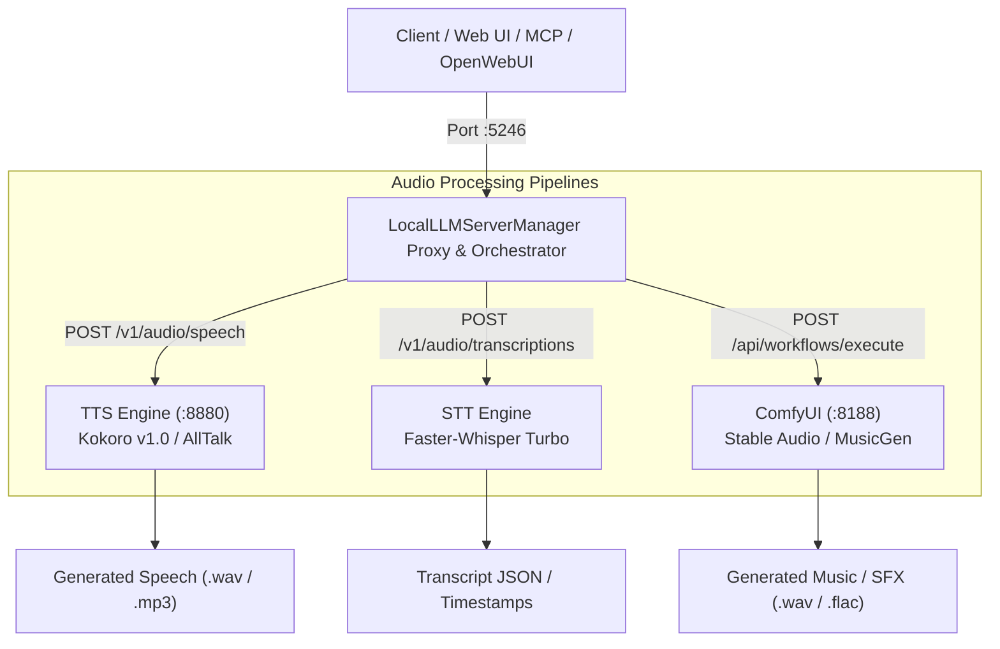

# Comprehensive Local Audio & Music Studio Design Specification

- **Date**: 2026-08-25
- **Status**: Approved / Ready for Implementation Planning
- **Author**: Antigravity & User

---

## 1. Overview & Objectives

This specification defines the architecture, directory structure, storage footprints, model configurations, and integration points for a local multimodal audio generation suite (TTS, STT, Voice Cloning, and Music/SFX generation) integrated with `LocalLLMServerManager`.

### Primary Objectives:
1. **Model Footprint Isolation**: Consolidate and cleanly isolate all speech and audio models under `D:\AI\audio\` and `D:\AI\comfy_models\` to maintain order and protect disk capacity.
2. **Dual-Tier TTS**:
   - **Kokoro v1.0** (FastAPI / ONNX): Blazing fast, low-latency (<100ms), lightweight everyday speech synthesis for LLM assistant readbacks.
   - **XTTS-v2** (via AllTalk): High-fidelity zero-shot voice cloning from 6-second reference audio samples.
3. **STT (Speech-to-Text)**:
   - **Faster-Whisper Large-v3-Turbo**: High accuracy, multi-lingual transcription with word timestamps and sub-realtime latency backed by CTranslate2.
4. **Sound Effects & Music Generation**:
   - **Stable Audio Open 1.0**: High-quality text-to-SFX and ambient loops (up to 47 seconds at 44.1kHz stereo) running through ComfyUI.
   - **Meta MusicGen (Medium)**: Text-to-music generation workflow preset in ComfyUI.
5. **OpenAI API Standard Compliance**: Expose standard `POST /v1/audio/speech` and `POST /v1/audio/transcriptions` endpoints through the server manager reverse proxy (`:5246`).

---

## 2. Hardware & Storage Allocation

* **Host System**: 13th Gen Intel Core i7-13700K (16 cores / 24 threads)
* **GPU**: NVIDIA GeForce RTX 4070 Ti SUPER (16 GB VRAM)
* **Target Storage Drive**: `D:\` (~292 GB free)

### Detailed Storage Breakdown on `D:\AI`

| Subsystem | Model / Component | Artifact Format | Destination Directory | Disk Footprint |
| :--- | :--- | :--- | :--- | :--- |
| **TTS (Default)** | Kokoro v1.0 | ONNX / Weights (`kokoro-v1.0.onnx`, `voices.bin`) | `D:\AI\audio\engines\kokoro-fastapi\` | **~350 MB** |
| **Voice Cloning** | AllTalk / XTTS-v2 | PyTorch Checkpoint / Vocoder / Tokenizer | `D:\AI\audio\engines\alltalk_tts\` | **~2.2 GB** |
| **STT Engine** | Faster-Whisper Large-v3-Turbo | CTranslate2 Model / Vocabulary | `D:\AI\audio\stt\whisper-large-v3-turbo\` | **~1.6 GB** |
| **SFX / Ambient** | Stable Audio Open 1.0 | Safetensors (`stable_audio_open_1_0.safetensors`) | `D:\AI\comfy_models\checkpoints\` | **~3.5 GB** |
| **Music Gen** | Meta MusicGen Medium | AudioCraft / ComfyUI Node Weights | `D:\AI\audio\music\musicgen-medium\` | **~3.3 GB** |
| **User Voices** | Voice Sample Library | WAV Audio Clips (16-bit 44.1kHz mono/stereo) | `D:\AI\audio\custom_voices\` | *User data* |
| **Total Footprint** | | | | **~11.0 GB** |

*(Leaves ~281 GB of free disk capacity on `D:\`).*

---

## 3. Directory Layout on `D:\AI`

```
D:\AI\
├── audio\
│   ├── engines\
│   │   ├── kokoro-fastapi\
│   │   │   ├── main.py
│   │   │   ├── models\ (kokoro-v1.0.onnx, voices.bin)
│   │   │   └── requirements.txt
│   │   └── alltalk_tts\
│   │       ├── run.bat
│   │       ├── models\xtts\
│   │       └── voices\
│   ├── stt\
│   │   └── whisper-large-v3-turbo\
│   │       ├── model.bin
│   │       ├── config.json
│   │       └── tokenizer.json
│   ├── music\
│   │   └── musicgen-medium\
│   └── custom_voices\
│       └── reference_sample.wav
├── comfy_models\
│   └── checkpoints\
│       └── stable_audio_open_1_0.safetensors
└── system\
    └── python\  (Existing portable Python environment)
```

---

## 4. Architecture & Endpoints



### Key API Contracts:

1. **Text-to-Speech (`POST /v1/audio/speech`)**:
   ```json
   {
     "model": "kokoro",
     "input": "Hello from your local AI assistant running on RTX 4070 Ti SUPER.",
     "voice": "af_heart",
     "response_format": "mp3",
     "speed": 1.0
   }
   ```
2. **Speech-to-Text (`POST /v1/audio/transcriptions`)**:
   * Multi-part form upload with audio file (`file`), model name (`whisper-large-v3-turbo`), and language (optional).
   * Returns JSON transcription with segments and word timestamps.
3. **Sound FX & Music Generation (`POST /api/workflows/execute`)**:
   * Dispatches `Workflows/Audio/stable_audio_open_sfx.json` or `Workflows/Audio/yue_full_song.json` to ComfyUI on `:8188`.

---

## 5. Integration with `LocalLLMServerManager`

1. **Tool Discovery Service (`ToolDiscoveryService.cs`)**:
   - Detects Kokoro and AllTalk under `D:\AI\audio\engines\` and `D:\AI\Kokoro-FastAPI`.
   - Validates Python packages (`kokoro_onnx`, `soundfile`, `fastapi`, `uvicorn`, `faster_whisper`).
2. **Component Manager (`ComponentManagerService.cs`)**:
   - Manages the `audio-tts` and `audio-music` component packs with real-time download status and path verification.
3. **Settings (`AppSettings.cs`)**:
   - `AudioPath`: Set to `D:\AI\audio`.
   - `AudioEngineExecutablePath`: Points to active engine launcher (`D:\AI\audio\engines\kokoro-fastapi\main.py`).
   - `AudioEngineUrl`: Default `http://127.0.0.1:8880`.
   - `PreferredAudioVoice`: Default `af_heart`.
4. **Download Routing (`DownloadManager.cs`)**:
   - Routes Hugging Face Hub TTS, STT, and audio model pulls to `D:\AI\audio\...` and `D:\AI\comfy_models\...`.

---

## 6. Verification & Validation Plan

1. **Path & Environment Check**:
   - Verify Python environment can load `kokoro_onnx`, `soundfile`, and `faster_whisper`.
   - Verify `D:\AI\audio` directories exist and permissions are valid.
2. **TTS Functional Verification**:
   - Synthesize a test audio prompt (`af_heart`) via `POST /v1/audio/speech`.
   - Validate HTTP 200 and binary audio payload (`audio/mpeg` or `audio/wav`).
3. **STT Functional Verification**:
   - Transcribe synthesized test audio via `POST /v1/audio/transcriptions`.
   - Validate transcription matches input text.
4. **ComfyUI SFX Workflow Verification**:
   - Trigger `stable_audio_open_sfx.json` ComfyUI workflow via `/api/workflows/execute`.
   - Validate generated audio waveform and file output in `wwwroot/output/`.
