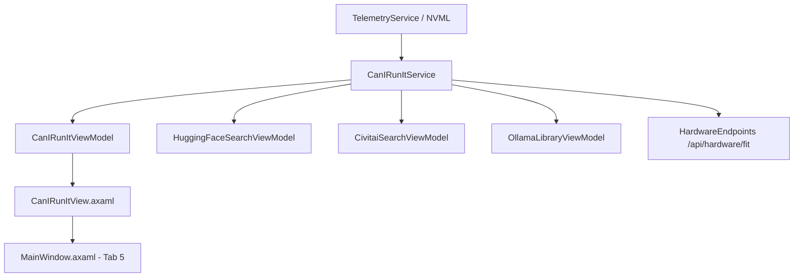

# Can I Run It — Hardware Compatibility & Performance Engine Design Specification

> **Date:** 2026-08-30  
> **Status:** Approved  
> **Feature Branch:** `feature/canIrunIt`

---

## 1. Overview & Vision
The **Can I Run It** feature provides an interactive, accurate, and real-time hardware compatibility calculator and performance estimator modeled after the methodology of **willitrunai.com**, deeply integrated with `LocalLLMServerManager`'s live system telemetry.

It evaluates whether a given model and workload can run on the user's specific GPU and system memory, computes exact VRAM and RAM footprints, calculates GPU vs. CPU layer offloading distributions, and provides ambient compatibility indicators across the entire discovery ecosystem (Hugging Face Hub, CivitAI, and Ollama installed models).

---

## 2. Core Mathematical Sizing & Evaluation Formulas

### 2.1 LLM Sizing Formula
For text generation models (GGUF / Ollama):
* **Model Weight Memory ($M_{weights}$)**:
  $$M_{weights} \text{ (GB)} \approx P \times \frac{B_{quant}}{8} \times 1.05$$
  where $P$ is parameter count in billions, $B_{quant}$ is the average bits per weight:
  - `Q2_K`: 2.65 bits
  - `Q3_K_M`: 3.50 bits
  - `Q4_K_M`: 4.50 bits
  - `Q5_K_M`: 5.50 bits
  - `Q6_K`: 6.60 bits
  - `Q8_0`: 8.50 bits
  - `FP16`: 16.00 bits
* **KV Cache Size ($M_{kv}$)**:
  $$M_{kv} \text{ (GB)} \approx 2 \times N_{layers} \times N_{kv\_heads} \times D_{head} \times C_{context} \times \frac{B_{kv}}{8} \times 10^{-9}$$
  where $B_{kv}$ is 16 (FP16), 8 (Q8_0), or 4 (Q4_0).
* **CUDA / Runtime Overhead ($M_{overhead}$)**:
  $$\approx 0.6 \text{ GB (Base CUDA Context \& Compute Scratchpad)}$$
* **Total VRAM Required ($V_{needed}$)**:
  $$V_{needed} = M_{weights} + M_{kv} + M_{overhead}$$

### 2.2 Layer Offloading Distribution
When $V_{needed} > VRAM_{available}$, the engine calculates the maximum number of transformer layers that fit in VRAM:
* $VRAM_{for\_weights} = \max(0, VRAM_{available} - M_{kv} - M_{overhead})$
* $\text{GPU Layers} = \min\left(N_{layers}, \lfloor N_{layers} \times \frac{VRAM_{for\_weights}}{M_{weights}} \rfloor\right)$
* $\text{CPU Layers} = N_{layers} - \text{GPU Layers}$
* **RAM Required**: $\text{CPU Layers} \times \frac{M_{weights}}{N_{layers}}$

### 2.3 Diffusion, Video, Audio & 3D Footprints
* **Image Generation (Flux, SDXL, SD 3.5, SD 1.5)**:
  - Base Model + Encoders (CLIP + T5) + VAE + Latent buffer per resolution (512, 768, 1024, 1536).
* **Video Generation (Wan 2.2 14B/1.3B, LTX-Video, HunyuanVideo)**:
  - DiT Transformer + Frame Context Memory (49–129 frames) + VAE Decode Buffer.
* **Audio & Speech (Kokoro, AllTalk XTTS-v2, Faster-Whisper, MusicGen)**:
  - Engine process footprints (~400MB Kokoro, ~2.0GB Whisper Large-v3-Turbo, ~2.5GB XTTS-v2, ~3.2GB MusicGen).
* **3D Mesh (TRELLIS V2, Hunyuan3D-2)**:
  - TRELLIS V2 (~12GB VRAM), Hunyuan3D-2 (~16GB VRAM).

### 2.4 Fit Verdicts
* 🟢 **Full VRAM Acceleration (Blazing Fast)**: $VRAM_{total} \ge V_{needed} + 0.5\text{ GB}$.
* 🟡 **Partial Offload (Usable)**: $V_{needed} > VRAM_{total}$ and $V_{needed} \le VRAM_{total} + RAM_{total}$.
* 🟠 **CPU / System RAM Only (Slow)**: Fits strictly in System RAM without meaningful GPU offload.
* 🔴 **Out of Memory (OOM)**: Exceeds total combined VRAM + System RAM.

---

## 3. Architecture & Component Decomposition

### 3.1 Domain Models & Interfaces (`LocalLLMServerManager.Shared/Models/HardwareFitModels.cs`)
* `LlmFitRequest`: Parameters, Quantization, ContextLength, KvPrecision, AvailableVramMb, AvailableRamMb.
* `LlmFitResult`: ModelWeightMb, KvCacheMb, TotalVramMb, GpuLayers, CpuLayers, TotalLayers, FitVerdict (`FullVram`, `PartialOffload`, `CpuOnly`, `OutOfMemory`), EstimatedTokPerSec, RecommendationMessage.
* `DiffusionFitRequest`, `DiffusionFitResult`, `VideoFitRequest`, `VideoFitResult`, `AudioFitResult`, `ThreeDFitResult`.
* `QuickFitBadge`: `BadgeText`, `BadgeColorHex`, `Tooltip`, `FitVerdict`.

### 3.2 Service (`LocalLLMServerManager.Shared/Services/CanIRunItService.cs`)
* `ICanIRunItService`:
  - `LlmFitResult EvaluateLlmFit(LlmFitRequest request)`
  - `DiffusionFitResult EvaluateDiffusionFit(DiffusionFitRequest request)`
  - `VideoFitResult EvaluateVideoFit(VideoFitRequest request)`
  - `AudioFitResult EvaluateAudioFit(string engineName, long vramMb, long ramMb)`
  - `ThreeDFitResult Evaluate3DFit(string modelName, long vramMb, long ramMb)`
  - `QuickFitBadge EvaluateQuickFit(string modelName, long? fileSizeBytes, string modality, long vramMb, long ramMb)`

### 3.3 ViewModel (`LocalLLMServerManager.Shared/ViewModels/CanIRunItViewModel.cs`)
* Telemetry binding (`GpuName`, `TotalVramMb`, `FreeVramMb`, `TotalRamMb`, `FreeRamMb`).
* Active Modality selector (`LLM`, `Image`, `Video`, `Audio`, `3D`).
* Model preset list + Custom tuning sliders.
* Reactive calculation and memory breakdown (`WeightVramPercent`, `KvCachePercent`, `OverheadPercent`, `FreePercent`).

### 3.4 Avalonia View (`LocalLLMServerManager.Shared/Views/CanIRunItView.axaml`)
* Matte Carbon styled dark container (`#0F172A`).
* Hardware Telemetry Banner with live VRAM usage.
* Modality tab strip with icons.
* Interactive sliders: Context tokens, Quantization picker, KV cache precision.
* Visual Stacked Memory Bar + Fit Verdict Badge + Speed estimate card.

### 3.5 Ambient Cards Integration
* Hugging Face, CivitAI, and Ollama search cards display `QuickFitBadge`.
* Clicking badge executes `NavigateToCanIRunItCommand(modelName, modality)` pre-filling the calculator.

### 3.6 API Endpoints (`Endpoints/HardwareEndpoints.cs`)
* `GET /api/hardware/fit` — Evaluates model parameters via query string.
* `POST /api/hardware/evaluate` — Evaluates detailed workload request JSON payload.

---

## 4. Verification & Testing Strategy
* **Unit Tests**: `LocalLLMServerManager.Tests/CanIRunItServiceTests.cs` (verifying Llama 3.3 70B, Qwen 32B, DeepSeek 671B, Flux.1, Wan 2.2, Kokoro formulas).
* **ViewModel Tests**: `LocalLLMServerManager.Tests/CanIRunItViewModelTests.cs` (verifying reactive slider updates and modality transitions).
* **API Tests**: `LocalLLMServerManager.Tests/HardwareEndpointsTests.cs`.
* **Headless UI Tests**: `AvaloniaHeadlessInteractionTests.cs` (verifying Tab #5 navigation and control bindings).
* **Playwright E2E**: In-browser WebAssembly tab switching and slider interaction.
