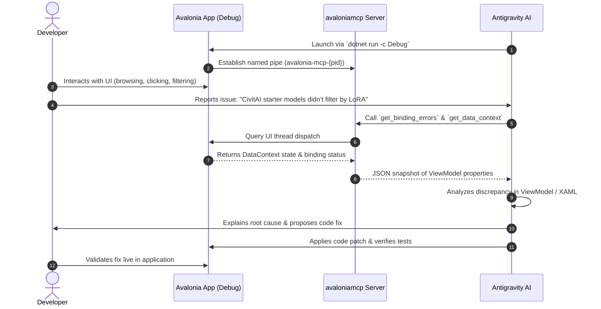

# Design Spec: Collaborative UI Bug Hunting via AvaloniaMcp & DevTools

**Date:** 2026-09-18  
**Status:** Approved  
**Target Branch:** `feature/fixes-and-adjustments`  

---

## 1. Overview & Purpose

This design enables a collaborative, live debugging environment between the developer and Antigravity (AI coding assistant) while running `LocalLLMServerManager` in `Debug` mode. 

The developer explores the desktop Avalonia UI, hunts for bugs, and reports anomalies or user experience friction. Concurrently, Antigravity attaches directly to the running application process via the open-source **`AvaloniaMcp`** Model Context Protocol (MCP) server, inspecting the live visual and logical trees, reading ViewModel data contexts, intercepting broken XAML bindings, capturing UI screenshots, and programmatically triggering commands to reproduce and resolve bugs in real time.

---

## 2. Architecture & Components

```
+-------------------------------------------------------------------------+
|                              USER WORKSPACE                             |
|  - Browses Desktop Avalonia UI in Debug mode                            |
|  - Inspects visual layout & controls with F12 (Avalonia.Diagnostics)    |
|  - Reports issues, edge cases, and UI friction in conversation          |
+------------------------------------+------------------------------------+
                                     |
                                     v
+-------------------------------------------------------------------------+
|                  AVALONIA RUNTIME PROCESS (PID: {pid})                  |
|                                                                         |
|  - AppBuilder.Configure<App>()                                          |
|      .UsePlatformDetect()                                               |
|      .UseMcpDiagnostics()        <-- AvaloniaMcp Named Pipe Server      |
|      .LogToTrace()                                                      |
|                                                                         |
|  - Named Pipe Endpoint: `avalonia-mcp-{pid}`                            |
|  - Process Discovery File: `%TEMP%/avalonia-mcp/{pid}.json`             |
+------------------------------------+------------------------------------+
                                     | Named Pipe (JSON-RPC)
                                     v
+-------------------------------------------------------------------------+
|                  AVALONIA MCP SERVER (`avaloniamcp`)                    |
|                                                                         |
|  - Global .NET Tool (`dotnet avalonia-mcp`)                             |
|  - Connects to `avalonia-mcp-{pid}` via stdio transport                 |
|  - Exposes 15 MCP Tools to AI Assistant                                 |
+------------------------------------+------------------------------------+
                                     | MCP Protocol (stdio)
                                     v
+-------------------------------------------------------------------------+
|                        ANTIGRAVITY AI ASSISTANT                         |
|  - Discovers running UI app instance                                    |
|  - Queries visual/logical trees, DataContexts, & broken bindings        |
|  - Reads & edits control properties dynamically                         |
|  - Captures screenshots of buggy controls or layouts                    |
|  - Diagnoses root causes and applies code fixes directly                |
+-------------------------------------------------------------------------+
```

### Key Components

1. **`AvaloniaMcp.Diagnostics` (NuGet Package v0.4.0)**:
   - Added conditionally to `LocalLLMServerManager.csproj` for `'$(Configuration)' == 'Debug'`.
   - Free, open-source MIT library designed specifically for `.NET 10` and `Avalonia 11.2+`.
   - Starts a lightweight named-pipe server in the app on launch (`UseMcpDiagnostics()`) with zero runtime overhead in production.

2. **`avaloniamcp` (.NET Global Tool v0.4.0)**:
   - Installed globally via `dotnet tool install -g avaloniamcp`.
   - Connects to the running Avalonia named-pipe process and translates MCP tool invocations into UI-thread-dispatched inspection calls.

3. **`Avalonia.Diagnostics` (NuGet Package v11.3.22 / 12.x)**:
   - Added conditionally to `LocalLLMServerManager.csproj` for `'$(Configuration)' == 'Debug'`.
   - Enables the built-in F12 DevTools inspection window for human developer interaction.

4. **Antigravity MCP Configuration**:
   - Registered as `avalonia_mcp` server using command `dotnet` and arguments `["avalonia-mcp"]`.

---

## 3. Tool Reference (AvaloniaMcp)

The `avaloniamcp` server exposes 15 specialized tools to Antigravity:

| Category | Tool | Parameters | Functionality |
|---|---|---|---|
| **Inspection** | `list_windows` | None | Lists all open windows, titles, bounds, and states. |
| | `get_visual_tree` | `maxDepth?` | Full visual element hierarchy with types, names, layout bounds, and visibility. |
| | `get_logical_tree` | `maxDepth?` | High-level logical tree representing developer XAML intent. |
| | `find_control` | `name?`, `typeName?`, `text?` | Fast lookup of UI elements by `#Name`, `Type`, or text content. |
| | `get_control_properties` | `controlId` | Dumps all Avalonia properties, values, types, and inheritance sources. |
| **Data & Bindings** | `get_data_context` | `controlId?` | Serializes the bound ViewModel properties and values to JSON. |
| | `get_binding_errors` | None | Pinpoints all broken bindings with error messages and timestamps. |
| **Visual & Styles** | `take_screenshot` | `controlId?` | Captures the entire window or a specific control as a base64 PNG. |
| | `get_applied_styles` | `controlId` | Inspects active style classes, pseudo-classes (`:pointerover`), and setters. |
| | `get_resources` | `controlId?` | Inspects resource dictionaries (colors, templates, brushes, converters). |
| | `get_focused_element` | None | Returns the currently focused control and tab index. |
| **Interaction** | `click_control` | `controlId` | Simulates click events and triggers bound `ICommand` handlers. |
| | `input_text` | `controlId`, `text` | Types text into `TextBox` or editable controls. |
| | `set_property` | `controlId`, `propertyName`, `value` | Mutates control properties at runtime to test layout fixes live. |
| **Discovery** | `discover_apps` | None | Discovers running Avalonia apps and their PIDs. |

---

## 4. Collaborative Bug-Hunting Workflow



### Collaborative Steps
1. **Launch**: App is compiled and launched in `Debug` configuration. The desktop window appears on the user's desktop, and `avaloniamcp` automatically binds to the process.
2. **Explore**: User browses features (Hugging Face hub, CivitAI filters, Ollama library, floating documentation overlay, Can I Run It, settings).
3. **Report**: When an unexpected UI behavior occurs, the user describes the symptom or presses F12 to inspect the element name.
4. **Inspect**: Antigravity uses `get_binding_errors`, `get_data_context`, and `get_visual_tree` to see the exact runtime values and state without guesswork.
5. **Fix & Verify**: Antigravity writes the fix, runs `dotnet test`, `npm run lint`, and `npx tsc --noEmit`, and the user confirms the resolution.

---

## 5. Security & Isolation Considerations

- `AvaloniaMcp.Diagnostics` and `Avalonia.Diagnostics` are strictly conditioned on `'$(Configuration)' == 'Debug'`.
- Production/Release builds do not include the diagnostic bridge, avoiding any attack surface, binary bloat, or unintended named pipes.
- Named pipes only bind to local loopback/OS IPC (`%TEMP%/avalonia-mcp/`), accessible only by the current logged-in user.

---

## 6. Verification Plan

1. **Package Verification**:
   - `LocalLLMServerManager.csproj` references `AvaloniaMcp.Diagnostics` (v0.4.0) under `Condition="'$(Configuration)' == 'Debug'"`.
   - `Program.cs` includes `#if DEBUG` `.UseMcpDiagnostics()` `#endif`.
2. **Tool Verification**:
   - `dotnet tool install -g avaloniamcp` executes cleanly.
   - Running `dotnet avalonia-mcp cli discover_apps` detects the running process.
   - `get_binding_errors` and `get_data_context` return valid JSON.
3. **Build & Test Verification**:
   - Full test suite (`dotnet test`) passes with 0 errors.
   - Release build verification (`dotnet build -c Release`) ensures diagnostic packages are stripped from Release builds.
