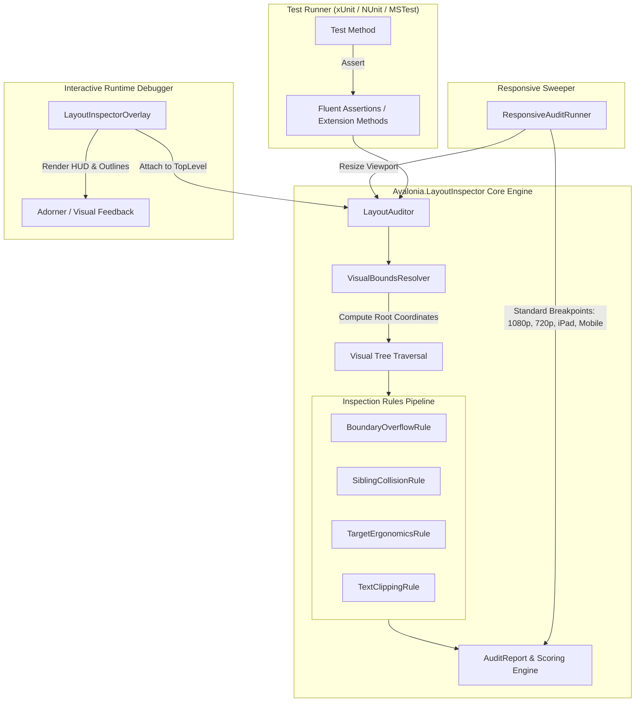

# Avalonia.LayoutInspector — Design Specification

- **Date:** 2026-09-20
- **Topic:** Avalonia Layout Inspector C# NuGet Package & Test Harness
- **Status:** Approved
- **Repository Location:** `C:\Users\Alias\repos\Avalonia.LayoutInspector`

---

## 1. Executive Summary

This specification establishes the architecture, rule pipeline, test harness, and packaging for **`Avalonia.LayoutInspector`**, an open-source C# library and NuGet package for Avalonia UI. It provides automated geometric layout auditing, collision detection, boundary overflow analysis, touch target ergonomics inspection, and responsive viewport sweeping across Desktop and Mobile form factors.

It replaces web-only Playwright DOM inspectors for Avalonia applications by directly analyzing Avalonia's native `VisualTree` and geometric bounds in both headless automated test suites and interactive runtime environments.

---

## 2. Architecture & System Topology



---

## 3. Component Specifications

### 3.1 VisualBoundsResolver & Geometry Engine
- **Coordinate Space Transformation**: Transforms element local `Bounds` to root window coordinates using `visual.TransformToVisual(rootVisual)` and `visual.TranslatePoint(new Point(0, 0), rootVisual)`.
- **Layout Pass Guarantee**: Ensures controls are measured and arranged prior to inspection via `control.UpdateLayout()` if bounds are uninitialized (`Width == 0 && Height == 0`).
- **Visibility Filtering**: Excludes collapsed or invisible visuals (`IsVisible == false`, `Opacity <= 0`, or width/height of zero).

### 3.2 Rules Pipeline (`ILayoutAuditRule`)

```csharp
public interface ILayoutAuditRule
{
    string RuleId { get; }
    string Name { get; }
    IEnumerable<LayoutViolation> Evaluate(Visual root, VisualBoundsResolver resolver, AuditOptions options);
}
```

1. **`BoundaryOverflowRule` (Rule ID: `LAYOUT001_OVERFLOW`)**:
   - Detects child visual bounds extending beyond container or viewport boundaries.
   - Respects `ScrollViewer` scrollable axes (`HorizontalScrollBarVisibility` / `VerticalScrollBarVisibility`).
   - Respects controls with `ClipToBounds = true`.
   - Detects negative coordinate shifting (`X < 0` or `Y < 0`).
2. **`SiblingCollisionRule` (Rule ID: `LAYOUT002_COLLISION`)**:
   - Calculates 2D Axis-Aligned Bounding Box (AABB) intersections between sibling elements.
   - Automatically excludes layered containers (`Canvas`, unindexed `Panel`, controls with explicit `ZIndex`).
   - Evaluates `Grid` layout coordinates: checks siblings only when sharing identical `Grid.Row` and `Grid.Column` without spanning separation.
   - Applies 1px border tolerance to prevent false positives on touching edges.
3. **`TargetErgonomicsRule` (Rule ID: `LAYOUT003_ERGONOMICS`)**:
   - Identifies interactive controls (`Button`, `ToggleButton`, `TextBox`, `ComboBox`, `CheckBox`, `RadioButton`, `Slider`, `MenuItem`, and custom pointer interactors).
   - Validates dimensions against `MinTouchTargetSize` (default 24.0px).
   - Audits adjacent target spacing (flags targets spaced $< 8.0\text{px}$ apart).
4. **`TextClippingRule` (Rule ID: `LAYOUT004_TRUNCATION`)**:
   - Audits `TextBlock` and `SelectableTextBlock` controls.
   - Flags unhandled truncation where `DesiredSize.Width > Bounds.Width` and `TextWrapping == NoWrap` with `TextTrimming == None`.
   - Flags collapsed labels whose rendered height is below the font line height.

### 3.3 UX Health Scoring Engine
- Base: 100 points.
- Deductions: -15 per Boundary Overflow, -15 per Sibling Collision, -5 per Ergonomics violation, -5 per Text clipping.
- Grade brackets:
  - **A**: 90–100 (Clean, production ready)
  - **B**: 80–89 (Minor ergonomics or text trimming warnings)
  - **C**: 70–79 (Substantial layout issues)
  - **F**: $< 70$ (Critical layout overflows or collisions)

---

## 4. Responsive Sweeper & Assertion API

### 4.1 Breakpoints
Provides predefined standard breakpoints:
- `Desktop1440p` (2560 x 1440)
- `Desktop1080p` (1920 x 1080)
- `Desktop720p` (1280 x 720)
- `TabletiPad` (768 x 1024)
- `MobilePortrait` (412 x 915)

### 4.2 Fluent Assertions
Extension methods providing seamless integration with xUnit, NUnit, and MSTest:
```csharp
public static class LayoutAssertExtensions
{
    public static AuditReport ShouldHaveNoLayoutViolations(this Visual visual, AuditOptions? options = null);
    public static AuditReport ShouldHaveNoOverflow(this Visual visual);
    public static AuditReport ShouldHaveNoCollisions(this Visual visual);
    public static AuditReport ShouldHaveTouchFriendlyTargets(this Visual visual, double minSize = 24.0);
    public static ResponsiveAuditReport ShouldFitResponsiveBreakpoints(
        this Window window, 
        IEnumerable<Breakpoint>? breakpoints = null, 
        AuditOptions? options = null);
}
```

---

## 5. Repository Structure & Toolbelt Standards

Repository root: `C:\Users\Alias\repos\Avalonia.LayoutInspector`

```text
Avalonia.LayoutInspector/
├── .github/
│   └── workflows/
│       └── ci.yml
├── docs/
│   ├── ARCHITECTURE.md
│   └── TEST_CATALOG.md
├── src/
│   └── Avalonia.LayoutInspector/
│       ├── Assertions/
│       ├── Diagnostics/
│       ├── Engine/
│       ├── Models/
│       ├── Overlay/
│       ├── Rules/
│       └── Avalonia.LayoutInspector.csproj
├── tests/
│   └── Avalonia.LayoutInspector.Tests/
│       ├── Fixtures/
│       ├── Rules/
│       ├── Runners/
│       └── Avalonia.LayoutInspector.Tests.csproj
├── Directory.Build.props
├── Avalonia.LayoutInspector.slnx
├── AGENTS.md
├── CHANGELOG.md
├── LICENSE
└── README.md
```

### 5.1 Standards Compliance
- **Target Frameworks**: Multi-targets `net8.0;net9.0;net10.0` for core library; `net10.0` for test project.
- **Modern Solution**: `.slnx` solution file.
- **Code Style**: `<Nullable>enable</Nullable>`, `<ImplicitUsings>enable</ImplicitUsings>`, client-focused interfaces (`ILayoutAuditor`, `ILayoutAuditRule`, `IVisualBoundsResolver`).
- **Tests**: $\ge 80\%$ test coverage using `Avalonia.Headless.XUnit`.
- **NuGet Packaging**: Generates `Avalonia.LayoutInspector.nupkg` with symbol package (`.snupkg`), XML documentation, and license embedded.

---

## 6. Verification & Quality Gates

1. **Compilation**: `dotnet build` passes with zero warnings and zero errors across all target frameworks (`net8.0`, `net9.0`, `net10.0`).
2. **Unit Tests**: Full test suite in `Avalonia.LayoutInspector.Tests` executes and passes via `dotnet test`.
3. **Packaging**: `dotnet pack -c Release` produces valid NuGet packages ready for distribution.
4. **Integration Verification**: Consume the package in `LocalLLMServerManager.Tests` to run layout audits against `MainWindow`, `CivitaiTabControl`, `HuggingFaceTabControl`, `OllamaModelsTabControl`, and `SettingsTabControl`.
